# Iris - MLP

### [Dataset](https://www.kaggle.com/datasets/himanshunakrani/iris-dataset)

Author: [Kevin Thomas](mailto:ket189@pitt.edu)

License: MIT

## Install Libraries


```python
# !python -m pip install --upgrade pip
# %pip install ipywidgets
# %pip install pandas matplotlib seaborn
# %pip install scikit-learn
# # %pip install torch torchvision --index-url https://download.pytorch.org/whl/cu124  # Windows with CUDA 12.4
# %pip install torch  # MacOS or CPU-only
# %pip install shap
# %pip install black
# %pip install black[jupyter]
# %pip install nbqa
# %pip install scipy
```

## Import Libraries


```python
import warnings
import sqlite3
from itertools import combinations
import joblib
import matplotlib.pyplot as plt
import numpy as np
import pandas as pd
import seaborn as sns
from scipy import stats
from sklearn.metrics import (
    accuracy_score,
    auc,
    classification_report,
    confusion_matrix,
    normalized_mutual_info_score,
    precision_recall_fscore_support,
    roc_auc_score,
    roc_curve,
)
from sklearn.model_selection import train_test_split
from sklearn.preprocessing import StandardScaler
import torch
import torch.nn as nn
import torch.nn.functional as F
from torch.utils.data import DataLoader

warnings.filterwarnings("ignore", message=".*global RNG.*", category=FutureWarning)
```

## Seed


```python
SEED = 42
np.random.seed(SEED)
torch.manual_seed(SEED)
```


    <torch._C.Generator at 0x11aae47b0>


## Device


```python
if torch.cuda.is_available():
    DEVICE = torch.device("cuda")
elif torch.backends.mps.is_available():
    DEVICE = torch.device("mps")
else:
    DEVICE = torch.device("cpu")
DEVICE
```


    device(type='mps')


## Parameters


```python
H1 = 8
H2 = 8
OUT_FEATURES = 3
TEST_SIZE = 0.3
DATA_PATH = "iris.csv"
SCALAR_PATH = "iris_scaler.pkl"
MODEL_PATH = "iris_model.pth"
TARGET_VAR = "species"
CLASS_NAMES = ["Setosa", "Versicolor", "Virginica"]
SPECIES_MAP = {0: "setosa", 1: "versicolor", 2: "virginica"}
```

## Hyperparameters


```python
LR = 0.01
EPOCHS = 1000
LOG_INTERVAL = 10
BATCH_SIZE = 32
CHUNK_SIZE = None  # Set to int (e.g., 100000) for large files, None for small files
DROPOUT = 0.0  # Dropout rate (0.0 = no dropout, 0.2-0.5 typical for regularization)
VAL_SIZE = 0.15  # Fraction of training data reserved for validation
PATIENCE = 50  # Early stopping patience (epochs without improvement)
```

## Load Dataset


```python
if CHUNK_SIZE is None:
    df = pd.read_csv(DATA_PATH)
else:
    chunks = []
    for chunk in pd.read_csv(DATA_PATH, chunksize=CHUNK_SIZE):
        chunks.append(chunk)
    df = pd.concat(chunks, ignore_index=True)
    del chunks  # Free memory
df
```


<div>
<table border="1" class="dataframe">
  <thead>
    <tr style="text-align: right;">
      <th></th>
      <th>sepal_length</th>
      <th>sepal_width</th>
      <th>petal_length</th>
      <th>petal_width</th>
      <th>species</th>
    </tr>
  </thead>
  <tbody>
    <tr>
      <th>0</th>
      <td>5.1</td>
      <td>3.5</td>
      <td>1.4</td>
      <td>0.2</td>
      <td>setosa</td>
    </tr>
    <tr>
      <th>1</th>
      <td>4.9</td>
      <td>3.0</td>
      <td>1.4</td>
      <td>0.2</td>
      <td>setosa</td>
    </tr>
    <tr>
      <th>2</th>
      <td>4.7</td>
      <td>3.2</td>
      <td>1.3</td>
      <td>0.2</td>
      <td>setosa</td>
    </tr>
    <tr>
      <th>3</th>
      <td>4.6</td>
      <td>3.1</td>
      <td>1.5</td>
      <td>0.2</td>
      <td>setosa</td>
    </tr>
    <tr>
      <th>4</th>
      <td>5.0</td>
      <td>3.6</td>
      <td>1.4</td>
      <td>0.2</td>
      <td>setosa</td>
    </tr>
    <tr>
      <th>...</th>
      <td>...</td>
      <td>...</td>
      <td>...</td>
      <td>...</td>
      <td>...</td>
    </tr>
    <tr>
      <th>145</th>
      <td>6.7</td>
      <td>3.0</td>
      <td>5.2</td>
      <td>2.3</td>
      <td>virginica</td>
    </tr>
    <tr>
      <th>146</th>
      <td>6.3</td>
      <td>2.5</td>
      <td>5.0</td>
      <td>1.9</td>
      <td>virginica</td>
    </tr>
    <tr>
      <th>147</th>
      <td>6.5</td>
      <td>3.0</td>
      <td>5.2</td>
      <td>2.0</td>
      <td>virginica</td>
    </tr>
    <tr>
      <th>148</th>
      <td>6.2</td>
      <td>3.4</td>
      <td>5.4</td>
      <td>2.3</td>
      <td>virginica</td>
    </tr>
    <tr>
      <th>149</th>
      <td>5.9</td>
      <td>3.0</td>
      <td>5.1</td>
      <td>1.8</td>
      <td>virginica</td>
    </tr>
  </tbody>
</table>
<p>150 rows × 5 columns</p>
</div>


```python
df.info()
```

    <class 'pandas.DataFrame'>
    RangeIndex: 150 entries, 0 to 149
    Data columns (total 5 columns):
     #   Column        Non-Null Count  Dtype  
    ---  ------        --------------  -----  
     0   sepal_length  150 non-null    float64
     1   sepal_width   150 non-null    float64
     2   petal_length  150 non-null    float64
     3   petal_width   150 non-null    float64
     4   species       150 non-null    str    
    dtypes: float64(4), str(1)
    memory usage: 6.0 KB


## Clean Dataset

### Complete Missingness Analysis


```python
missing_df = pd.DataFrame(
    {
        "Variable": df.columns,
        "Missing_Count": df.isna().sum(),
        "Missing_Pct": (df.isna().sum() / len(df) * 100).round(1),
    }
).sort_values("Missing_Pct", ascending=False)
missing_df
```


<div>
<table border="1" class="dataframe">
  <thead>
    <tr style="text-align: right;">
      <th></th>
      <th>Variable</th>
      <th>Missing_Count</th>
      <th>Missing_Pct</th>
    </tr>
  </thead>
  <tbody>
    <tr>
      <th>sepal_length</th>
      <td>sepal_length</td>
      <td>0</td>
      <td>0.0</td>
    </tr>
    <tr>
      <th>sepal_width</th>
      <td>sepal_width</td>
      <td>0</td>
      <td>0.0</td>
    </tr>
    <tr>
      <th>petal_length</th>
      <td>petal_length</td>
      <td>0</td>
      <td>0.0</td>
    </tr>
    <tr>
      <th>petal_width</th>
      <td>petal_width</td>
      <td>0</td>
      <td>0.0</td>
    </tr>
    <tr>
      <th>species</th>
      <td>species</td>
      <td>0</td>
      <td>0.0</td>
    </tr>
  </tbody>
</table>
</div>


### Create Dataset `df_clean` w/ Cleaned Data


```python
df_clean = df.copy()
df_clean
```


<div>
<table border="1" class="dataframe">
  <thead>
    <tr style="text-align: right;">
      <th></th>
      <th>sepal_length</th>
      <th>sepal_width</th>
      <th>petal_length</th>
      <th>petal_width</th>
      <th>species</th>
    </tr>
  </thead>
  <tbody>
    <tr>
      <th>0</th>
      <td>5.1</td>
      <td>3.5</td>
      <td>1.4</td>
      <td>0.2</td>
      <td>setosa</td>
    </tr>
    <tr>
      <th>1</th>
      <td>4.9</td>
      <td>3.0</td>
      <td>1.4</td>
      <td>0.2</td>
      <td>setosa</td>
    </tr>
    <tr>
      <th>2</th>
      <td>4.7</td>
      <td>3.2</td>
      <td>1.3</td>
      <td>0.2</td>
      <td>setosa</td>
    </tr>
    <tr>
      <th>3</th>
      <td>4.6</td>
      <td>3.1</td>
      <td>1.5</td>
      <td>0.2</td>
      <td>setosa</td>
    </tr>
    <tr>
      <th>4</th>
      <td>5.0</td>
      <td>3.6</td>
      <td>1.4</td>
      <td>0.2</td>
      <td>setosa</td>
    </tr>
    <tr>
      <th>...</th>
      <td>...</td>
      <td>...</td>
      <td>...</td>
      <td>...</td>
      <td>...</td>
    </tr>
    <tr>
      <th>145</th>
      <td>6.7</td>
      <td>3.0</td>
      <td>5.2</td>
      <td>2.3</td>
      <td>virginica</td>
    </tr>
    <tr>
      <th>146</th>
      <td>6.3</td>
      <td>2.5</td>
      <td>5.0</td>
      <td>1.9</td>
      <td>virginica</td>
    </tr>
    <tr>
      <th>147</th>
      <td>6.5</td>
      <td>3.0</td>
      <td>5.2</td>
      <td>2.0</td>
      <td>virginica</td>
    </tr>
    <tr>
      <th>148</th>
      <td>6.2</td>
      <td>3.4</td>
      <td>5.4</td>
      <td>2.3</td>
      <td>virginica</td>
    </tr>
    <tr>
      <th>149</th>
      <td>5.9</td>
      <td>3.0</td>
      <td>5.1</td>
      <td>1.8</td>
      <td>virginica</td>
    </tr>
  </tbody>
</table>
<p>150 rows × 5 columns</p>
</div>


### Drop Variables in `df_clean` w/ Missings


```python
# df_clean.drop(columns=[
#     "",
#     ""],
#     inplace=True)
```

### Drop Variables w/ No Predictive Value


```python
# df_clean.drop(columns=[
#     "",
#     ""],
#     inplace=True)
```

## Feature Engineering

### Classify `petal_shape` If `petal_length` > 3x `petal_width`


```python
df_clean["petal_shape"] = np.where(
    (df_clean["petal_length"] / df_clean["petal_width"]) > 3.0, "elongated", "round"
)
df_clean["petal_shape"]
```


    0      elongated
    1      elongated
    2      elongated
    3      elongated
    4      elongated
             ...    
    145        round
    146        round
    147        round
    148        round
    149        round
    Name: petal_shape, Length: 150, dtype: str


### Classify `sepal_dominance`, If `sepal_length` > 2x `petal_length`


```python
df_clean["sepal_dominance"] = np.where(
    df_clean["sepal_length"] > (2 * df_clean["petal_length"]),
    "sepal_dominant",
    "balanced",
)
df_clean["sepal_dominance"]
```


    0      sepal_dominant
    1      sepal_dominant
    2      sepal_dominant
    3      sepal_dominant
    4      sepal_dominant
                ...      
    145          balanced
    146          balanced
    147          balanced
    148          balanced
    149          balanced
    Name: sepal_dominance, Length: 150, dtype: str


## Save Cleaned Dataset


```python
df_clean.to_csv("iris_dataset_clean.csv", index=False)
```

## Load Cleaned Dataset


```python
df_eda = pd.read_csv("iris_dataset_clean.csv")
df_eda
```


<div>
<table border="1" class="dataframe">
  <thead>
    <tr style="text-align: right;">
      <th></th>
      <th>sepal_length</th>
      <th>sepal_width</th>
      <th>petal_length</th>
      <th>petal_width</th>
      <th>species</th>
      <th>petal_shape</th>
      <th>sepal_dominance</th>
    </tr>
  </thead>
  <tbody>
    <tr>
      <th>0</th>
      <td>5.1</td>
      <td>3.5</td>
      <td>1.4</td>
      <td>0.2</td>
      <td>setosa</td>
      <td>elongated</td>
      <td>sepal_dominant</td>
    </tr>
    <tr>
      <th>1</th>
      <td>4.9</td>
      <td>3.0</td>
      <td>1.4</td>
      <td>0.2</td>
      <td>setosa</td>
      <td>elongated</td>
      <td>sepal_dominant</td>
    </tr>
    <tr>
      <th>2</th>
      <td>4.7</td>
      <td>3.2</td>
      <td>1.3</td>
      <td>0.2</td>
      <td>setosa</td>
      <td>elongated</td>
      <td>sepal_dominant</td>
    </tr>
    <tr>
      <th>3</th>
      <td>4.6</td>
      <td>3.1</td>
      <td>1.5</td>
      <td>0.2</td>
      <td>setosa</td>
      <td>elongated</td>
      <td>sepal_dominant</td>
    </tr>
    <tr>
      <th>4</th>
      <td>5.0</td>
      <td>3.6</td>
      <td>1.4</td>
      <td>0.2</td>
      <td>setosa</td>
      <td>elongated</td>
      <td>sepal_dominant</td>
    </tr>
    <tr>
      <th>...</th>
      <td>...</td>
      <td>...</td>
      <td>...</td>
      <td>...</td>
      <td>...</td>
      <td>...</td>
      <td>...</td>
    </tr>
    <tr>
      <th>145</th>
      <td>6.7</td>
      <td>3.0</td>
      <td>5.2</td>
      <td>2.3</td>
      <td>virginica</td>
      <td>round</td>
      <td>balanced</td>
    </tr>
    <tr>
      <th>146</th>
      <td>6.3</td>
      <td>2.5</td>
      <td>5.0</td>
      <td>1.9</td>
      <td>virginica</td>
      <td>round</td>
      <td>balanced</td>
    </tr>
    <tr>
      <th>147</th>
      <td>6.5</td>
      <td>3.0</td>
      <td>5.2</td>
      <td>2.0</td>
      <td>virginica</td>
      <td>round</td>
      <td>balanced</td>
    </tr>
    <tr>
      <th>148</th>
      <td>6.2</td>
      <td>3.4</td>
      <td>5.4</td>
      <td>2.3</td>
      <td>virginica</td>
      <td>round</td>
      <td>balanced</td>
    </tr>
    <tr>
      <th>149</th>
      <td>5.9</td>
      <td>3.0</td>
      <td>5.1</td>
      <td>1.8</td>
      <td>virginica</td>
      <td>round</td>
      <td>balanced</td>
    </tr>
  </tbody>
</table>
<p>150 rows × 7 columns</p>
</div>


## SQL Exploration


```python
# Create in-memory SQLite database from cleaned Iris dataset
conn = sqlite3.connect(":memory:")
df_eda.to_sql("iris", conn, index=False, if_exists="replace")
```


    150


### Helper Function for Query Execution


```python
def run_query(query, description, n_rows=20):
    """
    Execute a SQL query against the in-memory SQLite database and display results.

    Parameters:
        query (str): SQL query string to execute.
        description (str): Human-readable description of what the query does.
        n_rows (int): Maximum number of rows to display (default: 20).

    Returns:
        None
    """
    print(f"\n{'='*80}")
    print(f"QUERY: {description}")
    print(f"{'='*80}")
    print(f"\nSQL:\n{query}\n")
    result = pd.read_sql_query(query, conn)
    print(f"Results ({len(result)} rows):")
    display(result.head(n_rows))
```

### Species Distribution

Understand the distribution of `species` across the Iris dataset.


```python
query = """
SELECT
    species,
    COUNT(*) as count,
    ROUND(COUNT(*) * 100.0 / (SELECT COUNT(*) FROM iris), 2) as percentage
FROM iris
GROUP BY species
ORDER BY count DESC;
"""
run_query(query, "Overall species distribution")
```

    
    ================================================================================
    QUERY: Overall species distribution
    ================================================================================
    
    SQL:
    
    SELECT
        species,
        COUNT(*) as count,
        ROUND(COUNT(*) * 100.0 / (SELECT COUNT(*) FROM iris), 2) as percentage
    FROM iris
    GROUP BY species
    ORDER BY count DESC;
    
    
    Results (3 rows):


<div>
<table border="1" class="dataframe">
  <thead>
    <tr style="text-align: right;">
      <th></th>
      <th>species</th>
      <th>count</th>
      <th>percentage</th>
    </tr>
  </thead>
  <tbody>
    <tr>
      <th>0</th>
      <td>virginica</td>
      <td>50</td>
      <td>33.33</td>
    </tr>
    <tr>
      <th>1</th>
      <td>versicolor</td>
      <td>50</td>
      <td>33.33</td>
    </tr>
    <tr>
      <th>2</th>
      <td>setosa</td>
      <td>50</td>
      <td>33.33</td>
    </tr>
  </tbody>
</table>
</div>


### Feature Statistics by Species

What are the average measurements for each `species`?


```python
query = """
SELECT
    species,
    ROUND(AVG(sepal_length), 2) as avg_sepal_length,
    ROUND(AVG(sepal_width), 2) as avg_sepal_width,
    ROUND(AVG(petal_length), 2) as avg_petal_length,
    ROUND(AVG(petal_width), 2) as avg_petal_width,
    COUNT(*) as sample_count
FROM iris
GROUP BY species
ORDER BY species;
"""
run_query(query, "Average feature measurements by species")
```

    
    ================================================================================
    QUERY: Average feature measurements by species
    ================================================================================
    
    SQL:
    
    SELECT
        species,
        ROUND(AVG(sepal_length), 2) as avg_sepal_length,
        ROUND(AVG(sepal_width), 2) as avg_sepal_width,
        ROUND(AVG(petal_length), 2) as avg_petal_length,
        ROUND(AVG(petal_width), 2) as avg_petal_width,
        COUNT(*) as sample_count
    FROM iris
    GROUP BY species
    ORDER BY species;
    
    
    Results (3 rows):


<div>
<table border="1" class="dataframe">
  <thead>
    <tr style="text-align: right;">
      <th></th>
      <th>species</th>
      <th>avg_sepal_length</th>
      <th>avg_sepal_width</th>
      <th>avg_petal_length</th>
      <th>avg_petal_width</th>
      <th>sample_count</th>
    </tr>
  </thead>
  <tbody>
    <tr>
      <th>0</th>
      <td>setosa</td>
      <td>5.01</td>
      <td>3.42</td>
      <td>1.46</td>
      <td>0.24</td>
      <td>50</td>
    </tr>
    <tr>
      <th>1</th>
      <td>versicolor</td>
      <td>5.94</td>
      <td>2.77</td>
      <td>4.26</td>
      <td>1.33</td>
      <td>50</td>
    </tr>
    <tr>
      <th>2</th>
      <td>virginica</td>
      <td>6.59</td>
      <td>2.97</td>
      <td>5.55</td>
      <td>2.03</td>
      <td>50</td>
    </tr>
  </tbody>
</table>
</div>


### Petal Shape Distribution by Species

How does the engineered `petal_shape` feature distribute across `species`?


```python
query = """
SELECT
    species,
    petal_shape,
    COUNT(*) as count,
    ROUND(COUNT(*) * 100.0 / SUM(COUNT(*)) OVER (PARTITION BY species), 2) as pct_within_species
FROM iris
GROUP BY species, petal_shape
ORDER BY species, petal_shape;
"""
run_query(query, "Petal shape distribution by species")
```

    
    ================================================================================
    QUERY: Petal shape distribution by species
    ================================================================================
    
    SQL:
    
    SELECT
        species,
        petal_shape,
        COUNT(*) as count,
        ROUND(COUNT(*) * 100.0 / SUM(COUNT(*)) OVER (PARTITION BY species), 2) as pct_within_species
    FROM iris
    GROUP BY species, petal_shape
    ORDER BY species, petal_shape;
    
    
    Results (6 rows):


<div>
<table border="1" class="dataframe">
  <thead>
    <tr style="text-align: right;">
      <th></th>
      <th>species</th>
      <th>petal_shape</th>
      <th>count</th>
      <th>pct_within_species</th>
    </tr>
  </thead>
  <tbody>
    <tr>
      <th>0</th>
      <td>setosa</td>
      <td>elongated</td>
      <td>49</td>
      <td>98.0</td>
    </tr>
    <tr>
      <th>1</th>
      <td>setosa</td>
      <td>round</td>
      <td>1</td>
      <td>2.0</td>
    </tr>
    <tr>
      <th>2</th>
      <td>versicolor</td>
      <td>elongated</td>
      <td>37</td>
      <td>74.0</td>
    </tr>
    <tr>
      <th>3</th>
      <td>versicolor</td>
      <td>round</td>
      <td>13</td>
      <td>26.0</td>
    </tr>
    <tr>
      <th>4</th>
      <td>virginica</td>
      <td>elongated</td>
      <td>16</td>
      <td>32.0</td>
    </tr>
    <tr>
      <th>5</th>
      <td>virginica</td>
      <td>round</td>
      <td>34</td>
      <td>68.0</td>
    </tr>
  </tbody>
</table>
</div>


### Sepal Dominance Distribution by Species

How does the engineered `sepal_dominance` feature distribute across `species`?


```python
query = """
SELECT
    species,
    sepal_dominance,
    COUNT(*) as count,
    ROUND(COUNT(*) * 100.0 / SUM(COUNT(*)) OVER (PARTITION BY species), 2) as pct_within_species
FROM iris
GROUP BY species, sepal_dominance
ORDER BY species, sepal_dominance;
"""
run_query(query, "Sepal dominance distribution by species")
```

    
    ================================================================================
    QUERY: Sepal dominance distribution by species
    ================================================================================
    
    SQL:
    
    SELECT
        species,
        sepal_dominance,
        COUNT(*) as count,
        ROUND(COUNT(*) * 100.0 / SUM(COUNT(*)) OVER (PARTITION BY species), 2) as pct_within_species
    FROM iris
    GROUP BY species, sepal_dominance
    ORDER BY species, sepal_dominance;
    
    
    Results (3 rows):


<div>
<table border="1" class="dataframe">
  <thead>
    <tr style="text-align: right;">
      <th></th>
      <th>species</th>
      <th>sepal_dominance</th>
      <th>count</th>
      <th>pct_within_species</th>
    </tr>
  </thead>
  <tbody>
    <tr>
      <th>0</th>
      <td>setosa</td>
      <td>sepal_dominant</td>
      <td>50</td>
      <td>100.0</td>
    </tr>
    <tr>
      <th>1</th>
      <td>versicolor</td>
      <td>balanced</td>
      <td>50</td>
      <td>100.0</td>
    </tr>
    <tr>
      <th>2</th>
      <td>virginica</td>
      <td>balanced</td>
      <td>50</td>
      <td>100.0</td>
    </tr>
  </tbody>
</table>
</div>


### Feature Ranges by Species

What are the min/max feature values for each `species`?


```python
query = """
SELECT
    species,
    MIN(petal_length) as min_petal_length,
    MAX(petal_length) as max_petal_length,
    MIN(petal_width) as min_petal_width,
    MAX(petal_width) as max_petal_width,
    MIN(sepal_length) as min_sepal_length,
    MAX(sepal_length) as max_sepal_length
FROM iris
GROUP BY species
ORDER BY species;
"""
run_query(query, "Feature ranges by species")
```

    
    ================================================================================
    QUERY: Feature ranges by species
    ================================================================================
    
    SQL:
    
    SELECT
        species,
        MIN(petal_length) as min_petal_length,
        MAX(petal_length) as max_petal_length,
        MIN(petal_width) as min_petal_width,
        MAX(petal_width) as max_petal_width,
        MIN(sepal_length) as min_sepal_length,
        MAX(sepal_length) as max_sepal_length
    FROM iris
    GROUP BY species
    ORDER BY species;
    
    
    Results (3 rows):


<div>
<table border="1" class="dataframe">
  <thead>
    <tr style="text-align: right;">
      <th></th>
      <th>species</th>
      <th>min_petal_length</th>
      <th>max_petal_length</th>
      <th>min_petal_width</th>
      <th>max_petal_width</th>
      <th>min_sepal_length</th>
      <th>max_sepal_length</th>
    </tr>
  </thead>
  <tbody>
    <tr>
      <th>0</th>
      <td>setosa</td>
      <td>1.0</td>
      <td>1.9</td>
      <td>0.1</td>
      <td>0.6</td>
      <td>4.3</td>
      <td>5.8</td>
    </tr>
    <tr>
      <th>1</th>
      <td>versicolor</td>
      <td>3.0</td>
      <td>5.1</td>
      <td>1.0</td>
      <td>1.8</td>
      <td>4.9</td>
      <td>7.0</td>
    </tr>
    <tr>
      <th>2</th>
      <td>virginica</td>
      <td>4.5</td>
      <td>6.9</td>
      <td>1.4</td>
      <td>2.5</td>
      <td>4.9</td>
      <td>7.9</td>
    </tr>
  </tbody>
</table>
</div>


### Species Identification Patterns

Which features best identify each `species`?


```python
query = """
SELECT
    species,
    COUNT(*) as total,
    SUM(CASE WHEN petal_length < 2.5 THEN 1 ELSE 0 END) as short_petal,
    ROUND(SUM(CASE WHEN petal_length < 2.5 THEN 1 ELSE 0 END) * 100.0 / COUNT(*), 2) as short_petal_pct,
    SUM(CASE WHEN sepal_dominance = 'sepal_dominant' THEN 1 ELSE 0 END) as sepal_dominant_count,
    ROUND(SUM(CASE WHEN sepal_dominance = 'sepal_dominant' THEN 1 ELSE 0 END) * 100.0 / COUNT(*), 2) as sepal_dominant_pct
FROM iris
GROUP BY species
ORDER BY species;
"""
run_query(query, "Species identification patterns")
```

    
    ================================================================================
    QUERY: Species identification patterns
    ================================================================================
    
    SQL:
    
    SELECT
        species,
        COUNT(*) as total,
        SUM(CASE WHEN petal_length < 2.5 THEN 1 ELSE 0 END) as short_petal,
        ROUND(SUM(CASE WHEN petal_length < 2.5 THEN 1 ELSE 0 END) * 100.0 / COUNT(*), 2) as short_petal_pct,
        SUM(CASE WHEN sepal_dominance = 'sepal_dominant' THEN 1 ELSE 0 END) as sepal_dominant_count,
        ROUND(SUM(CASE WHEN sepal_dominance = 'sepal_dominant' THEN 1 ELSE 0 END) * 100.0 / COUNT(*), 2) as sepal_dominant_pct
    FROM iris
    GROUP BY species
    ORDER BY species;
    
    
    Results (3 rows):


<div>
<table border="1" class="dataframe">
  <thead>
    <tr style="text-align: right;">
      <th></th>
      <th>species</th>
      <th>total</th>
      <th>short_petal</th>
      <th>short_petal_pct</th>
      <th>sepal_dominant_count</th>
      <th>sepal_dominant_pct</th>
    </tr>
  </thead>
  <tbody>
    <tr>
      <th>0</th>
      <td>setosa</td>
      <td>50</td>
      <td>50</td>
      <td>100.0</td>
      <td>50</td>
      <td>100.0</td>
    </tr>
    <tr>
      <th>1</th>
      <td>versicolor</td>
      <td>50</td>
      <td>0</td>
      <td>0.0</td>
      <td>0</td>
      <td>0.0</td>
    </tr>
    <tr>
      <th>2</th>
      <td>virginica</td>
      <td>50</td>
      <td>0</td>
      <td>0.0</td>
      <td>0</td>
      <td>0.0</td>
    </tr>
  </tbody>
</table>
</div>


```python
conn.close()
```

## Exploratory Data Analysis


```python
df_eda.dtypes
```


    sepal_length       float64
    sepal_width        float64
    petal_length       float64
    petal_width        float64
    species                str
    petal_shape            str
    sepal_dominance        str
    dtype: object


### Create `CATEGORICAL_FEATURES` & `CONTINUOUS_FEATURES`


```python
CATEGORICAL_FEATURES = ["petal_shape", "sepal_dominance"]
CATEGORICAL_FEATURES
```


    ['petal_shape', 'sepal_dominance']


```python
CONTINUOUS_FEATURES = ["sepal_length", "sepal_width", "petal_length", "petal_width"]
CONTINUOUS_FEATURES
```


    ['sepal_length', 'sepal_width', 'petal_length', 'petal_width']


### Create `TARGET_VARS`


```python
TARGET_VARS_list = df_clean[TARGET_VAR].value_counts()
TARGET_VARS = TARGET_VARS_list.index.tolist()
TARGET_VARS
```


    ['setosa', 'versicolor', 'virginica']


### Verify Class Balance


```python
# Verify class balance (important: accuracy is misleading if imbalanced)
print("Class Distribution:")
print(TARGET_VARS_list)
print(f"\nPercentages:")
print((TARGET_VARS_list / TARGET_VARS_list.sum() * 100).round(1).astype(str) + "%")
# Balance ratio: min_class / max_class (1.0 = perfect, <0.5 = significantly imbalanced)
balance_ratio = TARGET_VARS_list.min() / TARGET_VARS_list.max()
print(f"\nBalance Ratio: {balance_ratio:.2f}")
if balance_ratio >= 0.8:
    print("Assessment: Well-Balanced \u2705")
elif balance_ratio >= 0.5:
    print("Assessment: Moderately Imbalanced (consider stratified sampling)")
else:
    print("Assessment: Severely Imbalanced (use F1/AUC over accuracy, consider SMOTE)")
```

    Class Distribution:
    species
    setosa        50
    versicolor    50
    virginica     50
    Name: count, dtype: int64
    
    Percentages:
    species
    setosa        33.3%
    versicolor    33.3%
    virginica     33.3%
    Name: count, dtype: str
    
    Balance Ratio: 1.00
    Assessment: Well-Balanced ✅


### Visualize the Marginal Distributions

#### Count Plots — Marginal Distributions of Each Categorical Variable, w/ Facets for Each Categorical Variable


```python
grid = sns.catplot(
    data=df_eda.melt(value_vars=CATEGORICAL_FEATURES),
    x="value",
    col="variable",
    col_wrap=3,
    kind="count",
    sharex=False,
    sharey=False,
    height=4,
    aspect=1.5,
)
for ax in grid.axes.flatten():
    for label in ax.get_xticklabels():
        label.set_rotation(90)
        label.set_ha("center")
grid.figure.tight_layout()
plt.subplots_adjust(hspace=0.4, wspace=0.2)
plt.show()
```


    

    


#### Count Plots with Facets - Explore Relationships Between Categorical Variables


```python
pairs = list(combinations(CATEGORICAL_FEATURES, 2))
for x_var, col_var in pairs:
    grid = sns.catplot(
        data=df_eda,
        x=x_var,
        col=col_var,
        col_wrap=3,
        kind="count",
        sharex=False,
        sharey=False,
        height=3,
        aspect=1.5,
    )
    for ax in grid.axes.flatten():
        for label in ax.get_xticklabels():
            label.set_rotation(90)
            label.set_ha("center")
    grid.figure.tight_layout()
    grid.figure.subplots_adjust(hspace=1.0, wspace=0.2)
    plt.show()
```


    

    


### Histogram Plots — Marginal Distributions of Each Numerical Variable, w/ Facets for Each Numerical Variable


```python
df_eda_lf = (
    df_eda.reset_index()
    .rename(columns={"index": "rowid"})
    .melt(id_vars=["rowid"] + CATEGORICAL_FEATURES, value_vars=CONTINUOUS_FEATURES)
)
df_eda_lf
```


<div>
<table border="1" class="dataframe">
  <thead>
    <tr style="text-align: right;">
      <th></th>
      <th>rowid</th>
      <th>petal_shape</th>
      <th>sepal_dominance</th>
      <th>variable</th>
      <th>value</th>
    </tr>
  </thead>
  <tbody>
    <tr>
      <th>0</th>
      <td>0</td>
      <td>elongated</td>
      <td>sepal_dominant</td>
      <td>sepal_length</td>
      <td>5.1</td>
    </tr>
    <tr>
      <th>1</th>
      <td>1</td>
      <td>elongated</td>
      <td>sepal_dominant</td>
      <td>sepal_length</td>
      <td>4.9</td>
    </tr>
    <tr>
      <th>2</th>
      <td>2</td>
      <td>elongated</td>
      <td>sepal_dominant</td>
      <td>sepal_length</td>
      <td>4.7</td>
    </tr>
    <tr>
      <th>3</th>
      <td>3</td>
      <td>elongated</td>
      <td>sepal_dominant</td>
      <td>sepal_length</td>
      <td>4.6</td>
    </tr>
    <tr>
      <th>4</th>
      <td>4</td>
      <td>elongated</td>
      <td>sepal_dominant</td>
      <td>sepal_length</td>
      <td>5.0</td>
    </tr>
    <tr>
      <th>...</th>
      <td>...</td>
      <td>...</td>
      <td>...</td>
      <td>...</td>
      <td>...</td>
    </tr>
    <tr>
      <th>595</th>
      <td>145</td>
      <td>round</td>
      <td>balanced</td>
      <td>petal_width</td>
      <td>2.3</td>
    </tr>
    <tr>
      <th>596</th>
      <td>146</td>
      <td>round</td>
      <td>balanced</td>
      <td>petal_width</td>
      <td>1.9</td>
    </tr>
    <tr>
      <th>597</th>
      <td>147</td>
      <td>round</td>
      <td>balanced</td>
      <td>petal_width</td>
      <td>2.0</td>
    </tr>
    <tr>
      <th>598</th>
      <td>148</td>
      <td>round</td>
      <td>balanced</td>
      <td>petal_width</td>
      <td>2.3</td>
    </tr>
    <tr>
      <th>599</th>
      <td>149</td>
      <td>round</td>
      <td>balanced</td>
      <td>petal_width</td>
      <td>1.8</td>
    </tr>
  </tbody>
</table>
<p>600 rows × 5 columns</p>
</div>


```python
sns.displot(
    data=df_eda_lf,
    x="value",
    col="variable",
    col_wrap=4,
    kind="hist",
    facet_kws={"sharex": False, "sharey": False},
    common_bins=False,
)
plt.show()
```


    

    


### Histogram Plots with Facets - Explore Relationships Between Numerical & Categorical Variables


```python
for num_var in CONTINUOUS_FEATURES:
    for cat_var in CATEGORICAL_FEATURES:
        grid = sns.displot(
            data=df_eda,
            x=num_var,
            col=cat_var,
            col_wrap=3,
            kind="hist",
            facet_kws={"sharex": False, "sharey": False},
            height=3,
            aspect=1.5,
        )
        for ax in grid.axes.flatten():
            for label in ax.get_xticklabels():
                label.set_rotation(90)
                label.set_ha("center")
        grid.figure.tight_layout()
        grid.figure.subplots_adjust(hspace=0.4, wspace=0.2)
        plt.show()
```


    

    


    

    


    

    


    

    


    

    


    
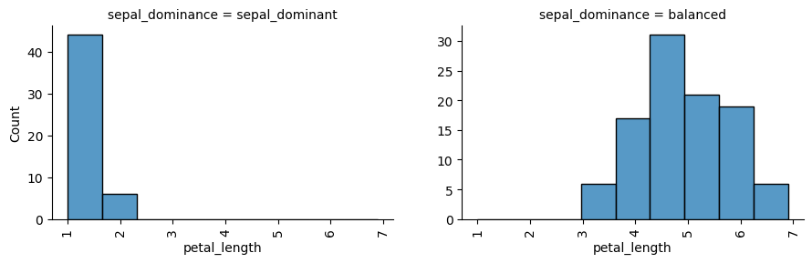
    


    

    


    
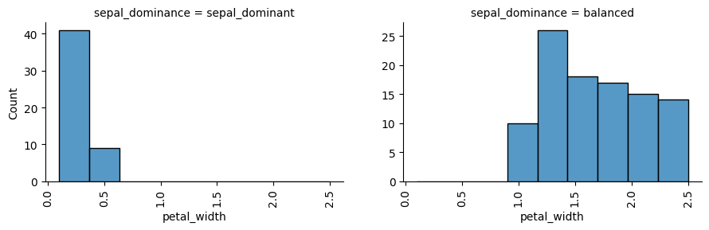
    


### Box Plots — Distribution of Each Numerical Variable by Categorical Variable, Faceted by the Respective Numerical Variable


```python
for num_var in CONTINUOUS_FEATURES:
    for cat_var in CATEGORICAL_FEATURES:
        n_categories = df_eda[cat_var].nunique()
        fig_width = max(8, n_categories * 0.6)
        grid = sns.catplot(
            data=df_eda,
            x=cat_var,
            y=num_var,
            kind="box",
            height=6,
            aspect=fig_width / 6,
        )
        for ax in grid.axes.flatten():
            for label in ax.get_xticklabels():
                label.set_rotation(90)
                label.set_ha("center")
        grid.figure.tight_layout()
        grid.figure.subplots_adjust(hspace=0.4, wspace=0.2)
        plt.show()
```


    

    


    
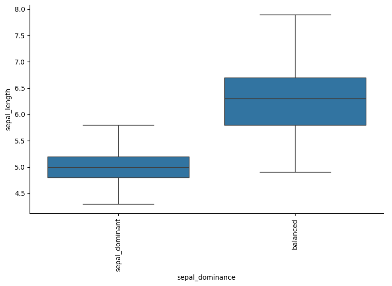
    


    
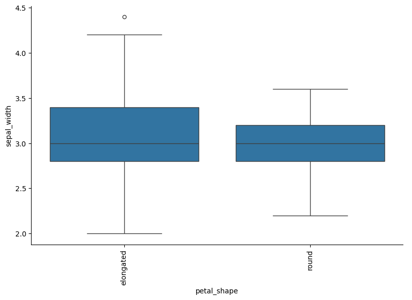
    


    
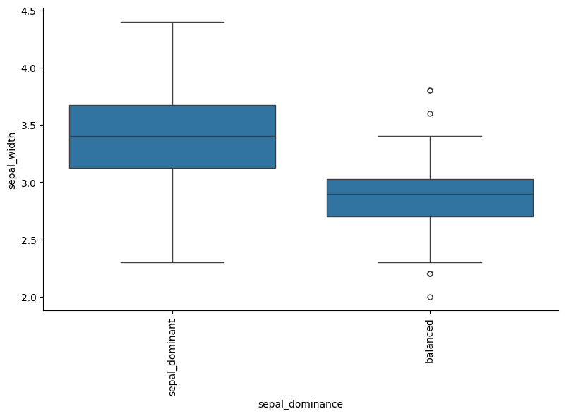
    


    

    


    

    


    

    


    
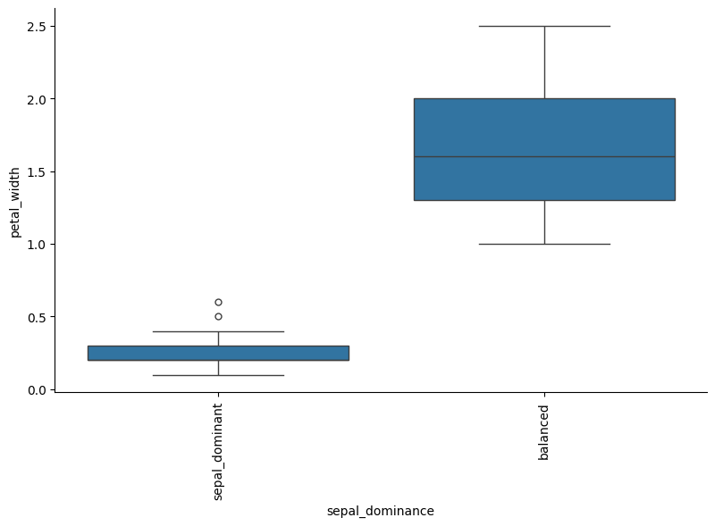
    


### Point Plots — Mean and Confidence Interval of Each Numerical Variable by Categorical Variable, Faceted by the Respective Numerical Variable


```python
for num_var in CONTINUOUS_FEATURES:
    for cat_var in CATEGORICAL_FEATURES:
        n_categories = df_eda[cat_var].nunique()
        fig_width = max(8, n_categories * 0.6)
        grid = sns.catplot(
            data=df_eda,
            x=cat_var,
            y=num_var,
            kind="point",
            linestyle="none",
            height=6,
            aspect=fig_width / 6,
        )
        for ax in grid.axes.flatten():
            for label in ax.get_xticklabels():
                label.set_rotation(90)
                label.set_ha("center")
        grid.figure.tight_layout()
        grid.figure.subplots_adjust(hspace=0.4, wspace=0.2)
        plt.show()
```


    

    


    
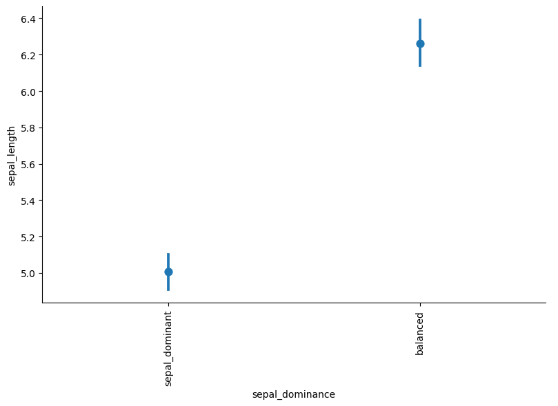
    


    
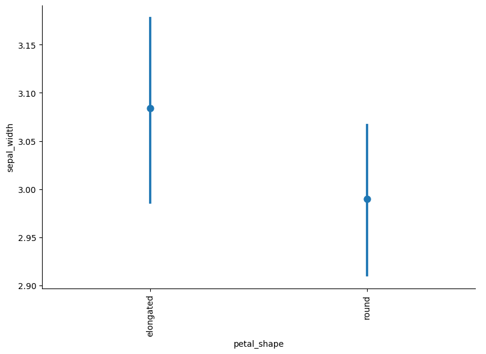
    


    
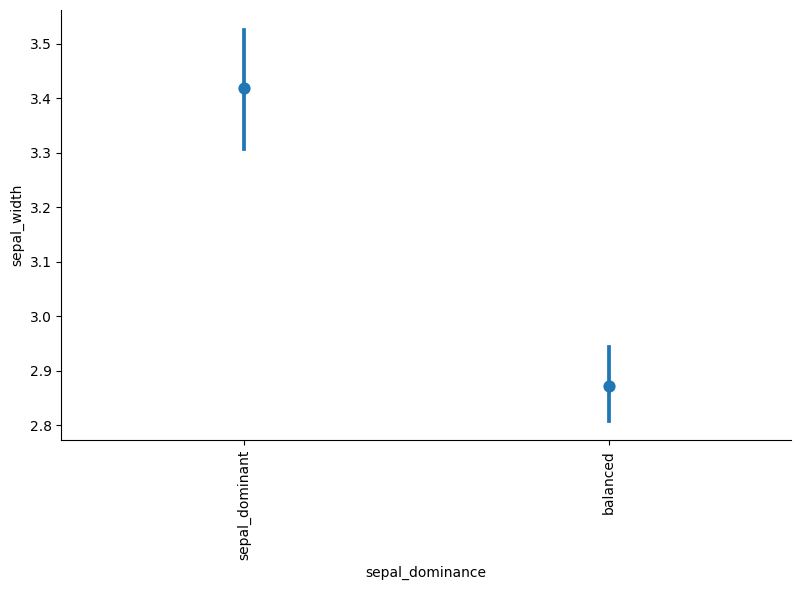
    


    
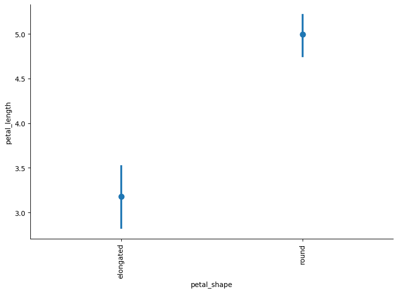
    


    
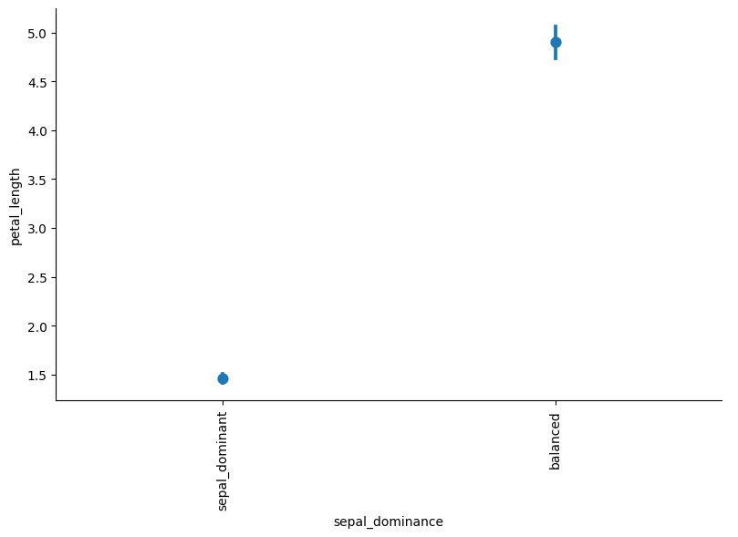
    


    

    


    
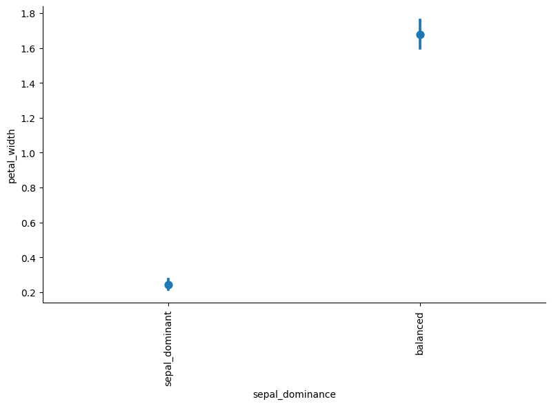
    


### Regression Plots — Linear Relationships Between Pairs of Numerical Variables, Colored by Categorical Variable


```python
def smart_downsample(
    df: pd.DataFrame,
    hue_col: str,
    num_cols: list[str],
    max_points: int = 10_000,
    outlier_keep: float = 1.0,
    random_state: int = SEED,
) -> pd.DataFrame:
    """Stratified downsample that preserves category proportions and keeps outliers.

    Parameters
    ----------
    df : pd.DataFrame
        Full dataset.
    hue_col : str
        Categorical column used for stratification.
    num_cols : list[str]
        Numerical columns checked for outliers (IQR method).
    max_points : int
        Target number of rows when df exceeds this size.
    outlier_keep : float
        Fraction of detected outliers to always keep (1.0 = all).
    random_state : int
        Reproducibility seed.

    Returns
    -------
    pd.DataFrame
        Down-sampled dataframe (original returned unchanged if small enough).
    """
    if len(df) <= max_points:
        return df
    # --- 1. Identify IQR outliers across all numerical columns ---
    outlier_mask = pd.Series(False, index=df.index)
    for col in num_cols:
        q1, q3 = df[col].quantile(0.25), df[col].quantile(0.75)
        iqr = q3 - q1
        outlier_mask |= (df[col] < q1 - 1.5 * iqr) | (df[col] > q3 + 1.5 * iqr)
    outliers = df[outlier_mask]
    if outlier_keep < 1.0:
        outliers = outliers.sample(frac=outlier_keep, random_state=random_state)
    # --- 2. Stratified sample from non-outlier rows ---
    non_outliers = df[~df.index.isin(outliers.index)]
    remaining_budget = max(0, max_points - len(outliers))
    if remaining_budget > 0 and len(non_outliers) > 0:
        frac = min(1.0, remaining_budget / len(non_outliers))
        sampled = non_outliers.groupby(hue_col, group_keys=False).apply(
            lambda g: g.sample(frac=frac, random_state=random_state)
        )
    else:
        sampled = non_outliers.iloc[:0]
    result = pd.concat([outliers, sampled]).drop_duplicates()
    print(
        f"smart_downsample: {len(df):,} → {len(result):,} rows "
        f"(outliers kept: {len(outliers):,}, sampled: {len(sampled):,})"
    )
    return result
```


```python
for x_var, y_var in combinations(CONTINUOUS_FEATURES, 2):
    for cat_var in CATEGORICAL_FEATURES:
        plot_df = smart_downsample(df_eda, hue_col=cat_var, num_cols=[x_var, y_var])
        sns.lmplot(
            data=plot_df,
            x=x_var,
            y=y_var,
            hue=cat_var,
            height=6,
            aspect=1.2,
        )
        plt.show()
```


    
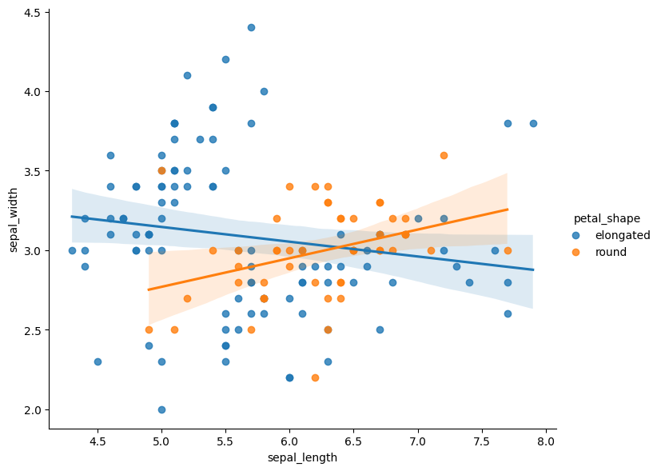
    


    
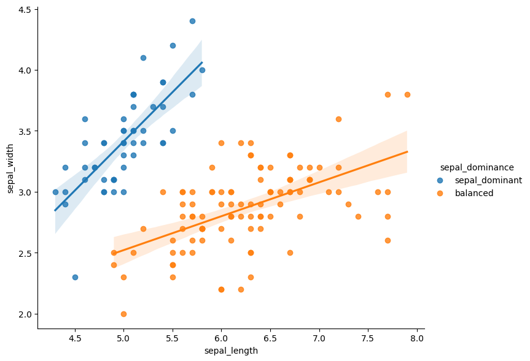
    


    
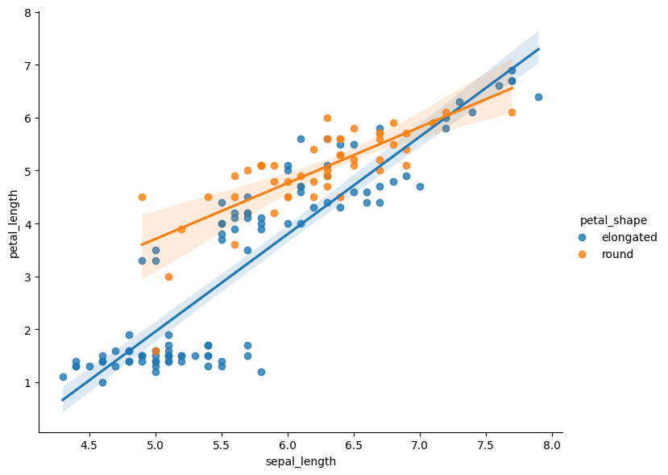
    


    
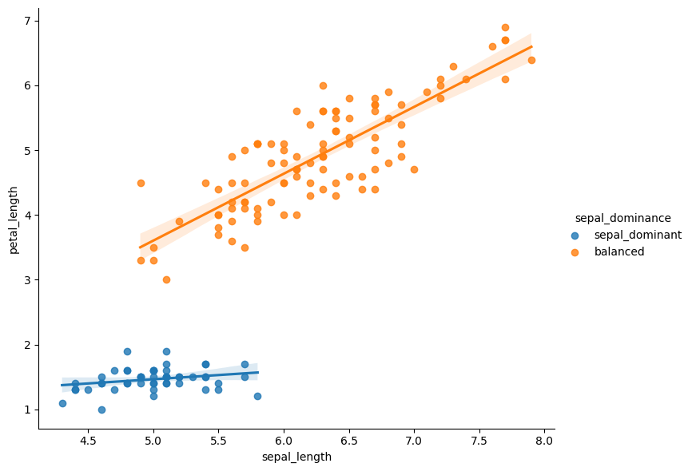
    


    
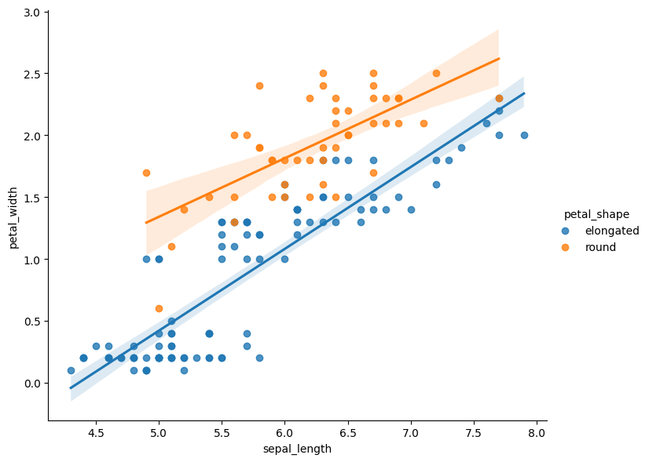
    


    
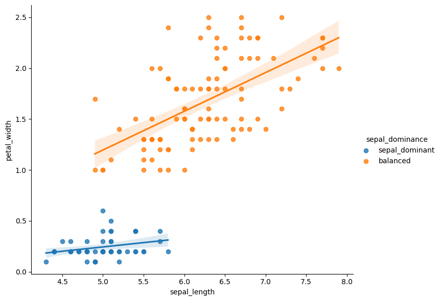
    


    
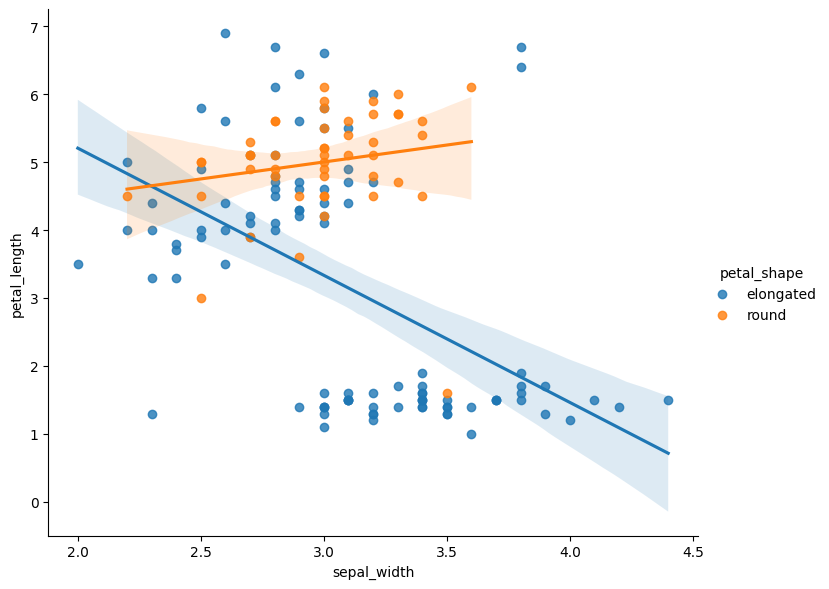
    


    
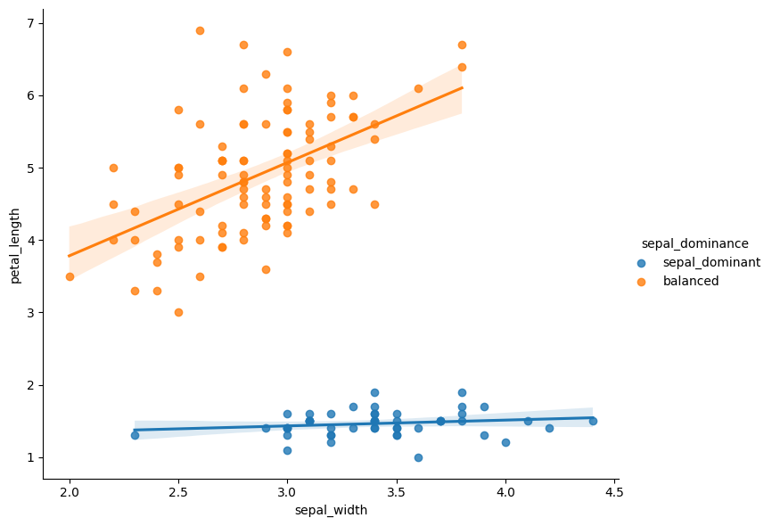
    


    
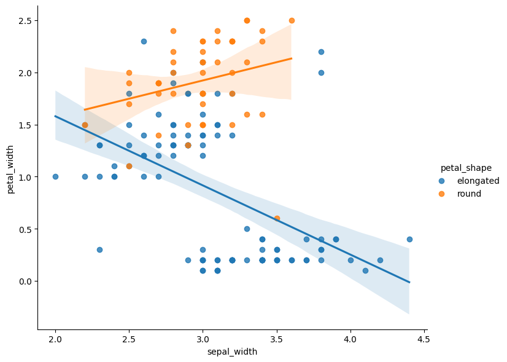
    


    
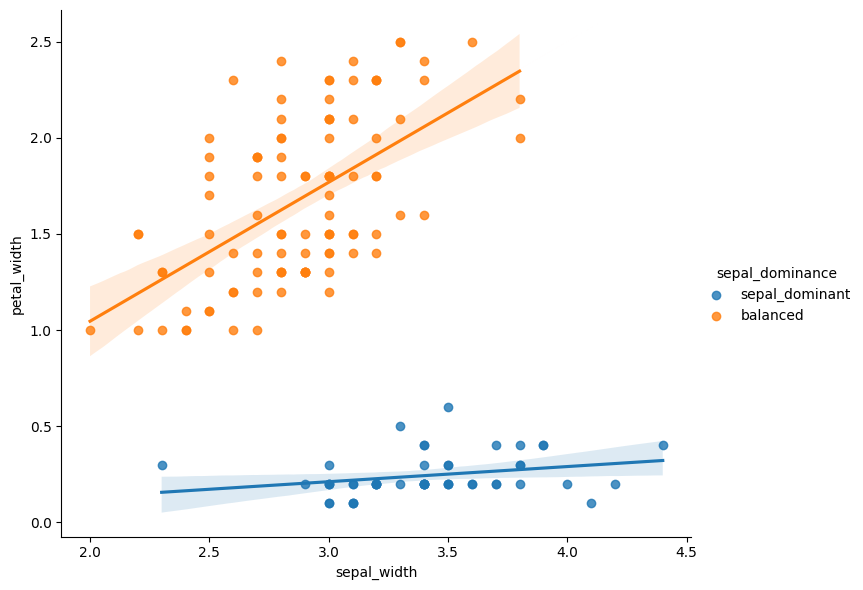
    


    
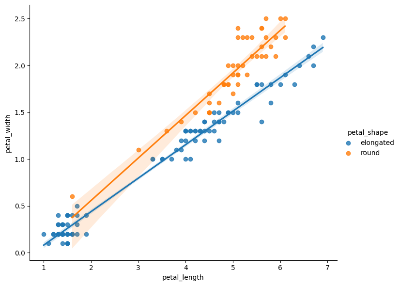
    


    
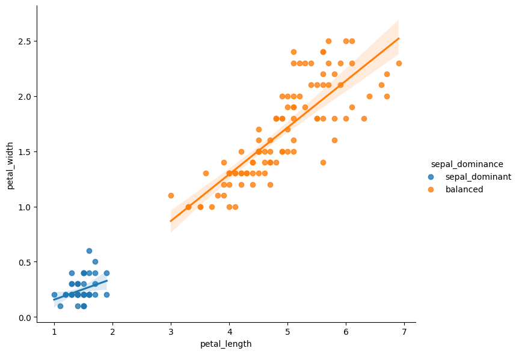
    


### Encode Categorical Variables for Correlation, Feature Importance Analysis & Modeling


```python
df_eda.dtypes
```


    sepal_length       float64
    sepal_width        float64
    petal_length       float64
    petal_width        float64
    species                str
    petal_shape            str
    sepal_dominance        str
    dtype: object


#### Encode `species` as Integer Labels (Classification)


```python
df_eda["species"].value_counts()
```


    species
    setosa        50
    versicolor    50
    virginica     50
    Name: count, dtype: int64


```python
df_eda["species"] = df_eda["species"].map(
    {
        "setosa": 0,
        "versicolor": 1,
        "virginica": 2,
    }
)
df_eda["species"]
```


    0      0
    1      0
    2      0
    3      0
    4      0
          ..
    145    2
    146    2
    147    2
    148    2
    149    2
    Name: species, Length: 150, dtype: int64


#### Encode `petal_shape` as Binary Float


```python
df_eda["petal_shape"].value_counts()
```


    petal_shape
    elongated    102
    round         48
    Name: count, dtype: int64


```python
df_eda["petal_shape"] = (
    df_eda["petal_shape"].map({"round": 0, "elongated": 1}).astype(float)
)
df_eda["petal_shape"]
```


    0      1.0
    1      1.0
    2      1.0
    3      1.0
    4      1.0
          ... 
    145    0.0
    146    0.0
    147    0.0
    148    0.0
    149    0.0
    Name: petal_shape, Length: 150, dtype: float64


#### Encode `sepal_dominance` as Binary Float


```python
df_eda["sepal_dominance"].value_counts()
```


    sepal_dominance
    balanced          100
    sepal_dominant     50
    Name: count, dtype: int64


```python
df_eda["sepal_dominance"] = (
    df_eda["sepal_dominance"].map({"balanced": 0, "sepal_dominant": 1}).astype(float)
)
df_eda["sepal_dominance"]
```


    0      1.0
    1      1.0
    2      1.0
    3      1.0
    4      1.0
          ... 
    145    0.0
    146    0.0
    147    0.0
    148    0.0
    149    0.0
    Name: sepal_dominance, Length: 150, dtype: float64


### Verify Data Types Match PyTorch Requirements (float for `X`, int for `y`)


```python
df_eda.dtypes
```


    sepal_length       float64
    sepal_width        float64
    petal_length       float64
    petal_width        float64
    species              int64
    petal_shape        float64
    sepal_dominance    float64
    dtype: object


### Correlation Plots — Correlation Matrix of All Numerical Variables


```python
fig, ax = plt.subplots(figsize=(14, 10))
sns.heatmap(
    data=df_eda.corr(),
    vmin=-1,
    vmax=1,
    center=0,
    cmap="coolwarm",
    cbar=True,
    annot=True,
    fmt=".2f",
    annot_kws={"size": 10},
    ax=ax,
)
plt.tight_layout()
plt.show()
```


    

    


### Correlation Plots — Feature Correlation w/ Target Variable


```python
feature_vars = df_eda.columns.drop(TARGET_VAR)
corr_with_target = (
    df_eda[feature_vars].corrwith(df_eda[TARGET_VAR]).sort_values(ascending=False)
)
fig, ax = plt.subplots(figsize=(10, 8))
colors = ["tab:red" if x >= 0 else "tab:green" for x in corr_with_target]
corr_with_target.plot(kind="barh", ax=ax, color=colors)
ax.set_xlabel(f"Correlation with {TARGET_VAR}")
ax.set_title(f"Feature Correlation with Target ({TARGET_VAR})")
ax.axvline(x=0, color="black", linestyle="--", linewidth=0.8)
plt.tight_layout()
plt.show()
```


    

    


### Create `features` Variable for Audit


```python
features = [col for col in df_eda.columns if col != TARGET_VAR]
features
```


    ['sepal_length',
     'sepal_width',
     'petal_length',
     'petal_width',
     'petal_shape',
     'sepal_dominance']


### Train/Test Split (Pre-Analysis)

Split **before** discriminative score analysis and feature audit to prevent data leakage. Test data must never influence feature selection decisions.


```python
# Stratified split BEFORE analysis to prevent data leakage
df_train, df_test = train_test_split(
    df_eda, test_size=TEST_SIZE, random_state=SEED, stratify=df_eda[TARGET_VAR]
)
print(f"Train: {len(df_train)}, Test: {len(df_test)}")
```

    Train: 105, Test: 45


## Discriminative Score Analysis

The **discriminative score** rates how useful a single feature is for separating two groups (label 0 vs label 1). It combines three normalized signals:

$$S = 0.4\,P + 0.4\,E + 0.2\,M$$

| Symbol | Name | Range | What it captures |
|---|---|---|---|
| $P$ | p-value strength | $[0, 1]$ | $\min\!\bigl(1,\;{-\log_{10}(p)}/{10}\bigr)$ — is the difference real? |
| $E$ | effect size | $[0, 1]$ | Cohen's $d$ (continuous) or Cramér's $V$ (categorical), capped at 1 |
| $M$ | mutual information | $[0, 1]$ | Normalized MI between feature and label |

### How to Interpret Each Value (Good vs Bad)

#### P — p-value strength
| P value | Raw p-value | Interpretation |
|---|---|---|
| < 0.05 | p > 0.3 | **Bad.** The difference could easily be random noise. |
| 0.05 - 0.20 | p ~ 0.01 - 0.1 | **Weak.** Some evidence, but not convincing. |
| 0.20 - 0.50 | p ~ 1e-2 to 1e-5 | **Good.** Strong statistical evidence the groups differ. |
| > 0.50 | p < 1e-5 | **Excellent.** Very strong evidence. |

#### E — effect size (Cohen's d or Cramer's V)
| E value | Interpretation |
|---|---|
| < 0.20 | **Negligible.** Groups overlap almost completely. |
| 0.20 - 0.50 | **Small.** Noticeable difference but lots of overlap. |
| 0.50 - 0.80 | **Medium.** Clear practical difference. |
| > 0.80 | **Large.** Groups are well separated. |

#### M — normalized mutual information
| M value | Interpretation |
|---|---|
| < 0.05 | **Bad.** Feature tells you almost nothing about the label. |
| 0.05 - 0.20 | **Weak.** Slight information gain. |
| 0.20 - 0.50 | **Good.** Feature meaningfully reduces uncertainty about the label. |
| > 0.50 | **Excellent.** Feature strongly predicts the label. |

#### S — final discriminative score
| S value | Interpretation |
|---|---|
| < 0.20 | **Drop it.** The feature is not useful for classification. |
| 0.20 - 0.40 | **Weak.** Might help slightly but do not rely on it alone. |
| 0.40 - 0.60 | **Moderate.** A decent feature worth including. |
| 0.60 - 0.80 | **Strong.** Reliable discriminator — prioritize this feature. |
| > 0.80 | **Excellent.** Top-tier feature with high significance, large effect, and high MI. |

### Continuous Features — Two-Sample t-Test

#### Sample Means

$$\bar{x} = \frac{1}{n}\sum_{i=1}^{n} x_i$$

#### Sample Variances (Bessel-corrected, ddof=1)

$$s^2 = \frac{1}{n-1}\sum_{i=1}^{n}(x_i - \bar{x})^2$$

#### Pooled Variance & t-Statistic

**Degrees of freedom:**

$$df = n_0 + n_1 - 2$$

**Pooled variance:**

$$s_p^2 = \frac{(n_0-1)\,s_0^2 + (n_1-1)\,s_1^2}{df}$$

**t-statistic:**

$$t = \frac{\bar{x}_1 - \bar{x}_0}{s_p\,\sqrt{\dfrac{1}{n_0} + \dfrac{1}{n_1}}}$$

#### Cohen's d → Component $E$

$$d = \frac{\bar{x}_1 - \bar{x}_0}{s_p}$$

$$E = \min(1,\;|d|)$$

### Categorical Features — Chi-Square Test

#### Contingency Table & Chi-Square Statistic

**Expected count:**

$$E_{ij} = \frac{(\text{row total}_i)(\text{col total}_j)}{n}$$

**Degrees of freedom:**

$$df = (r-1)(c-1)$$

**Chi-square statistic:**

$$\chi^2 = \sum_{i,j}\frac{(O_{ij} - E_{ij})^2}{E_{ij}}$$

#### Cramér's V → Component $E$

$$V = \sqrt{\frac{\chi^2}{n\,(\min(r,c) - 1)}}$$

$$E = \min(1,\;V)$$

### NMI → Component $M$

**Mutual Information:**

$$I(X;Y) = \sum_{x,y} p(x,y)\,\ln\!\frac{p(x,y)}{p(x)\,p(y)}$$

**Entropy:**

$$H(X) = -\sum_x p(x)\,\ln p(x)$$

**Normalized Mutual Information:**

$$\text{NMI} = \frac{I}{\sqrt{H(X) \cdot H(Y)}}$$

$$M = \text{NMI}$$

#### P Component & Final Score

$$P = \min\!\left(1,\;\frac{-\log_{10}(p)}{10}\right)$$

$$S = 0.4\,P + 0.4\,E + 0.2\,M$$

### Reusable Function: `compute_discriminative_score()`

Private helpers (prefixed `_`) are defined above the main function, in the exact order they are called.


```python
def _infer_feature_type(values):
    """
    Infer whether a pandas Series is continuous or categorical.

    Parameters:
        values (pd.Series): Feature column to evaluate.

    Returns:
        str: 'continuous' if numeric dtype, otherwise 'categorical'.
    """
    return "continuous" if pd.api.types.is_numeric_dtype(values) else "categorical"


def _continuous_stats(g0, g1, labels, values):
    """
    Compute p-value, effect size (Cohen's d), and NMI for a continuous feature.

    Parameters:
        g0 (np.ndarray): Feature values for label-0 samples.
        g1 (np.ndarray): Feature values for label-1 samples.
        labels (pd.Series): Full label column.
        values (pd.Series): Full feature column (used for median-split binning).

    Returns:
        tuple: (p_value, cohens_d, nmi).
    """
    n0, n1 = len(g0), len(g1)
    sp2 = ((n0 - 1) * g0.var(ddof=1) + (n1 - 1) * g1.var(ddof=1)) / (n0 + n1 - 2)
    sp = np.sqrt(sp2)
    _, p = stats.ttest_ind(g0, g1, equal_var=True)
    d = abs(g1.mean() - g0.mean()) / sp if sp > 0 else 0.0
    binned = (values > values.median()).astype(int)
    nmi = normalized_mutual_info_score(labels, binned)
    return p, d, nmi


def _categorical_stats(labels, values, n):
    """
    Compute p-value, effect size (Cramer's V), and NMI for a categorical feature.

    Parameters:
        labels (pd.Series): Binary label column.
        values (pd.Series): Categorical feature column.
        n (int): Total number of samples.

    Returns:
        tuple: (p_value, cramers_v, nmi).
    """
    ct = pd.crosstab(labels, values)
    chi2, p, _, _ = stats.chi2_contingency(ct, correction=False)
    k = min(ct.shape)
    v = np.sqrt(chi2 / (n * max(k - 1, 1)))
    nmi = normalized_mutual_info_score(labels, values)
    return p, v, nmi


def _compute_raw_stats(feature_type, labels, values, n):
    """
    Dispatch to the correct statistical test based on feature type.

    Parameters:
        feature_type (str): 'continuous' or 'categorical'.
        labels (pd.Series): Binary label column.
        values (pd.Series): Feature column.
        n (int): Total number of samples.

    Returns:
        tuple: (p_value, effect_size, nmi).
    """
    if feature_type == "continuous":
        g0 = values[labels == 0].dropna().values
        g1 = values[labels == 1].dropna().values
        return _continuous_stats(g0, g1, labels, values)
    return _categorical_stats(labels, values, n)


def _score_components(p_value, effect_size, nmi):
    """
    Normalize raw statistics into the P, E, M components and compute S.

    Parameters:
        p_value (float): Raw p-value from the statistical test.
        effect_size (float): Raw effect size (Cohen's d or Cramer's V).
        nmi (float): Normalized mutual information.

    Returns:
        dict: Keys: p_value, effect_size, nmi, P, E, M, S.
    """
    P = min(1.0, -np.log10(max(p_value, 1e-300)) / 10)
    E = min(1.0, effect_size)
    M = nmi
    S = 0.4 * P + 0.4 * E + 0.2 * M
    return {
        "p_value": p_value,
        "effect_size": effect_size,
        "nmi": nmi,
        "P": P,
        "E": E,
        "M": M,
        "S": S,
    }


def compute_discriminative_score(df, feature_col, label_col, feature_type="auto"):
    """
    Compute the discriminative score for a single feature.

    Parameters:
        df (pd.DataFrame): Input dataframe containing feature and label columns.
        feature_col (str): Name of the feature column to evaluate.
        label_col (str): Name of the binary label column (0 or 1).
        feature_type (str): 'continuous', 'categorical', or 'auto' (default: 'auto').

    Returns:
        dict: Keys: p_value, effect_size, nmi, P, E, M, S.
    """
    labels, values = df[label_col], df[feature_col]
    if feature_type == "auto":
        feature_type = _infer_feature_type(values)
    p, effect, nmi = _compute_raw_stats(feature_type, labels, values, len(df))
    return _score_components(p, effect, nmi)
```

### Apply Discriminative Score to Iris Features (One-vs-Rest)

Since Iris has 3 classes, we compute discriminative scores using a **one-vs-rest** (OVR) approach: for each species, we create a binary label (1 = target species, 0 = all others) and evaluate every feature.


```python
# Define feature types for discriminative score computation
feature_types = {col: "continuous" for col in CONTINUOUS_FEATURES}
for cat in CATEGORICAL_FEATURES:
    feature_types[cat] = "categorical"

# Compute discriminative scores for each feature vs each class (OVR)
disc_results = []
for class_idx, class_name in SPECIES_MAP.items():
    df_disc = df_train.copy()
    df_disc["binary_label"] = (df_disc[TARGET_VAR] == class_idx).astype(int)
    for feat in features:
        score = compute_discriminative_score(
            df_disc, feat, "binary_label", feature_type=feature_types[feat]
        )
        disc_results.append({"Feature": feat, "Class": class_name, **score})
disc_df = pd.DataFrame(disc_results)
disc_df
```


<div>
<table border="1" class="dataframe">
  <thead>
    <tr style="text-align: right;">
      <th></th>
      <th>Feature</th>
      <th>Class</th>
      <th>p_value</th>
      <th>effect_size</th>
      <th>nmi</th>
      <th>P</th>
      <th>E</th>
      <th>M</th>
      <th>S</th>
    </tr>
  </thead>
  <tbody>
    <tr>
      <th>0</th>
      <td>sepal_length</td>
      <td>setosa</td>
      <td>1.288405e-18</td>
      <td>2.234062</td>
      <td>0.413999</td>
      <td>1.000000</td>
      <td>1.000000</td>
      <td>0.413999</td>
      <td>0.882800</td>
    </tr>
    <tr>
      <th>1</th>
      <td>sepal_width</td>
      <td>setosa</td>
      <td>3.478401e-10</td>
      <td>1.437961</td>
      <td>0.197960</td>
      <td>0.945862</td>
      <td>1.000000</td>
      <td>0.197960</td>
      <td>0.817937</td>
    </tr>
    <tr>
      <th>2</th>
      <td>petal_length</td>
      <td>setosa</td>
      <td>1.611085e-42</td>
      <td>4.780438</td>
      <td>0.455829</td>
      <td>1.000000</td>
      <td>1.000000</td>
      <td>0.455829</td>
      <td>0.891166</td>
    </tr>
    <tr>
      <th>3</th>
      <td>petal_width</td>
      <td>setosa</td>
      <td>1.472239e-35</td>
      <td>3.946378</td>
      <td>0.427411</td>
      <td>1.000000</td>
      <td>1.000000</td>
      <td>0.427411</td>
      <td>0.885482</td>
    </tr>
    <tr>
      <th>4</th>
      <td>petal_shape</td>
      <td>setosa</td>
      <td>2.736120e-06</td>
      <td>0.457667</td>
      <td>0.239752</td>
      <td>0.556286</td>
      <td>0.457667</td>
      <td>0.239752</td>
      <td>0.453532</td>
    </tr>
    <tr>
      <th>5</th>
      <td>sepal_dominance</td>
      <td>setosa</td>
      <td>1.221358e-24</td>
      <td>1.000000</td>
      <td>1.000000</td>
      <td>1.000000</td>
      <td>1.000000</td>
      <td>1.000000</td>
      <td>1.000000</td>
    </tr>
    <tr>
      <th>6</th>
      <td>sepal_length</td>
      <td>versicolor</td>
      <td>5.301533e-01</td>
      <td>0.130402</td>
      <td>0.004954</td>
      <td>0.027560</td>
      <td>0.130402</td>
      <td>0.004954</td>
      <td>0.064176</td>
    </tr>
    <tr>
      <th>7</th>
      <td>sepal_width</td>
      <td>versicolor</td>
      <td>5.931626e-08</td>
      <td>1.210525</td>
      <td>0.154467</td>
      <td>0.722683</td>
      <td>1.000000</td>
      <td>0.154467</td>
      <td>0.719966</td>
    </tr>
    <tr>
      <th>8</th>
      <td>petal_length</td>
      <td>versicolor</td>
      <td>6.628994e-02</td>
      <td>0.384261</td>
      <td>0.001230</td>
      <td>0.117855</td>
      <td>0.384261</td>
      <td>0.001230</td>
      <td>0.201092</td>
    </tr>
    <tr>
      <th>9</th>
      <td>petal_width</td>
      <td>versicolor</td>
      <td>3.365922e-01</td>
      <td>0.199862</td>
      <td>0.006762</td>
      <td>0.047290</td>
      <td>0.199862</td>
      <td>0.006762</td>
      <td>0.100213</td>
    </tr>
    <tr>
      <th>10</th>
      <td>petal_shape</td>
      <td>versicolor</td>
      <td>1.303292e-01</td>
      <td>0.147635</td>
      <td>0.018284</td>
      <td>0.088496</td>
      <td>0.147635</td>
      <td>0.018284</td>
      <td>0.098109</td>
    </tr>
    <tr>
      <th>11</th>
      <td>sepal_dominance</td>
      <td>versicolor</td>
      <td>2.999548e-07</td>
      <td>0.500000</td>
      <td>0.274018</td>
      <td>0.652294</td>
      <td>0.500000</td>
      <td>0.274018</td>
      <td>0.515721</td>
    </tr>
    <tr>
      <th>12</th>
      <td>sepal_length</td>
      <td>virginica</td>
      <td>8.454484e-15</td>
      <td>1.878454</td>
      <td>0.260535</td>
      <td>1.000000</td>
      <td>1.000000</td>
      <td>0.260535</td>
      <td>0.852107</td>
    </tr>
    <tr>
      <th>13</th>
      <td>sepal_width</td>
      <td>virginica</td>
      <td>5.063281e-01</td>
      <td>0.138061</td>
      <td>0.003479</td>
      <td>0.029557</td>
      <td>0.138061</td>
      <td>0.003479</td>
      <td>0.067743</td>
    </tr>
    <tr>
      <th>14</th>
      <td>petal_length</td>
      <td>virginica</td>
      <td>4.021343e-19</td>
      <td>2.281304</td>
      <td>0.503104</td>
      <td>1.000000</td>
      <td>1.000000</td>
      <td>0.503104</td>
      <td>0.900621</td>
    </tr>
    <tr>
      <th>15</th>
      <td>petal_width</td>
      <td>virginica</td>
      <td>1.989687e-23</td>
      <td>2.689076</td>
      <td>0.538363</td>
      <td>1.000000</td>
      <td>1.000000</td>
      <td>0.538363</td>
      <td>0.907673</td>
    </tr>
    <tr>
      <th>16</th>
      <td>petal_shape</td>
      <td>virginica</td>
      <td>5.557304e-10</td>
      <td>0.605302</td>
      <td>0.293669</td>
      <td>0.925514</td>
      <td>0.605302</td>
      <td>0.293669</td>
      <td>0.671060</td>
    </tr>
    <tr>
      <th>17</th>
      <td>sepal_dominance</td>
      <td>virginica</td>
      <td>2.999548e-07</td>
      <td>0.500000</td>
      <td>0.274018</td>
      <td>0.652294</td>
      <td>0.500000</td>
      <td>0.274018</td>
      <td>0.515721</td>
    </tr>
  </tbody>
</table>
</div>


### Discriminative Score Visualization — Average Feature Importance


```python
# Average discriminative score across all OVR comparisons per feature
avg_scores = disc_df.groupby("Feature")["S"].mean().sort_values(ascending=False)

# Plot discriminative scores
fig, ax = plt.subplots(figsize=(10, 6))
colors = ["#4C72B0" if s >= 0.4 else "#DD8452" for s in avg_scores]
avg_scores.plot(kind="barh", ax=ax, color=colors)
ax.set_xlabel("Average Discriminative Score (S)")
ax.set_title("Discriminative Score: Feature Importance (One-vs-Rest)")
ax.axvline(
    x=0.4, color="red", linestyle="--", linewidth=0.8, label="Moderate Threshold"
)
ax.legend()
plt.tight_layout()
plt.show()
```


    
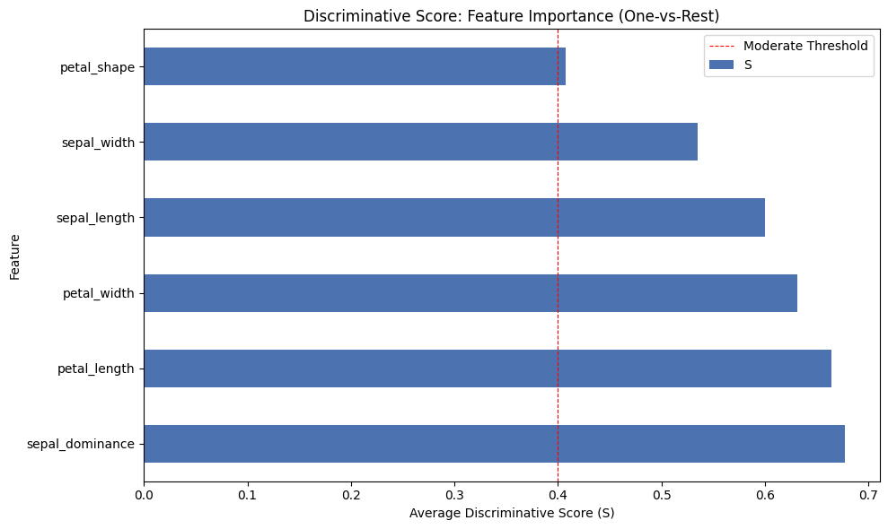
    


### Discriminative Score Visualization — Component Breakdown by Class


```python
# Component breakdown: P, E, M side by side for each class
fig, axes = plt.subplots(1, 3, figsize=(18, 5))
for idx, class_name in enumerate(["setosa", "versicolor", "virginica"]):
    class_data = disc_df[disc_df["Class"] == class_name].set_index("Feature")
    class_data[["P", "E", "M"]].plot(kind="bar", ax=axes[idx], ylim=(0, 1.15))
    axes[idx].set_title(f"Components: {class_name} vs Rest")
    axes[idx].set_ylabel("Value")
    axes[idx].set_xticklabels(axes[idx].get_xticklabels(), rotation=45, ha="right")
    axes[idx].legend(loc="upper right")
plt.tight_layout()
plt.show()
```


    

    


## Feature Selection Audit: Discriminative Score & Correlation


```python
def audit_reason(s):
    """
    Return a human-readable reason string based on discriminative score.

    Parameters:
        s (float): Average discriminative score.

    Returns:
        str: Interpretation of the score.
    """
    if s >= 0.8:
        return "Excellent — top-tier discriminator"
    if s >= 0.6:
        return "Strong — reliable discriminator"
    if s >= 0.4:
        return "Moderate — decent feature"
    if s >= 0.2:
        return "Weak — marginal value"
    return "Drop — not useful for classification"
```


```python
all_corrs = df_train[features].corrwith(df_train[TARGET_VAR])
results = []
for col in features:
    s = avg_scores[col]
    corr = all_corrs[col]
    recommendation = "\u2705 KEEP" if s >= 0.4 else "\u274c DROP"
    reason = audit_reason(s)
    results.append(
        {
            "Feature": col,
            "Avg_S": round(s, 4),
            "Correlation": round(corr, 4),
            "Recommendation": recommendation,
            "Reason": reason,
        }
    )
audit_df = (
    pd.DataFrame(results).sort_values("Avg_S", ascending=False).reset_index(drop=True)
)
audit_df
```


<div>
<table border="1" class="dataframe">
  <thead>
    <tr style="text-align: right;">
      <th></th>
      <th>Feature</th>
      <th>Avg_S</th>
      <th>Correlation</th>
      <th>Recommendation</th>
      <th>Reason</th>
    </tr>
  </thead>
  <tbody>
    <tr>
      <th>0</th>
      <td>sepal_dominance</td>
      <td>0.6771</td>
      <td>-0.8660</td>
      <td>✅ KEEP</td>
      <td>Strong — reliable discriminator</td>
    </tr>
    <tr>
      <th>1</th>
      <td>petal_length</td>
      <td>0.6643</td>
      <td>0.9532</td>
      <td>✅ KEEP</td>
      <td>Strong — reliable discriminator</td>
    </tr>
    <tr>
      <th>2</th>
      <td>petal_width</td>
      <td>0.6311</td>
      <td>0.9646</td>
      <td>✅ KEEP</td>
      <td>Strong — reliable discriminator</td>
    </tr>
    <tr>
      <th>3</th>
      <td>sepal_length</td>
      <td>0.5997</td>
      <td>0.8054</td>
      <td>✅ KEEP</td>
      <td>Moderate — decent feature</td>
    </tr>
    <tr>
      <th>4</th>
      <td>sepal_width</td>
      <td>0.5352</td>
      <td>-0.3639</td>
      <td>✅ KEEP</td>
      <td>Moderate — decent feature</td>
    </tr>
    <tr>
      <th>5</th>
      <td>petal_shape</td>
      <td>0.4076</td>
      <td>-0.6137</td>
      <td>✅ KEEP</td>
      <td>Moderate — decent feature</td>
    </tr>
  </tbody>
</table>
</div>


## Preprocessing

### Create `df_preprocessed` Dataset


```python
df_preprocessed = df_eda.copy()
df_preprocessed.shape
```


    (150, 7)


### Drop Low-Correlation Features

#### Based on Recommendations, Drop Features w/ Low-Correlation


```python
# df_preprocessed.drop(columns=[
#     "",
# ], inplace=True)
# df_preprocessed
```

### Save `df_preprocessed` Processed Dataset


```python
df_preprocessed.to_csv("iris_dataset_preprocessed.csv", index=False)
```

### Load `df_preprocessed` Processed Dataset


```python
df_preprocessed = pd.read_csv("iris_dataset_preprocessed.csv")
df_preprocessed
```


<div>
<table border="1" class="dataframe">
  <thead>
    <tr style="text-align: right;">
      <th></th>
      <th>sepal_length</th>
      <th>sepal_width</th>
      <th>petal_length</th>
      <th>petal_width</th>
      <th>species</th>
      <th>petal_shape</th>
      <th>sepal_dominance</th>
    </tr>
  </thead>
  <tbody>
    <tr>
      <th>0</th>
      <td>5.1</td>
      <td>3.5</td>
      <td>1.4</td>
      <td>0.2</td>
      <td>0</td>
      <td>1.0</td>
      <td>1.0</td>
    </tr>
    <tr>
      <th>1</th>
      <td>4.9</td>
      <td>3.0</td>
      <td>1.4</td>
      <td>0.2</td>
      <td>0</td>
      <td>1.0</td>
      <td>1.0</td>
    </tr>
    <tr>
      <th>2</th>
      <td>4.7</td>
      <td>3.2</td>
      <td>1.3</td>
      <td>0.2</td>
      <td>0</td>
      <td>1.0</td>
      <td>1.0</td>
    </tr>
    <tr>
      <th>3</th>
      <td>4.6</td>
      <td>3.1</td>
      <td>1.5</td>
      <td>0.2</td>
      <td>0</td>
      <td>1.0</td>
      <td>1.0</td>
    </tr>
    <tr>
      <th>4</th>
      <td>5.0</td>
      <td>3.6</td>
      <td>1.4</td>
      <td>0.2</td>
      <td>0</td>
      <td>1.0</td>
      <td>1.0</td>
    </tr>
    <tr>
      <th>...</th>
      <td>...</td>
      <td>...</td>
      <td>...</td>
      <td>...</td>
      <td>...</td>
      <td>...</td>
      <td>...</td>
    </tr>
    <tr>
      <th>145</th>
      <td>6.7</td>
      <td>3.0</td>
      <td>5.2</td>
      <td>2.3</td>
      <td>2</td>
      <td>0.0</td>
      <td>0.0</td>
    </tr>
    <tr>
      <th>146</th>
      <td>6.3</td>
      <td>2.5</td>
      <td>5.0</td>
      <td>1.9</td>
      <td>2</td>
      <td>0.0</td>
      <td>0.0</td>
    </tr>
    <tr>
      <th>147</th>
      <td>6.5</td>
      <td>3.0</td>
      <td>5.2</td>
      <td>2.0</td>
      <td>2</td>
      <td>0.0</td>
      <td>0.0</td>
    </tr>
    <tr>
      <th>148</th>
      <td>6.2</td>
      <td>3.4</td>
      <td>5.4</td>
      <td>2.3</td>
      <td>2</td>
      <td>0.0</td>
      <td>0.0</td>
    </tr>
    <tr>
      <th>149</th>
      <td>5.9</td>
      <td>3.0</td>
      <td>5.1</td>
      <td>1.8</td>
      <td>2</td>
      <td>0.0</td>
      <td>0.0</td>
    </tr>
  </tbody>
</table>
<p>150 rows × 7 columns</p>
</div>


### Update `features` Variable for Modeling


```python
features = [col for col in df_preprocessed.columns if col != TARGET_VAR]
features
```


    ['sepal_length',
     'sepal_width',
     'petal_length',
     'petal_width',
     'petal_shape',
     'sepal_dominance']


## Reusable ML Pipeline

### Model Architecture


```python
class IrisMLP(nn.Module):
    """A feedforward neural network with two hidden layers and optional dropout."""

    def __init__(self, in_features, h1=8, h2=8, out_features=3, dropout=0.0):
        """
        Initialize the neural network layers.

        Parameters:
            in_features (int): Number of input features.
            h1 (int): Neurons in hidden layer 1.
            h2 (int): Neurons in hidden layer 2.
            out_features (int): Number of output classes.
            dropout (float): Dropout rate.
        """
        super().__init__()
        self.fc1 = nn.Linear(in_features, h1)
        self.fc2 = nn.Linear(h1, h2)
        self.out = nn.Linear(h2, out_features)
        self.dropout = nn.Dropout(p=dropout)

    def forward(self, x):
        """
        Define the forward pass.

        Parameters:
            x (torch.Tensor): Input tensor.

        Returns:
            torch.Tensor: Output logits.
        """
        x = F.relu(self.fc1(x))
        x = self.dropout(x)
        x = F.relu(self.fc2(x))
        x = self.dropout(x)
        return self.out(x)
```

### Dataset Class


```python
class NumpyDataset(torch.utils.data.Dataset):
    """Memory-efficient dataset converting numpy arrays to tensors on demand."""

    def __init__(self, X, y, device):
        """
        Initialize with numpy arrays.

        Parameters:
            X (np.ndarray): Feature array.
            y (np.ndarray): Label array.
            device (torch.device): Target device.
        """
        self.X = X
        self.y = y
        self.device = device

    def __len__(self):
        """Return the number of samples in the dataset."""
        return len(self.X)

    def __getitem__(self, idx):
        """
        Return a single sample as tensors on the specified device.

        Parameters:
            idx (int): Sample index.

        Returns:
            tuple[torch.Tensor, torch.Tensor]: Feature and label tensors.
        """
        X_tensor = torch.tensor(self.X[idx]).float().to(self.device)
        y_tensor = torch.tensor(self.y[idx]).long().to(self.device)
        return X_tensor, y_tensor
```

### Data Preparation Functions


```python
def _extract_arrays(df, feature_cols, target_col):
    """
    Extract feature and target arrays from a DataFrame.

    Parameters:
        df (pd.DataFrame): Source dataframe.
        feature_cols (list): Feature column names.
        target_col (str): Target column name.

    Returns:
        tuple: (X, y) as numpy arrays.
    """
    X = df[feature_cols].values.astype("float32")
    y = df[target_col].values.astype("int64")
    return X, y


def _fit_scaler(X_train, feature_cols):
    """
    Fit StandardScaler on training features.

    Parameters:
        X_train (np.ndarray): Training feature array.
        feature_cols (list): Feature column names.

    Returns:
        tuple: (scaled_DataFrame, fitted_scaler).
    """
    scaler = StandardScaler()
    X_scaled = pd.DataFrame(scaler.fit_transform(X_train), columns=feature_cols)
    return X_scaled, scaler


def _scale_array(X, scaler, feature_cols):
    """
    Transform a feature array with a fitted scaler.

    Parameters:
        X (np.ndarray): Feature array to transform.
        scaler (StandardScaler): Fitted scaler.
        feature_cols (list): Feature column names.

    Returns:
        pd.DataFrame: Scaled features.
    """
    return pd.DataFrame(scaler.transform(X), columns=feature_cols)


def _split_indices(n, size, seed, stratify):
    """
    Return stratified train/validation index arrays.

    Parameters:
        n (int): Total number of samples.
        size (float): Fraction for the validation set.
        seed (int): Random seed.
        stratify (np.ndarray): Labels for stratification.

    Returns:
        tuple: (train_indices, val_indices).
    """
    return train_test_split(
        np.arange(n), test_size=size, random_state=seed, stratify=stratify
    )


def prepare_data(df_train, df_test, feature_cols, target_col, val_size, seed):
    """
    Sub-split train into train/val, scale all three sets, return arrays + scaler.

    Parameters:
        df_train (pd.DataFrame): Training dataframe (from early split).
        df_test (pd.DataFrame): Test dataframe (from early split).
        feature_cols (list): Feature column names.
        target_col (str): Target column name.
        val_size (float): Fraction of training data for validation.
        seed (int): Random seed.

    Returns:
        tuple: (X_tr, X_val, X_te, y_tr, y_val, y_te, scaler).
    """
    X_all, y_all = _extract_arrays(df_train, feature_cols, target_col)
    X_te_raw, y_te = _extract_arrays(df_test, feature_cols, target_col)
    tr_idx, val_idx = _split_indices(len(X_all), val_size, seed, y_all)
    X_tr, scaler = _fit_scaler(X_all[tr_idx], feature_cols)
    X_val = _scale_array(X_all[val_idx], scaler, feature_cols)
    X_te = _scale_array(X_te_raw, scaler, feature_cols)
    return X_tr, X_val, X_te, y_all[tr_idx], y_all[val_idx], y_te, scaler


def _compute_class_weights(y_train, device):
    """
    Compute inverse-frequency class weights for imbalanced datasets.

    Parameters:
        y_train (np.ndarray): Training labels.
        device (torch.device): Target device for the weight tensor.

    Returns:
        torch.Tensor: Class weight tensor (balanced datasets get ~equal weights).
    """
    counts = np.bincount(y_train)
    weights = len(y_train) / (len(counts) * counts)
    return torch.tensor(weights, dtype=torch.float32).to(device)


def _make_loader(X, y, device, batch_size, shuffle):
    """
    Create a DataLoader from a feature DataFrame and label array.

    Parameters:
        X (pd.DataFrame): Scaled feature DataFrame.
        y (np.ndarray): Label array.
        device (torch.device): Target device.
        batch_size (int): Batch size.
        shuffle (bool): Whether to shuffle.

    Returns:
        DataLoader: Configured data loader.
    """
    return DataLoader(
        NumpyDataset(X.values, y, device), batch_size=batch_size, shuffle=shuffle
    )


def create_loaders(X_tr, X_val, X_te, y_tr, y_val, y_te, device, batch_size):
    """
    Create train, validation, and test DataLoaders.

    Parameters:
        X_tr (pd.DataFrame): Scaled training features.
        X_val (pd.DataFrame): Scaled validation features.
        X_te (pd.DataFrame): Scaled test features.
        y_tr (np.ndarray): Training labels.
        y_val (np.ndarray): Validation labels.
        y_te (np.ndarray): Test labels.
        device (torch.device): Target device.
        batch_size (int): Batch size.

    Returns:
        tuple: (train_loader, val_loader, test_loader).
    """
    train_ldr = _make_loader(X_tr, y_tr, device, batch_size, shuffle=True)
    val_ldr = _make_loader(X_val, y_val, device, batch_size, shuffle=False)
    test_ldr = _make_loader(X_te, y_te, device, batch_size, shuffle=False)
    return train_ldr, val_ldr, test_ldr
```

### Training Functions


```python
def _train_batch(model, X_batch, y_batch, criterion, optimizer):
    """
    Process one training batch and return batch loss.

    Parameters:
        model (nn.Module): Model being trained.
        X_batch (torch.Tensor): Input batch.
        y_batch (torch.Tensor): Label batch.
        criterion: Loss function.
        optimizer: Optimizer.

    Returns:
        float: Batch loss value.
    """
    optimizer.zero_grad()
    loss = criterion(model(X_batch), y_batch)
    loss.backward()
    optimizer.step()
    return loss.item()


def _run_train_epoch(model, loader, criterion, optimizer):
    """
    Run one full training epoch and return average loss.

    Parameters:
        model (nn.Module): Model being trained.
        loader (DataLoader): Training data loader.
        criterion: Loss function.
        optimizer: Optimizer.

    Returns:
        float: Average training loss for the epoch.
    """
    model.train()
    total_loss = 0.0
    for X_batch, y_batch in loader:
        total_loss += _train_batch(model, X_batch, y_batch, criterion, optimizer)
    return total_loss / len(loader)


def _run_val_epoch(model, loader, criterion):
    """
    Run one full validation epoch and return average loss.

    Parameters:
        model (nn.Module): Model being evaluated.
        loader (DataLoader): Validation data loader.
        criterion: Loss function.

    Returns:
        float: Average validation loss for the epoch.
    """
    model.eval()
    total_loss = 0.0
    with torch.no_grad():
        for X_batch, y_batch in loader:
            total_loss += criterion(model(X_batch), y_batch).item()
    return total_loss / len(loader)


def _save_if_improved(model, val_loss, best_val_loss, path, counter):
    """
    Save model if val loss improved; return (best_loss, patience_counter).

    Parameters:
        model (nn.Module): Model to potentially save.
        val_loss (float): Current validation loss.
        best_val_loss (float): Best validation loss so far.
        path (str): File path for saving weights.
        counter (int): Current patience counter.

    Returns:
        tuple: (updated_best_loss, updated_patience_counter).
    """
    if val_loss < best_val_loss:
        torch.save(model.state_dict(), path)
        return val_loss, 0
    return best_val_loss, counter + 1


def _check_early_stop(counter, patience, epoch):
    """
    Print message and return True if patience is exhausted.

    Parameters:
        counter (int): Epochs without improvement.
        patience (int): Maximum allowed patience.
        epoch (int): Current epoch number.

    Returns:
        bool: True if training should stop.
    """
    if counter >= patience:
        print(f"Early stopping at epoch {epoch} (patience={patience})")
        return True
    return False


def _log_progress(epoch, epochs, train_loss, val_loss, interval):
    """
    Print epoch progress at specified intervals.

    Parameters:
        epoch (int): Current epoch number.
        epochs (int): Total number of epochs.
        train_loss (float): Training loss for this epoch.
        val_loss (float): Validation loss for this epoch.
        interval (int): Logging interval.
    """
    if epoch % interval == 0:
        print(f"Epoch {epoch}/{epochs} - Train: {train_loss:.4f} - Val: {val_loss:.4f}")


def train_model(model, train_loader, val_loader, criterion, optimizer, config):
    """
    Full training loop with validation, checkpointing, early stopping, and logging.

    Parameters:
        model (nn.Module): Model to train.
        train_loader (DataLoader): Training data loader.
        val_loader (DataLoader): Validation data loader.
        criterion: Loss function.
        optimizer: Optimizer.
        config (dict): Keys: epochs, log_interval, save_path, patience.

    Returns:
        tuple: (train_losses, val_losses, best_val_loss).
    """
    train_losses, val_losses, best, ctr = [], [], float("inf"), 0
    for epoch in range(config["epochs"]):
        train_losses.append(_run_train_epoch(model, train_loader, criterion, optimizer))
        val_losses.append(_run_val_epoch(model, val_loader, criterion))
        best, ctr = _save_if_improved(
            model, val_losses[-1], best, config["save_path"], ctr
        )
        _log_progress(
            epoch,
            config["epochs"],
            train_losses[-1],
            val_losses[-1],
            config["log_interval"],
        )
        if _check_early_stop(ctr, config["patience"], epoch):
            break
    return train_losses, val_losses, best
```

### Evaluation Functions


```python
def _accumulate_batch(y_true, y_pred, y_probs, logits, y_batch):
    """
    Accumulate predictions and probabilities from a single batch.

    Parameters:
        y_true (list): Accumulator for true labels.
        y_pred (list): Accumulator for predicted labels.
        y_probs (list): Accumulator for class probabilities.
        logits (torch.Tensor): Raw model output.
        y_batch (torch.Tensor): True label batch.
    """
    y_true.extend(y_batch.cpu().numpy())
    y_pred.extend(logits.argmax(dim=1).cpu().numpy())
    y_probs.extend(F.softmax(logits, dim=1).cpu().numpy())


def collect_predictions(model, loader):
    """
    Collect all predictions, true labels, and probabilities from a loader.

    Parameters:
        model (nn.Module): Trained model.
        loader (DataLoader): Data loader to iterate over.

    Returns:
        tuple: (y_true, y_pred, y_probs) as numpy arrays.
    """
    y_true, y_pred, y_probs = [], [], []
    model.eval()
    with torch.no_grad():
        for X_batch, y_batch in loader:
            _accumulate_batch(y_true, y_pred, y_probs, model(X_batch), y_batch)
    return np.array(y_true), np.array(y_pred), np.array(y_probs)
```

### Visualization Functions


```python
def _draw_pie(ax, accuracy, title):
    """
    Draw a single accuracy pie chart on the given axis.

    Parameters:
        ax (matplotlib.axes.Axes): Target axis.
        accuracy (float): Accuracy value (0 to 1).
        title (str): Chart title.
    """
    colors = ["#00FF00", "#FF0000"]
    ax.pie(
        [accuracy, 1 - accuracy],
        labels=["Correct", "Incorrect"],
        autopct="%1.1f%%",
        colors=colors,
        startangle=90,
        explode=(0.1, 0),
    )
    ax.set_title(title)


def plot_accuracy_pies(train_acc, test_acc):
    """
    Display training and test accuracy as side-by-side pie charts.

    Parameters:
        train_acc (float): Training accuracy.
        test_acc (float): Test accuracy.
    """
    fig, (ax1, ax2) = plt.subplots(1, 2, figsize=(10, 5))
    _draw_pie(ax1, train_acc, "Training Accuracy")
    _draw_pie(ax2, test_acc, "Test Accuracy")
    plt.tight_layout()
    plt.show()


def plot_confusion_matrix(y_true, y_pred, class_names):
    """
    Display confusion matrix as a heatmap.

    Parameters:
        y_true (array): True labels.
        y_pred (array): Predicted labels.
        class_names (list): Human-readable class names.
    """
    cm = confusion_matrix(y_true, y_pred)
    plt.figure(figsize=(8, 6))
    sns.heatmap(
        cm,
        annot=True,
        fmt="d",
        cmap="Blues",
        xticklabels=class_names,
        yticklabels=class_names,
    )
    plt.xlabel("Predicted Label")
    plt.ylabel("Actual Label")
    plt.title("Confusion Matrix")
    plt.show()


def plot_loss_curves(train_losses, val_losses):
    """
    Plot training and validation loss curves over epochs.

    Parameters:
        train_losses (list): Training loss per epoch.
        val_losses (list): Validation loss per epoch.
    """
    plt.figure(figsize=(10, 6))
    plt.plot(range(len(train_losses)), train_losses, label="Training Loss")
    plt.plot(range(len(val_losses)), val_losses, label="Validation Loss")
    plt.xlabel("Epochs")
    plt.ylabel("Loss")
    plt.title("Training and Validation Loss Over Epochs")
    plt.legend()
    plt.show()
```

### ROC & Metrics Functions


```python
def _plot_class_roc(ax, y_true, y_probs, class_idx, class_name, color):
    """
    Plot ROC curve for a single class on the given axes.

    Parameters:
        ax (matplotlib.axes.Axes): Target axis.
        y_true (array): True labels.
        y_probs (array): Class probabilities.
        class_idx (int): Class index for OVR.
        class_name (str): Human-readable class name.
        color (str): Line color.
    """
    y_binary = (np.array(y_true) == class_idx).astype(int)
    fpr, tpr, _ = roc_curve(y_binary, y_probs[:, class_idx])
    class_auc = auc(fpr, tpr)
    ax.plot(fpr, tpr, color=color, lw=2, label=f"{class_name} (AUC = {class_auc:.4f})")


def _format_roc_axes(ax, overall_auc):
    """
    Configure ROC plot axes and formatting.

    Parameters:
        ax (matplotlib.axes.Axes): Target axis.
        overall_auc (float): Overall AUC score.
    """
    ax.plot([0, 1], [0, 1], "k--", label="Random (AUC = 0.50)")
    ax.set_xlabel("False Positive Rate")
    ax.set_ylabel("True Positive Rate")
    ax.set_title(f"Multi-Class ROC Curve (Overall AUC = {overall_auc:.4f})")
    ax.legend(loc="lower right")
    ax.grid(alpha=0.3)


def plot_roc_curves(y_true, y_probs, class_names):
    """
    Plot multi-class ROC curves with per-class and overall AUC.

    Parameters:
        y_true (array): True labels.
        y_probs (array): Predicted probabilities (n_samples, n_classes).
        class_names (list): Human-readable class names.
    """
    colors = ["red", "green", "blue"]
    overall_auc = roc_auc_score(y_true, y_probs, multi_class="ovr")
    fig, ax = plt.subplots(figsize=(10, 8))
    for idx, name in enumerate(class_names):
        _plot_class_roc(ax, y_true, y_probs, idx, name, colors[idx])
    _format_roc_axes(ax, overall_auc)
    plt.tight_layout()
    plt.show()


def _compute_all_metrics(y_true, y_pred, y_probs):
    """
    Compute all classification metrics and return as dict.

    Parameters:
        y_true (array): True labels.
        y_pred (array): Predicted labels.
        y_probs (array): Class probabilities.

    Returns:
        dict: Metric names mapped to scores.
    """
    acc = accuracy_score(y_true, y_pred)
    prec, rec, f1, _ = precision_recall_fscore_support(
        y_true, y_pred, average="weighted"
    )
    auc_val = roc_auc_score(y_true, y_probs, multi_class="ovr")
    return {
        "Accuracy": acc,
        "Precision": prec,
        "Recall": rec,
        "F1-Score": f1,
        "ROC AUC": auc_val,
    }


def _metric_descriptions():
    """
    Return descriptions for each classification metric.

    Returns:
        dict: Metric names mapped to description strings.
    """
    return {
        "Accuracy": "Overall correctness (caution: misleading if imbalanced)",
        "Precision": "When predicting positive, how often correct?",
        "Recall": "Of all actual positives, how many found?",
        "F1-Score": "Harmonic mean of Precision & Recall",
        "ROC AUC": "Class separability (1.0 = perfect)",
    }


def print_summary_metrics(y_true, y_pred, y_probs):
    """
    Print formatted classification metrics table.

    Parameters:
        y_true (array): True labels.
        y_pred (array): Predicted labels.
        y_probs (array): Class probabilities.
    """
    metrics = _compute_all_metrics(y_true, y_pred, y_probs)
    descs = _metric_descriptions()
    print("-" * 90)
    print(f"{'METRIC':<15} {'SCORE':<10} {'DESCRIPTION'}")
    print("-" * 90)
    for name, score in metrics.items():
        print(f"{name:<15} {score:.4f}     {descs[name]}")
    print("-" * 90)
```

### Inference Functions


```python
def _prepare_input_tensor(features, device):
    """
    Prepare input features as a tensor on the specified device.

    Parameters:
        features (list[float]): Feature values.
        device (torch.device): Target device.

    Returns:
        torch.Tensor: Input tensor with shape (1, n_features).
    """
    X_new = torch.tensor(features).float().to(device)
    if X_new.dim() == 1:
        X_new = X_new.unsqueeze(0)
    return X_new


def _get_prediction_details(logits):
    """
    Extract predicted class and confidence from logits.

    Parameters:
        logits (torch.Tensor): Raw model output.

    Returns:
        tuple: (predicted_class_index, confidence_score).
    """
    probabilities = torch.softmax(logits, dim=1)
    predicted_class = logits.argmax(dim=1).item()
    confidence = probabilities[0][predicted_class].item()
    return predicted_class, confidence


def predict(model, features, species_map, device):
    """
    Make a prediction on new data.

    Parameters:
        model (nn.Module): Trained model.
        features (list[float]): Feature values (pre-scaled).
        species_map (dict): Mapping of class index to name.
        device (torch.device): Target device.

    Returns:
        tuple: (class_name, confidence_score).
    """
    model.eval()
    with torch.no_grad():
        X_new = _prepare_input_tensor(features, device)
        logits = model(X_new)
        pred_class, confidence = _get_prediction_details(logits)
        return species_map[pred_class], confidence
```

## Model

### Data Preparation & Training


```python
# Prepare data using all features (train/val/test from early split)
X_tr_full, X_val_full, X_te_full, y_tr_full, y_val_full, y_te_full, scaler = (
    prepare_data(df_train, df_test, features, TARGET_VAR, VAL_SIZE, SEED)
)
train_loader_full, val_loader_full, test_loader_full = create_loaders(
    X_tr_full,
    X_val_full,
    X_te_full,
    y_tr_full,
    y_val_full,
    y_te_full,
    DEVICE,
    BATCH_SIZE,
)
print(f"Features ({len(features)}): {features}")
print(f"Train: {len(y_tr_full)}, Val: {len(y_val_full)}, Test: {len(y_te_full)}")
```

    Features (6): ['sepal_length', 'sepal_width', 'petal_length', 'petal_width', 'petal_shape', 'sepal_dominance']
    Train: 89, Val: 16, Test: 45


```python
# Create and train the full-feature model
model_full = IrisMLP(
    in_features=len(features), h1=H1, h2=H2, out_features=OUT_FEATURES, dropout=DROPOUT
).to(DEVICE)
class_weights_full = _compute_class_weights(y_tr_full, DEVICE)
criterion = nn.CrossEntropyLoss(weight=class_weights_full)
optimizer = torch.optim.AdamW(model_full.parameters(), lr=LR)
full_config = {
    "epochs": EPOCHS,
    "log_interval": LOG_INTERVAL,
    "save_path": MODEL_PATH,
    "patience": PATIENCE,
}
train_losses_full, val_losses_full, best_full = train_model(
    model_full, train_loader_full, val_loader_full, criterion, optimizer, full_config
)
print(f"\nBest Validation Loss: {best_full:.4f}")
```

    Epoch 0/1000 - Train: 1.1338 - Val: 1.0963
    Epoch 10/1000 - Train: 0.5337 - Val: 0.5446
    Epoch 20/1000 - Train: 0.4015 - Val: 0.3771
    Epoch 30/1000 - Train: 0.2559 - Val: 0.2179
    Epoch 40/1000 - Train: 0.1581 - Val: 0.1224
    Epoch 50/1000 - Train: 0.1134 - Val: 0.0760
    Epoch 60/1000 - Train: 0.0916 - Val: 0.0513
    Epoch 70/1000 - Train: 0.0798 - Val: 0.0355
    Epoch 80/1000 - Train: 0.0703 - Val: 0.0286
    Epoch 90/1000 - Train: 0.0418 - Val: 0.0159
    Epoch 100/1000 - Train: 0.0299 - Val: 0.0082
    Epoch 110/1000 - Train: 0.0236 - Val: 0.0056
    Epoch 120/1000 - Train: 0.0210 - Val: 0.0042
    Epoch 130/1000 - Train: 0.0201 - Val: 0.0033
    Epoch 140/1000 - Train: 0.0203 - Val: 0.0026
    Epoch 150/1000 - Train: 0.0152 - Val: 0.0023
    Epoch 160/1000 - Train: 0.0136 - Val: 0.0019
    Epoch 170/1000 - Train: 0.0179 - Val: 0.0016
    Epoch 180/1000 - Train: 0.0138 - Val: 0.0014
    Epoch 190/1000 - Train: 0.0113 - Val: 0.0013
    Epoch 200/1000 - Train: 0.0120 - Val: 0.0012
    Epoch 210/1000 - Train: 0.0090 - Val: 0.0010
    Epoch 220/1000 - Train: 0.0081 - Val: 0.0009
    Epoch 230/1000 - Train: 0.0077 - Val: 0.0008
    Epoch 240/1000 - Train: 0.0084 - Val: 0.0007
    Epoch 250/1000 - Train: 0.0068 - Val: 0.0006
    Epoch 260/1000 - Train: 0.0062 - Val: 0.0006
    Epoch 270/1000 - Train: 0.0061 - Val: 0.0005
    Epoch 280/1000 - Train: 0.0058 - Val: 0.0005
    Epoch 290/1000 - Train: 0.0056 - Val: 0.0004
    Epoch 300/1000 - Train: 0.0055 - Val: 0.0004
    Epoch 310/1000 - Train: 0.0046 - Val: 0.0004
    Epoch 320/1000 - Train: 0.0053 - Val: 0.0003
    Epoch 330/1000 - Train: 0.0052 - Val: 0.0003
    Epoch 340/1000 - Train: 0.0040 - Val: 0.0003
    Epoch 350/1000 - Train: 0.0036 - Val: 0.0003
    Epoch 360/1000 - Train: 0.0034 - Val: 0.0003
    Epoch 370/1000 - Train: 0.0032 - Val: 0.0002
    Epoch 380/1000 - Train: 0.0033 - Val: 0.0002
    Epoch 390/1000 - Train: 0.0031 - Val: 0.0002
    Epoch 400/1000 - Train: 0.0035 - Val: 0.0002
    Epoch 410/1000 - Train: 0.0028 - Val: 0.0002
    Epoch 420/1000 - Train: 0.0025 - Val: 0.0002
    Epoch 430/1000 - Train: 0.0031 - Val: 0.0002
    Epoch 440/1000 - Train: 0.0027 - Val: 0.0002
    Epoch 450/1000 - Train: 0.0027 - Val: 0.0001
    Epoch 460/1000 - Train: 0.0025 - Val: 0.0001
    Epoch 470/1000 - Train: 0.0022 - Val: 0.0001
    Epoch 480/1000 - Train: 0.0022 - Val: 0.0001
    Epoch 490/1000 - Train: 0.0022 - Val: 0.0001
    Epoch 500/1000 - Train: 0.0018 - Val: 0.0001
    Epoch 510/1000 - Train: 0.0018 - Val: 0.0001
    Epoch 520/1000 - Train: 0.0017 - Val: 0.0001
    Epoch 530/1000 - Train: 0.0018 - Val: 0.0001
    Epoch 540/1000 - Train: 0.0016 - Val: 0.0001
    Epoch 550/1000 - Train: 0.0017 - Val: 0.0001
    Epoch 560/1000 - Train: 0.0018 - Val: 0.0001
    Epoch 570/1000 - Train: 0.0018 - Val: 0.0001
    Epoch 580/1000 - Train: 0.0014 - Val: 0.0001
    Epoch 590/1000 - Train: 0.0015 - Val: 0.0001
    Epoch 600/1000 - Train: 0.0014 - Val: 0.0001
    Epoch 610/1000 - Train: 0.0015 - Val: 0.0001
    Epoch 620/1000 - Train: 0.0013 - Val: 0.0001
    Epoch 630/1000 - Train: 0.0015 - Val: 0.0001
    Epoch 640/1000 - Train: 0.0011 - Val: 0.0001
    Epoch 650/1000 - Train: 0.0013 - Val: 0.0001
    Epoch 660/1000 - Train: 0.0010 - Val: 0.0001
    Epoch 670/1000 - Train: 0.0011 - Val: 0.0001
    Epoch 680/1000 - Train: 0.0010 - Val: 0.0001
    Epoch 690/1000 - Train: 0.0012 - Val: 0.0001
    Epoch 700/1000 - Train: 0.0011 - Val: 0.0001
    Epoch 710/1000 - Train: 0.0011 - Val: 0.0001
    Epoch 720/1000 - Train: 0.0011 - Val: 0.0001
    Epoch 730/1000 - Train: 0.0008 - Val: 0.0001
    Epoch 740/1000 - Train: 0.0009 - Val: 0.0001
    Epoch 750/1000 - Train: 0.0008 - Val: 0.0001
    Early stopping at epoch 759 (patience=50)
    
    Best Validation Loss: 0.0001


### Evaluate Model


```python
# Collect predictions and compute accuracy
y_true_full, y_pred_full, y_probs_full = collect_predictions(
    model_full, test_loader_full
)
train_acc_full = accuracy_score(*collect_predictions(model_full, train_loader_full)[:2])
val_acc_full = accuracy_score(*collect_predictions(model_full, val_loader_full)[:2])
test_acc_full = accuracy_score(y_true_full, y_pred_full)
print(f"Train Accuracy: {train_acc_full:.4f}")
print(f"Val Accuracy:   {val_acc_full:.4f}")
print(f"Test Accuracy:  {test_acc_full:.4f}")
```

    Train Accuracy: 1.0000
    Val Accuracy:   1.0000
    Test Accuracy:  0.9111


```python
plot_accuracy_pies(train_acc_full, test_acc_full)
```


    

    


```python
plot_confusion_matrix(y_true_full, y_pred_full, CLASS_NAMES)
```


    
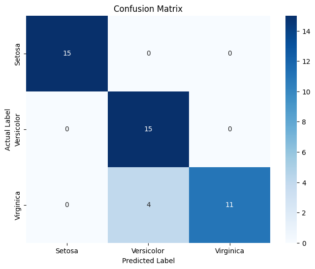
    


```python
plot_loss_curves(train_losses_full, val_losses_full)
```


    

    


```python
print(classification_report(y_true_full, y_pred_full, target_names=CLASS_NAMES))
```

                  precision    recall  f1-score   support
    
          Setosa       1.00      1.00      1.00        15
      Versicolor       0.79      1.00      0.88        15
       Virginica       1.00      0.73      0.85        15
    
        accuracy                           0.91        45
       macro avg       0.93      0.91      0.91        45
    weighted avg       0.93      0.91      0.91        45
    


```python
plot_roc_curves(y_true_full, y_probs_full, CLASS_NAMES)
```


    
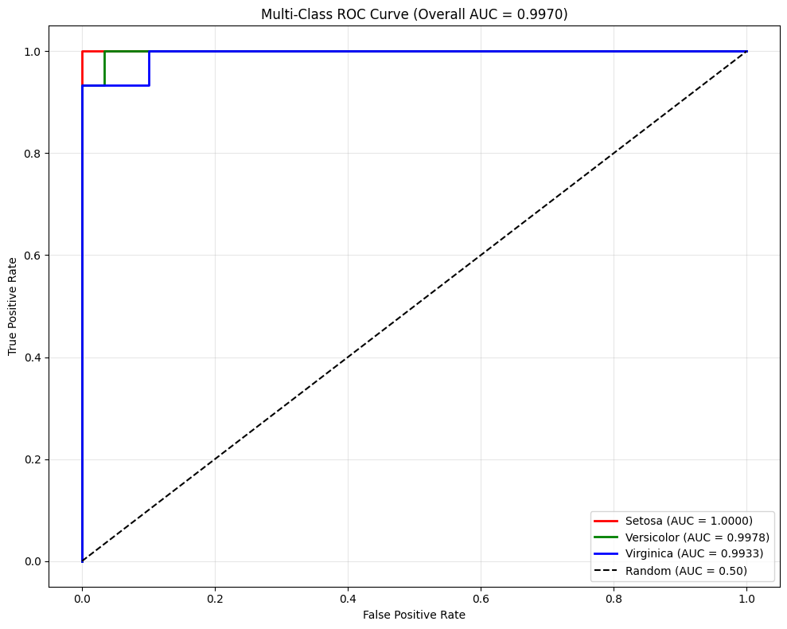
    


```python
print_summary_metrics(y_true_full, y_pred_full, y_probs_full)
```

    ------------------------------------------------------------------------------------------
    METRIC          SCORE      DESCRIPTION
    ------------------------------------------------------------------------------------------
    Accuracy        0.9111     Overall correctness (caution: misleading if imbalanced)
    Precision       0.9298     When predicting positive, how often correct?
    Recall          0.9111     Of all actual positives, how many found?
    F1-Score        0.9095     Harmonic mean of Precision & Recall
    ROC AUC         0.9970     Class separability (1.0 = perfect)
    ------------------------------------------------------------------------------------------


### Save Model Artifacts


```python
# Save model scaler for production inference
joblib.dump(scaler, SCALAR_PATH)
print(f"Scaler Saved: '{SCALAR_PATH}'")
```

    Scaler Saved: 'iris_scaler.pkl'


## Inference

### Load Model


```python
loaded_model = IrisMLP(
    in_features=len(features), h1=H1, h2=H2, out_features=OUT_FEATURES
).to(DEVICE)
loaded_model.load_state_dict(
    torch.load(MODEL_PATH, map_location=DEVICE, weights_only=True)
)
loaded_model.eval()
print(f"Model Loaded: '{MODEL_PATH}'")
```

    Model Loaded: 'iris_model.pth'


### Load Scaler


```python
scaler = joblib.load(SCALAR_PATH)
print(f"Scaler Loaded: '{SCALAR_PATH}'")
```

    Scaler Loaded: 'iris_scaler.pkl'


### Example: New Flower Measurements


```python
# 1. Define Raw Data (matching features order: sepal_length, sepal_width, petal_length, petal_width, petal_shape, sepal_dominance)
sepal_length = 5.1  # typical setosa sepal length
sepal_width = 3.5  # typical setosa sepal width
petal_length = 1.4  # small petal length -> setosa characteristic
petal_width = 0.2  # small petal width -> setosa characteristic
petal_shape = 1.0  # petal_length / petal_width category
sepal_dominance = 1.0  # setosa IS sepal_dominant (sepal_length > 2*petal_length)
raw_flower = [
    sepal_length,
    sepal_width,
    petal_length,
    petal_width,
    petal_shape,
    sepal_dominance,
]

# 2. CRITICAL: Scale using the fitted scaler from training
scaled_flower = scaler.transform([raw_flower])

# 3. Predict using SCALED data
species, confidence = predict(loaded_model, scaled_flower[0], SPECIES_MAP, DEVICE)
print(f"Raw Input:         {raw_flower}")
print(f"Predicted Species: {species}")
print(f"Confidence:        {confidence:.2%}")
```

    Raw Input:         [5.1, 3.5, 1.4, 0.2, 1.0, 1.0]
    Predicted Species: setosa
    Confidence:        100.00%

