# Iris - MLP

### [dataset](https://www.kaggle.com/datasets/himanshunakrani/iris-dataset)

Author: [Kevin Thomas](mailto:ket189@pitt.edu)

License: MIT

## Install Libraries


```python
# !python -m pip install --upgrade pip
# %pip install ipywidgets
# %pip install pandas matplotlib seaborn
# %pip install scikit-learn
# %pip install torch torchvision --index-url https://download.pytorch.org/whl/cu124  # Windows with CUDA 12.4
# # %pip install torch  # MacOS or CPU-only
# %pip install shap
```

## Import Libraries


```python
from itertools import combinations
import numpy as np
import pandas as pd
import matplotlib.pyplot as plt
import seaborn as sns
from sklearn.preprocessing import StandardScaler
from sklearn.model_selection import train_test_split
from sklearn.metrics import (
    r2_score,
    mean_squared_error,
    mean_absolute_error,
    classification_report, 
    confusion_matrix, 
    roc_auc_score,
    roc_curve,
    auc,
    precision_recall_fscore_support, 
    accuracy_score,
)
import torch
import torch.nn as nn
import torch.nn.functional as F
from torch.utils.data import DataLoader
import shap
import joblib
```

## Seed


```python
SEED = 42
SEED
```


    42


```python
np.random.seed(SEED)
torch.manual_seed(SEED)
```


    <torch._C.Generator at 0x118bdd750>


## Parameters


```python
IN_FEATURES = 6
IN_FEATURES
```


    6


```python
H1 = 8
H1
```


    8


```python
H2 = 8
H2
```


    8


```python
OUT_FEATURES = 3
OUT_FEATURES
```


    3


```python
TEST_SIZE = 0.3
TEST_SIZE
```


    0.3


```python
MODE = "classification"  # "classification" or "regression"
MODE
```


    'classification'


```python
DATA_PATH = "iris.csv"
DATA_PATH
```


    'iris.csv'


## Hyperparameters


```python
LR = 0.01
LR
```


    0.01


```python
EPOCHS = 1000
EPOCHS
```


    1000


```python
LOG_INTERVAL = 10
LOG_INTERVAL
```


    10


```python
BATCH_SIZE = 32  # Adjust based on dataset size (32-2048 typical)
BATCH_SIZE
```


    32


```python
CHUNK_SIZE = None  # Set to int (e.g., 100000) for large files, None for small files
CHUNK_SIZE
```


```python
DROPOUT = 0.0  # Dropout rate (0.0 = no dropout, 0.2-0.5 typical for regularization)
DROPOUT
```


    0.0


## Load Dataset


```python
if CHUNK_SIZE is None:
    df = pd.read_csv(DATA_PATH)
else:
    chunks = []
    for chunk in pd.read_csv(DATA_PATH, chunksize=CHUNK_SIZE):
        chunks.append(chunk)
    df = pd.concat(chunks, ignore_index=True)
    del chunks  # Free memory  
df
```


<div>
<table border="1" class="dataframe">
  <thead>
    <tr style="text-align: right;">
      <th></th>
      <th>sepal_length</th>
      <th>sepal_width</th>
      <th>petal_length</th>
      <th>petal_width</th>
      <th>species</th>
    </tr>
  </thead>
  <tbody>
    <tr>
      <th>0</th>
      <td>5.1</td>
      <td>3.5</td>
      <td>1.4</td>
      <td>0.2</td>
      <td>setosa</td>
    </tr>
    <tr>
      <th>1</th>
      <td>4.9</td>
      <td>3.0</td>
      <td>1.4</td>
      <td>0.2</td>
      <td>setosa</td>
    </tr>
    <tr>
      <th>2</th>
      <td>4.7</td>
      <td>3.2</td>
      <td>1.3</td>
      <td>0.2</td>
      <td>setosa</td>
    </tr>
    <tr>
      <th>3</th>
      <td>4.6</td>
      <td>3.1</td>
      <td>1.5</td>
      <td>0.2</td>
      <td>setosa</td>
    </tr>
    <tr>
      <th>4</th>
      <td>5.0</td>
      <td>3.6</td>
      <td>1.4</td>
      <td>0.2</td>
      <td>setosa</td>
    </tr>
    <tr>
      <th>...</th>
      <td>...</td>
      <td>...</td>
      <td>...</td>
      <td>...</td>
      <td>...</td>
    </tr>
    <tr>
      <th>145</th>
      <td>6.7</td>
      <td>3.0</td>
      <td>5.2</td>
      <td>2.3</td>
      <td>virginica</td>
    </tr>
    <tr>
      <th>146</th>
      <td>6.3</td>
      <td>2.5</td>
      <td>5.0</td>
      <td>1.9</td>
      <td>virginica</td>
    </tr>
    <tr>
      <th>147</th>
      <td>6.5</td>
      <td>3.0</td>
      <td>5.2</td>
      <td>2.0</td>
      <td>virginica</td>
    </tr>
    <tr>
      <th>148</th>
      <td>6.2</td>
      <td>3.4</td>
      <td>5.4</td>
      <td>2.3</td>
      <td>virginica</td>
    </tr>
    <tr>
      <th>149</th>
      <td>5.9</td>
      <td>3.0</td>
      <td>5.1</td>
      <td>1.8</td>
      <td>virginica</td>
    </tr>
  </tbody>
</table>
<p>150 rows × 5 columns</p>
</div>


```python
df.info()
```

    <class 'pandas.DataFrame'>
    RangeIndex: 150 entries, 0 to 149
    Data columns (total 5 columns):
     #   Column        Non-Null Count  Dtype  
    ---  ------        --------------  -----  
     0   sepal_length  150 non-null    float64
     1   sepal_width   150 non-null    float64
     2   petal_length  150 non-null    float64
     3   petal_width   150 non-null    float64
     4   species       150 non-null    str    
    dtypes: float64(4), str(1)
    memory usage: 6.0 KB


## Clean Dataset

### Complete Missingness Analysis


```python
missing_df = pd.DataFrame({
    "Variable": df.columns,
    "Missing_Count": df.isna().sum(),
    "Missing_Pct": (df.isna().sum() / len(df) * 100).round(1)
}).sort_values("Missing_Pct", ascending=False)
missing_df
```


<div>
<table border="1" class="dataframe">
  <thead>
    <tr style="text-align: right;">
      <th></th>
      <th>Variable</th>
      <th>Missing_Count</th>
      <th>Missing_Pct</th>
    </tr>
  </thead>
  <tbody>
    <tr>
      <th>sepal_length</th>
      <td>sepal_length</td>
      <td>0</td>
      <td>0.0</td>
    </tr>
    <tr>
      <th>sepal_width</th>
      <td>sepal_width</td>
      <td>0</td>
      <td>0.0</td>
    </tr>
    <tr>
      <th>petal_length</th>
      <td>petal_length</td>
      <td>0</td>
      <td>0.0</td>
    </tr>
    <tr>
      <th>petal_width</th>
      <td>petal_width</td>
      <td>0</td>
      <td>0.0</td>
    </tr>
    <tr>
      <th>species</th>
      <td>species</td>
      <td>0</td>
      <td>0.0</td>
    </tr>
  </tbody>
</table>
</div>


### Create Dataset `df_clean` w/ Cleaned Data


```python
df_clean = df.copy()
df_clean
```


<div>
<table border="1" class="dataframe">
  <thead>
    <tr style="text-align: right;">
      <th></th>
      <th>sepal_length</th>
      <th>sepal_width</th>
      <th>petal_length</th>
      <th>petal_width</th>
      <th>species</th>
    </tr>
  </thead>
  <tbody>
    <tr>
      <th>0</th>
      <td>5.1</td>
      <td>3.5</td>
      <td>1.4</td>
      <td>0.2</td>
      <td>setosa</td>
    </tr>
    <tr>
      <th>1</th>
      <td>4.9</td>
      <td>3.0</td>
      <td>1.4</td>
      <td>0.2</td>
      <td>setosa</td>
    </tr>
    <tr>
      <th>2</th>
      <td>4.7</td>
      <td>3.2</td>
      <td>1.3</td>
      <td>0.2</td>
      <td>setosa</td>
    </tr>
    <tr>
      <th>3</th>
      <td>4.6</td>
      <td>3.1</td>
      <td>1.5</td>
      <td>0.2</td>
      <td>setosa</td>
    </tr>
    <tr>
      <th>4</th>
      <td>5.0</td>
      <td>3.6</td>
      <td>1.4</td>
      <td>0.2</td>
      <td>setosa</td>
    </tr>
    <tr>
      <th>...</th>
      <td>...</td>
      <td>...</td>
      <td>...</td>
      <td>...</td>
      <td>...</td>
    </tr>
    <tr>
      <th>145</th>
      <td>6.7</td>
      <td>3.0</td>
      <td>5.2</td>
      <td>2.3</td>
      <td>virginica</td>
    </tr>
    <tr>
      <th>146</th>
      <td>6.3</td>
      <td>2.5</td>
      <td>5.0</td>
      <td>1.9</td>
      <td>virginica</td>
    </tr>
    <tr>
      <th>147</th>
      <td>6.5</td>
      <td>3.0</td>
      <td>5.2</td>
      <td>2.0</td>
      <td>virginica</td>
    </tr>
    <tr>
      <th>148</th>
      <td>6.2</td>
      <td>3.4</td>
      <td>5.4</td>
      <td>2.3</td>
      <td>virginica</td>
    </tr>
    <tr>
      <th>149</th>
      <td>5.9</td>
      <td>3.0</td>
      <td>5.1</td>
      <td>1.8</td>
      <td>virginica</td>
    </tr>
  </tbody>
</table>
<p>150 rows × 5 columns</p>
</div>


### Drop Variables in `df_clean` w/ Missings


```python
# df_clean.drop(columns=[
#     "", 
#     ""], 
#     inplace=True)
```

### Drop Variables w/ No Predictive Value


```python
# df_clean.drop(columns=[
#     "", 
#     ""], 
#     inplace=True)
```

## Feature Engineer Dataset

### Classify `petal_shape` If `petal_length` > 3x `petal_width`


```python
df_clean["petal_shape"] = np.where(
    (df_clean["petal_length"] / df_clean["petal_width"]) > 3.0, 
    "elongated", 
    "round"
)
df_clean["petal_shape"]
```


    0      elongated
    1      elongated
    2      elongated
    3      elongated
    4      elongated
             ...    
    145        round
    146        round
    147        round
    148        round
    149        round
    Name: petal_shape, Length: 150, dtype: str


### Classify `sepal_dominance`, If `sepal_length` > 2x `petal_length`


```python
df_clean["sepal_dominance"] = np.where(
    df_clean["sepal_length"] > (2 * df_clean["petal_length"]), 
    "sepal_dominant", 
    "balanced"
)
df_clean["sepal_dominance"]
```


    0      sepal_dominant
    1      sepal_dominant
    2      sepal_dominant
    3      sepal_dominant
    4      sepal_dominant
                ...      
    145          balanced
    146          balanced
    147          balanced
    148          balanced
    149          balanced
    Name: sepal_dominance, Length: 150, dtype: str


## Save Cleaned Dataset


```python
df_clean.to_csv("iris_dataset_clean.csv", index=False)
```

## Load Cleaned Dataset


```python
df_eda = pd.read_csv("iris_dataset_clean.csv")
df_eda
```


<div>
<table border="1" class="dataframe">
  <thead>
    <tr style="text-align: right;">
      <th></th>
      <th>sepal_length</th>
      <th>sepal_width</th>
      <th>petal_length</th>
      <th>petal_width</th>
      <th>species</th>
      <th>petal_shape</th>
      <th>sepal_dominance</th>
    </tr>
  </thead>
  <tbody>
    <tr>
      <th>0</th>
      <td>5.1</td>
      <td>3.5</td>
      <td>1.4</td>
      <td>0.2</td>
      <td>setosa</td>
      <td>elongated</td>
      <td>sepal_dominant</td>
    </tr>
    <tr>
      <th>1</th>
      <td>4.9</td>
      <td>3.0</td>
      <td>1.4</td>
      <td>0.2</td>
      <td>setosa</td>
      <td>elongated</td>
      <td>sepal_dominant</td>
    </tr>
    <tr>
      <th>2</th>
      <td>4.7</td>
      <td>3.2</td>
      <td>1.3</td>
      <td>0.2</td>
      <td>setosa</td>
      <td>elongated</td>
      <td>sepal_dominant</td>
    </tr>
    <tr>
      <th>3</th>
      <td>4.6</td>
      <td>3.1</td>
      <td>1.5</td>
      <td>0.2</td>
      <td>setosa</td>
      <td>elongated</td>
      <td>sepal_dominant</td>
    </tr>
    <tr>
      <th>4</th>
      <td>5.0</td>
      <td>3.6</td>
      <td>1.4</td>
      <td>0.2</td>
      <td>setosa</td>
      <td>elongated</td>
      <td>sepal_dominant</td>
    </tr>
    <tr>
      <th>...</th>
      <td>...</td>
      <td>...</td>
      <td>...</td>
      <td>...</td>
      <td>...</td>
      <td>...</td>
      <td>...</td>
    </tr>
    <tr>
      <th>145</th>
      <td>6.7</td>
      <td>3.0</td>
      <td>5.2</td>
      <td>2.3</td>
      <td>virginica</td>
      <td>round</td>
      <td>balanced</td>
    </tr>
    <tr>
      <th>146</th>
      <td>6.3</td>
      <td>2.5</td>
      <td>5.0</td>
      <td>1.9</td>
      <td>virginica</td>
      <td>round</td>
      <td>balanced</td>
    </tr>
    <tr>
      <th>147</th>
      <td>6.5</td>
      <td>3.0</td>
      <td>5.2</td>
      <td>2.0</td>
      <td>virginica</td>
      <td>round</td>
      <td>balanced</td>
    </tr>
    <tr>
      <th>148</th>
      <td>6.2</td>
      <td>3.4</td>
      <td>5.4</td>
      <td>2.3</td>
      <td>virginica</td>
      <td>round</td>
      <td>balanced</td>
    </tr>
    <tr>
      <th>149</th>
      <td>5.9</td>
      <td>3.0</td>
      <td>5.1</td>
      <td>1.8</td>
      <td>virginica</td>
      <td>round</td>
      <td>balanced</td>
    </tr>
  </tbody>
</table>
<p>150 rows × 7 columns</p>
</div>


## Exploratory Data Analysis


```python
df_eda.dtypes
```


    sepal_length       float64
    sepal_width        float64
    petal_length       float64
    petal_width        float64
    species                str
    petal_shape            str
    sepal_dominance        str
    dtype: object


### Create `categorical_input_vars` & `continuous_input_vars`


```python
categorical_input_vars = [
    "species",
    "petal_shape",
    "sepal_dominance"
]
categorical_input_vars
```


    ['species', 'petal_shape', 'sepal_dominance']


```python
continuous_input_vars = [
    "sepal_length",
    "sepal_width",
    "petal_length",
    "petal_width"
]
continuous_input_vars
```


    ['sepal_length', 'sepal_width', 'petal_length', 'petal_width']


### Create `target_var`


```python
target_var = "species"
target_var
```


    'species'


### Create `target_vars`


```python
target_vars_list = df_clean[target_var].value_counts()
target_vars = target_vars_list.index.tolist()
target_vars
```


    ['setosa', 'versicolor', 'virginica']


### Verify Class Balance


```python
# Verify class balance (important: accuracy is misleading if imbalanced)
print("Class Distribution:")
print(target_vars_list)
print(f"\nPercentages:")
print((target_vars_list / target_vars_list.sum() * 100).round(1).astype(str) + "%")

# Balance ratio: min_class / max_class (1.0 = perfect, <0.5 = significantly imbalanced)
balance_ratio = target_vars_list.min() / target_vars_list.max()
print(f"\nBalance Ratio: {balance_ratio:.2f}")
if balance_ratio >= 0.8:
    print("Assessment: Well-Balanced ✅")
elif balance_ratio >= 0.5:
    print("Assessment: Moderately Imbalanced (consider stratified sampling)")
else:
    print("Assessment: Severely Imbalanced (use F1/AUC over accuracy, consider SMOTE)")
```

    Class Distribution:
    species
    setosa        50
    versicolor    50
    virginica     50
    Name: count, dtype: int64
    
    Percentages:
    species
    setosa        33.3%
    versicolor    33.3%
    virginica     33.3%
    Name: count, dtype: str
    
    Balance Ratio: 1.00
    Assessment: Well-balanced ✅


### Visualize the Marginal Distributions

#### Count Plots – Marginal Distributions of Each Categorical Variable, w/ Facets for Each Categorical Variable


```python
grid = sns.catplot(
    data=df_eda.melt(value_vars=categorical_input_vars),
    x="value",
    col="variable",
    col_wrap=3,
    kind="count",
    sharex=False,
    sharey=False,
    height=4,
    aspect=1.5
)
for ax in grid.axes.flatten():
    for label in ax.get_xticklabels():
        label.set_rotation(90)
        label.set_ha("center")
grid.figure.tight_layout()
plt.subplots_adjust(hspace=0.4, wspace=0.2)
plt.show()
```


    

    


#### Count Plots with Facets - Explore Relationships Between Categorical Variables


```python
pairs = list(combinations(categorical_input_vars, 2))
for x_var, col_var in pairs:
    grid = sns.catplot(
        data=df_eda,
        x=x_var,
        col=col_var,
        col_wrap=3,
        kind="count",
        sharex=False,
        sharey=False,
        height=3,
        aspect=1.5
    )
    for ax in grid.axes.flatten():
        for label in ax.get_xticklabels():
            label.set_rotation(90)
            label.set_ha("center")
    grid.figure.tight_layout()
    grid.figure.subplots_adjust(hspace=1.0, wspace=0.2)
    plt.show()
```


    
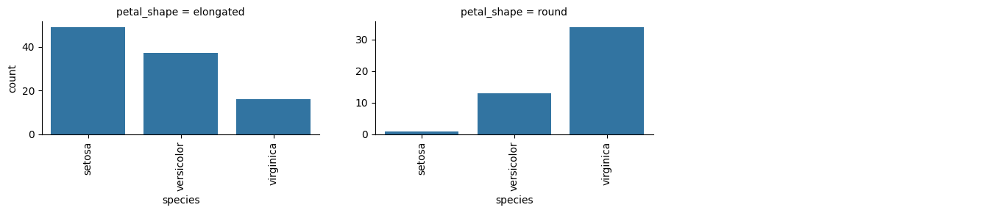
    


    
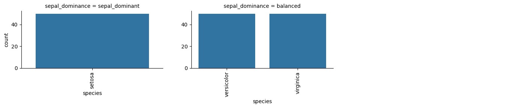
    


    
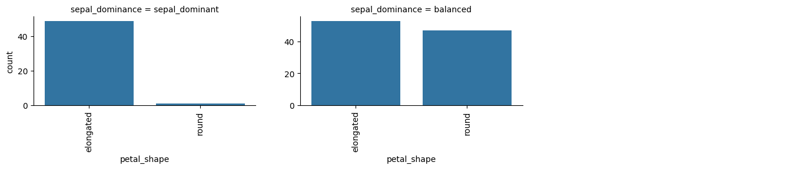
    


### Histogram Plots – Marginal Distributions of Each Numerical Variable, w/ Facets for Each Numerical Variable


```python
df_eda_lf = df_eda \
            .reset_index() \
            .rename(columns={"index": "rowid"}) \
            .melt(id_vars=["rowid"] + categorical_input_vars, value_vars=continuous_input_vars)
df_eda_lf
```


<div>
<table border="1" class="dataframe">
  <thead>
    <tr style="text-align: right;">
      <th></th>
      <th>rowid</th>
      <th>species</th>
      <th>petal_shape</th>
      <th>sepal_dominance</th>
      <th>variable</th>
      <th>value</th>
    </tr>
  </thead>
  <tbody>
    <tr>
      <th>0</th>
      <td>0</td>
      <td>setosa</td>
      <td>elongated</td>
      <td>sepal_dominant</td>
      <td>sepal_length</td>
      <td>5.1</td>
    </tr>
    <tr>
      <th>1</th>
      <td>1</td>
      <td>setosa</td>
      <td>elongated</td>
      <td>sepal_dominant</td>
      <td>sepal_length</td>
      <td>4.9</td>
    </tr>
    <tr>
      <th>2</th>
      <td>2</td>
      <td>setosa</td>
      <td>elongated</td>
      <td>sepal_dominant</td>
      <td>sepal_length</td>
      <td>4.7</td>
    </tr>
    <tr>
      <th>3</th>
      <td>3</td>
      <td>setosa</td>
      <td>elongated</td>
      <td>sepal_dominant</td>
      <td>sepal_length</td>
      <td>4.6</td>
    </tr>
    <tr>
      <th>4</th>
      <td>4</td>
      <td>setosa</td>
      <td>elongated</td>
      <td>sepal_dominant</td>
      <td>sepal_length</td>
      <td>5.0</td>
    </tr>
    <tr>
      <th>...</th>
      <td>...</td>
      <td>...</td>
      <td>...</td>
      <td>...</td>
      <td>...</td>
      <td>...</td>
    </tr>
    <tr>
      <th>595</th>
      <td>145</td>
      <td>virginica</td>
      <td>round</td>
      <td>balanced</td>
      <td>petal_width</td>
      <td>2.3</td>
    </tr>
    <tr>
      <th>596</th>
      <td>146</td>
      <td>virginica</td>
      <td>round</td>
      <td>balanced</td>
      <td>petal_width</td>
      <td>1.9</td>
    </tr>
    <tr>
      <th>597</th>
      <td>147</td>
      <td>virginica</td>
      <td>round</td>
      <td>balanced</td>
      <td>petal_width</td>
      <td>2.0</td>
    </tr>
    <tr>
      <th>598</th>
      <td>148</td>
      <td>virginica</td>
      <td>round</td>
      <td>balanced</td>
      <td>petal_width</td>
      <td>2.3</td>
    </tr>
    <tr>
      <th>599</th>
      <td>149</td>
      <td>virginica</td>
      <td>round</td>
      <td>balanced</td>
      <td>petal_width</td>
      <td>1.8</td>
    </tr>
  </tbody>
</table>
<p>600 rows × 6 columns</p>
</div>


```python
sns.displot(
    data=df_eda_lf, 
    x="value", 
    col="variable", 
    col_wrap=4,
    kind="hist",
    facet_kws={"sharex": False, "sharey": False},
    common_bins=False
)
plt.show()
```


    
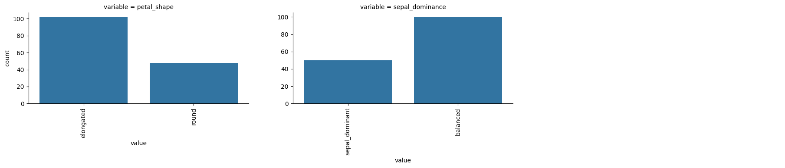
    


### Histogram Plots with Facets - Explore Relationships Between Numerical & Categorical Variables


```python
for num_var in continuous_input_vars:
    for cat_var in categorical_input_vars:
        grid = sns.displot(
            data=df_eda,
            x=num_var,
            col=cat_var,
            col_wrap=3,
            kind="hist",
            facet_kws={"sharex": False, "sharey": False},
            height=3,
            aspect=1.5
        )
        for ax in grid.axes.flatten():
            for label in ax.get_xticklabels():
                label.set_rotation(90)
                label.set_ha("center")
        grid.figure.tight_layout()
        grid.figure.subplots_adjust(hspace=0.4, wspace=0.2)
        plt.show()
```


    
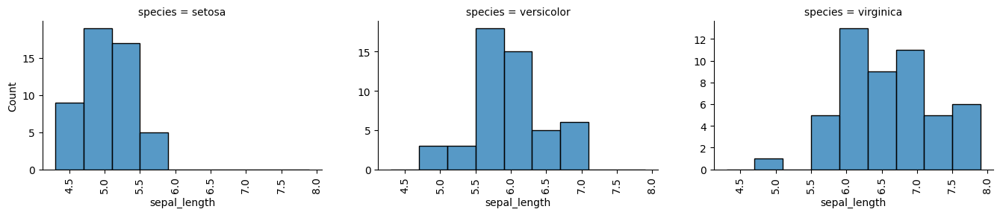
    


    
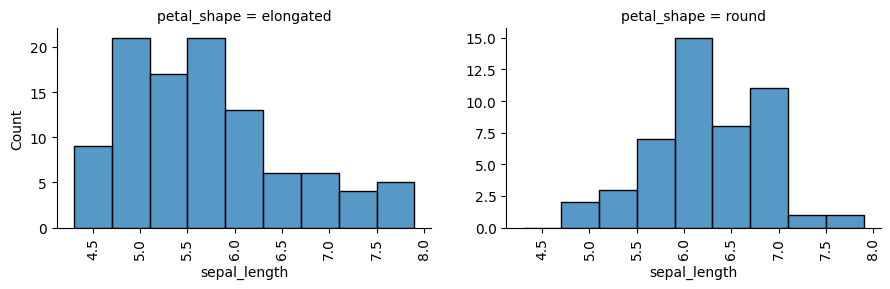
    


    
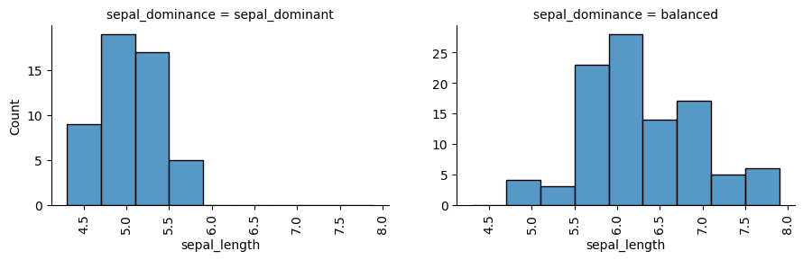
    


    
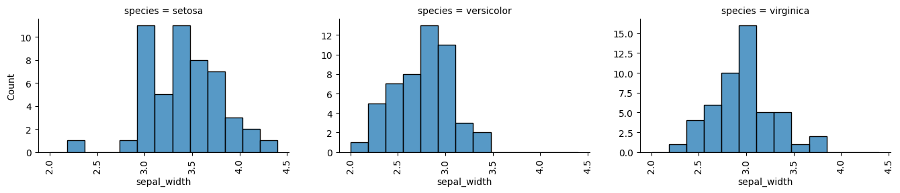
    


    
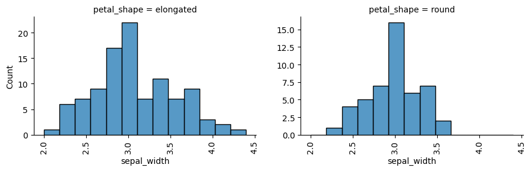
    


    

    


    

    


    
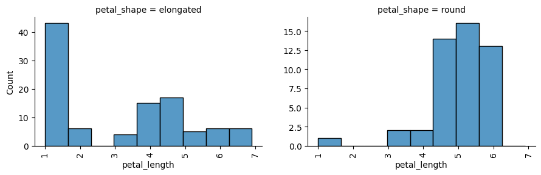
    


    

    


    
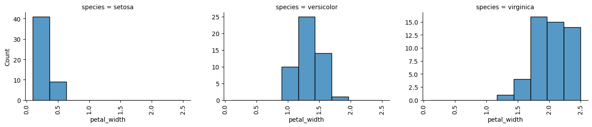
    


    
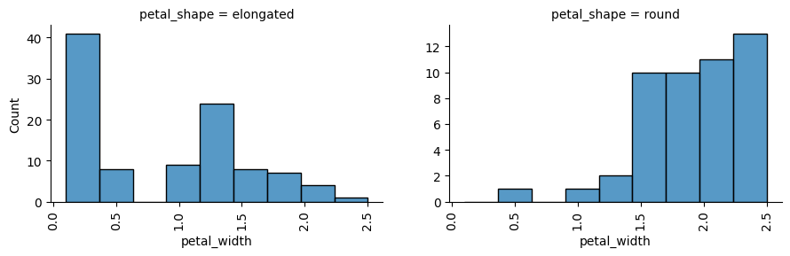
    


    

    


### Box Plots – Distribution of Each Numerical Variable by Categorical Variable, Faceted by the Respective Numerical Variable


```python
for num_var in continuous_input_vars:
    for cat_var in categorical_input_vars:
        n_categories = df_eda[cat_var].nunique()
        fig_width = max(8, n_categories * 0.6)
        grid = sns.catplot(
            data=df_eda,
            x=cat_var,
            y=num_var,
            kind="box",
            height=6,
            aspect=fig_width/6
        )
        for ax in grid.axes.flatten():
            for label in ax.get_xticklabels():
                label.set_rotation(90)
                label.set_ha("center")
        grid.figure.tight_layout()
        grid.figure.subplots_adjust(hspace=0.4, wspace=0.2)
        plt.show()
```


    

    


    
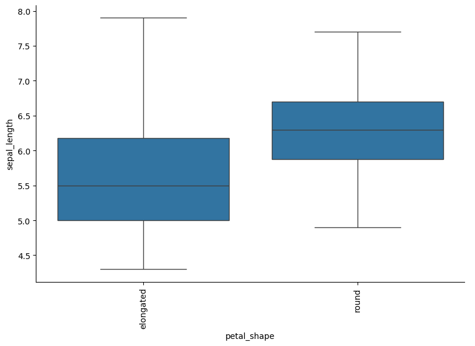
    


    

    


    
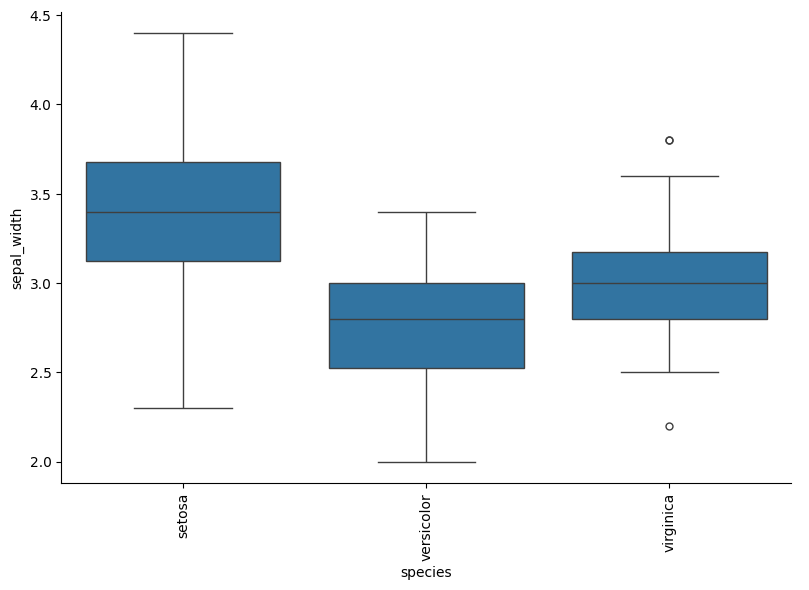
    


    

    


    

    


    

    


    

    


    
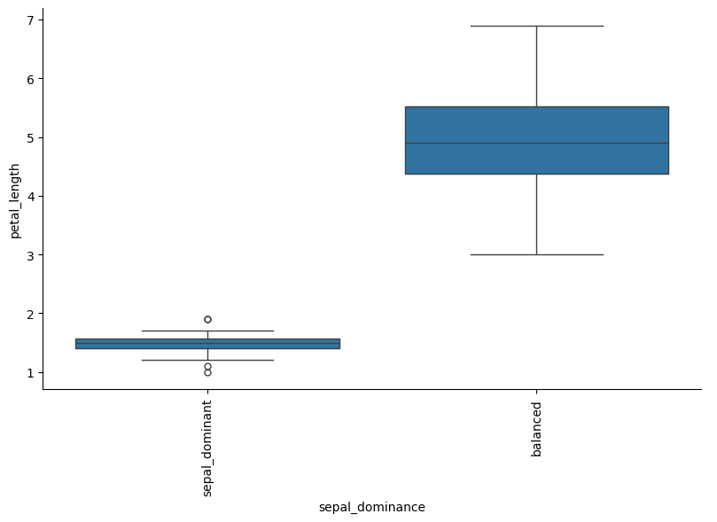
    


    

    


    
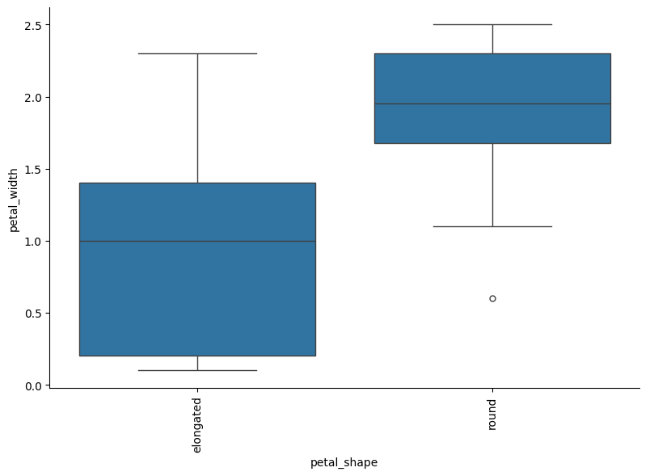
    


    

    


### Point Plots – Mean and Confidence Interval of Each Numerical Variable by Categorical Variable, Faceted by the Respective Numerical Variable


```python
for num_var in continuous_input_vars:
    for cat_var in categorical_input_vars:
        n_categories = df_eda[cat_var].nunique()
        fig_width = max(8, n_categories * 0.6)
        grid = sns.catplot(
            data=df_eda,
            x=cat_var,
            y=num_var,
            kind="point",
            linestyle="none",
            height=6,
            aspect=fig_width/6
        )
        for ax in grid.axes.flatten():
            for label in ax.get_xticklabels():
                label.set_rotation(90)
                label.set_ha("center")
        grid.figure.tight_layout()
        grid.figure.subplots_adjust(hspace=0.4, wspace=0.2)
        plt.show()
```


    
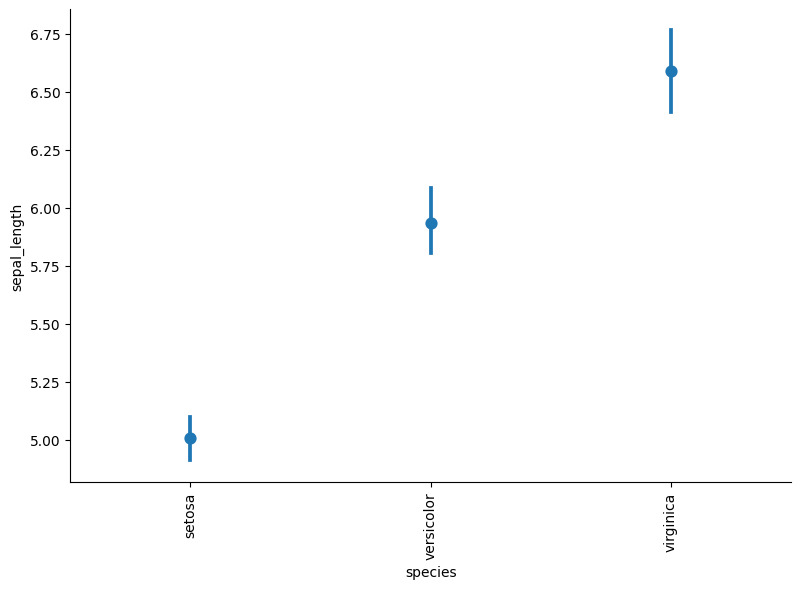
    


    
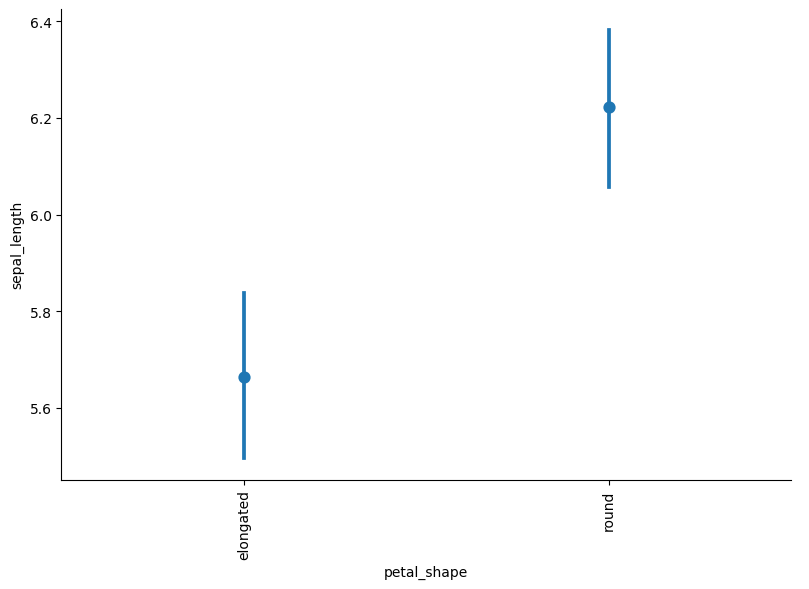
    


    
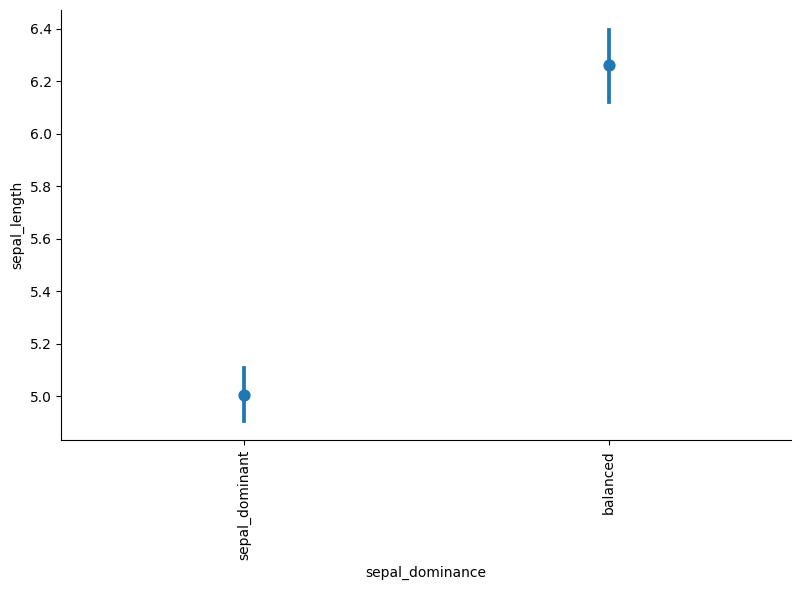
    


    
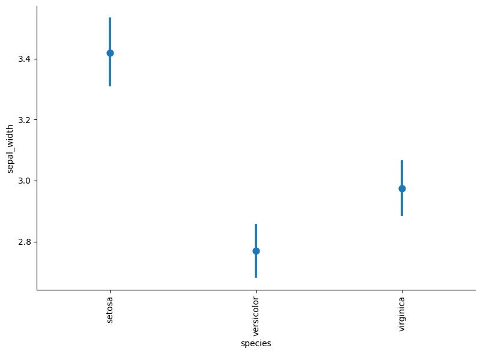
    


    
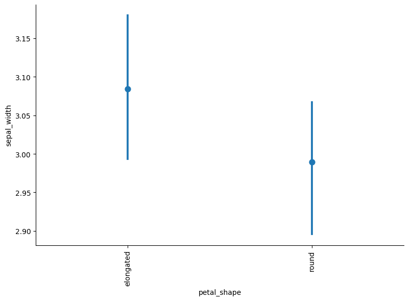
    


    
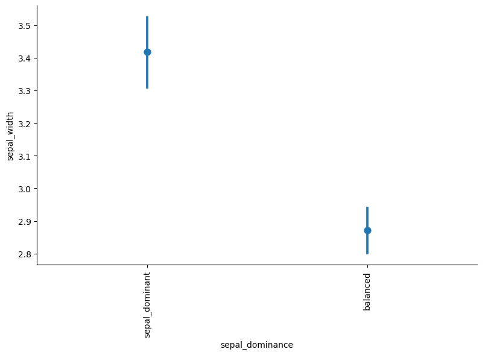
    


    
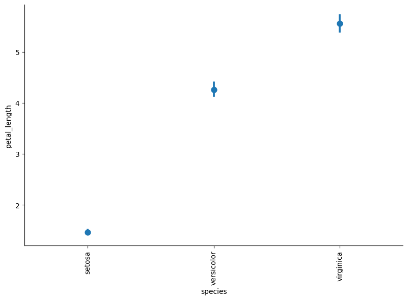
    


    
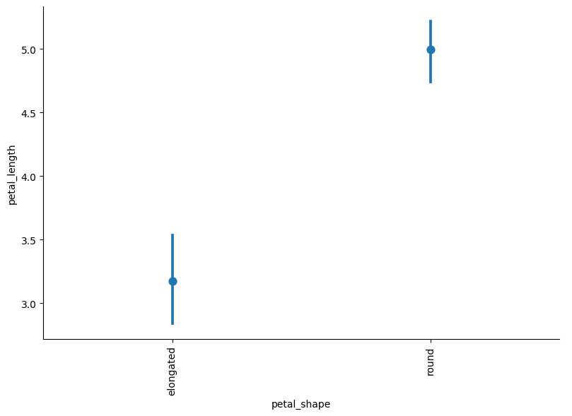
    


    

    


    
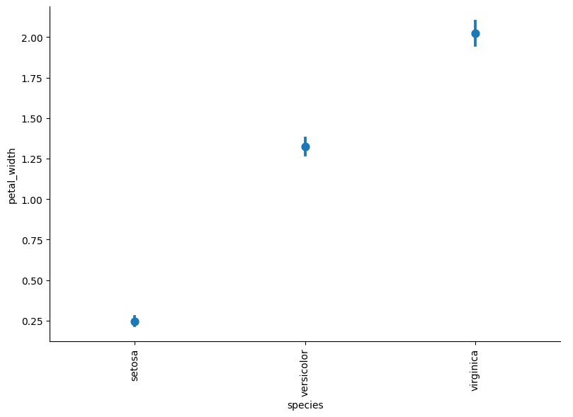
    


    
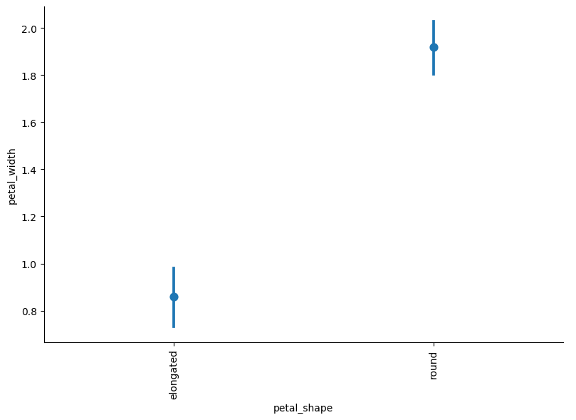
    


    

    


### Encode Categorical Variables for Correlation, Feature Importance Analysis & Modeling


```python
df_eda.dtypes
```


    sepal_length       float64
    sepal_width        float64
    petal_length       float64
    petal_width        float64
    species                str
    petal_shape            str
    sepal_dominance        str
    dtype: object


#### Encode `species` as Integer Labels (Classification)


```python
df_eda["species"]
```


    0         setosa
    1         setosa
    2         setosa
    3         setosa
    4         setosa
             ...    
    145    virginica
    146    virginica
    147    virginica
    148    virginica
    149    virginica
    Name: species, Length: 150, dtype: str


```python
df_eda["species"].value_counts()
```


    species
    setosa        50
    versicolor    50
    virginica     50
    Name: count, dtype: int64


```python
df_eda["species"] = df_eda["species"].map({
    "setosa": 0,
    "versicolor": 1,
    "virginica": 2,
})
df_eda["species"]
```


    0      0
    1      0
    2      0
    3      0
    4      0
          ..
    145    2
    146    2
    147    2
    148    2
    149    2
    Name: species, Length: 150, dtype: int64


#### Encode `petal_shape` as Binary Float


```python
df_eda["petal_shape"]
```


    0      elongated
    1      elongated
    2      elongated
    3      elongated
    4      elongated
             ...    
    145        round
    146        round
    147        round
    148        round
    149        round
    Name: petal_shape, Length: 150, dtype: str


```python
df_eda["petal_shape"].value_counts()
```


    petal_shape
    elongated    102
    round         48
    Name: count, dtype: int64


```python
df_eda["petal_shape"] = df_eda["petal_shape"].map({
    "round": 0, 
    "elongated": 1
}).astype(float)
df_eda["petal_shape"]
```


    0      1.0
    1      1.0
    2      1.0
    3      1.0
    4      1.0
          ... 
    145    0.0
    146    0.0
    147    0.0
    148    0.0
    149    0.0
    Name: petal_shape, Length: 150, dtype: float64


#### Encode `sepal_dominance` as Binary Float


```python
df_eda["sepal_dominance"]
```


    0      sepal_dominant
    1      sepal_dominant
    2      sepal_dominant
    3      sepal_dominant
    4      sepal_dominant
                ...      
    145          balanced
    146          balanced
    147          balanced
    148          balanced
    149          balanced
    Name: sepal_dominance, Length: 150, dtype: str


```python
df_eda["sepal_dominance"].value_counts()
```


    sepal_dominance
    balanced          100
    sepal_dominant     50
    Name: count, dtype: int64


```python
df_eda["sepal_dominance"] = df_eda["sepal_dominance"].map({
    "balanced": 0, 
    "sepal_dominant": 1
}).astype(float)
df_eda["sepal_dominance"]
```


    0      1.0
    1      1.0
    2      1.0
    3      1.0
    4      1.0
          ... 
    145    0.0
    146    0.0
    147    0.0
    148    0.0
    149    0.0
    Name: sepal_dominance, Length: 150, dtype: float64


### Verify Data Types Match PyTorch Requirements (float for `X`, int for `y`)


```python
df_eda.dtypes
```


    sepal_length       float64
    sepal_width        float64
    petal_length       float64
    petal_width        float64
    species              int64
    petal_shape        float64
    sepal_dominance    float64
    dtype: object


### Correlation Plots – Correlation Matrix of All Numerical Variables


```python
fig, ax = plt.subplots(figsize=(14, 10))
sns.heatmap(
    data=df_eda.corr(),
    vmin=-1,
    vmax=1,
    center=0,
    cmap="coolwarm",
    cbar=True,
    annot=True,
    fmt=".2f",
    annot_kws={"size": 10},
    ax=ax
)
plt.tight_layout()
plt.show()
```


    
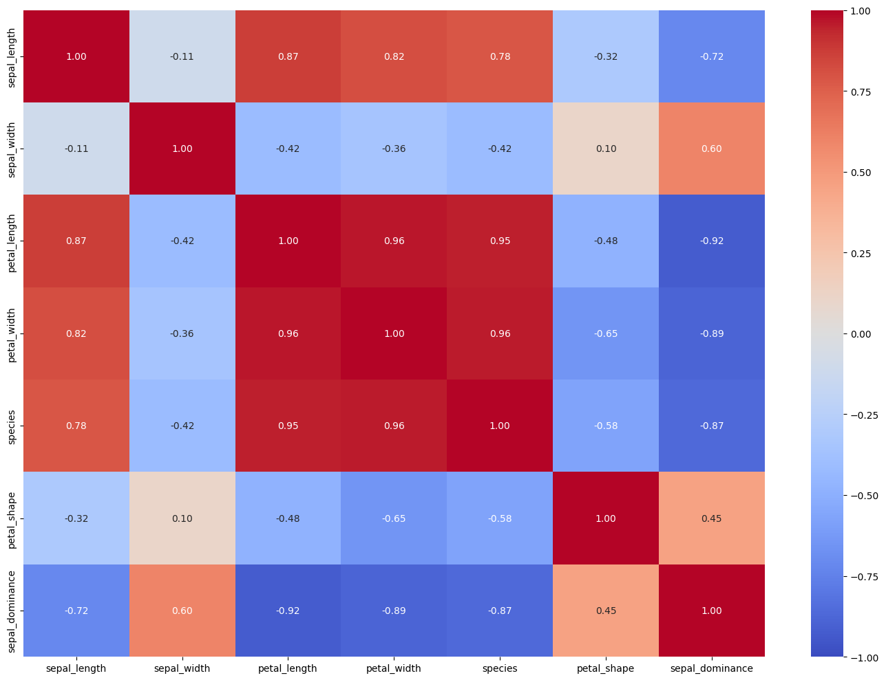
    


### Correlation Plots – Feature Correlation w/ Target Variable (`species`)


```python
feature_vars = df_eda.columns.drop(target_var)
corr_with_target = df_eda[feature_vars].corrwith(df_eda[target_var]).sort_values(ascending=False)
fig, ax = plt.subplots(figsize=(10, 8))
colors = ["tab:red" if x >= 0 else "tab:green" for x in corr_with_target]
corr_with_target.plot(kind="barh", ax=ax, color=colors)
ax.set_xlabel(f"Correlation with {target_var}")
ax.set_title(f"Feature Correlation with Target ({target_var})")
ax.axvline(
    x=0, 
    color="black", 
    linestyle="--", 
    linewidth=0.8
)
plt.tight_layout()
plt.show()
```


    
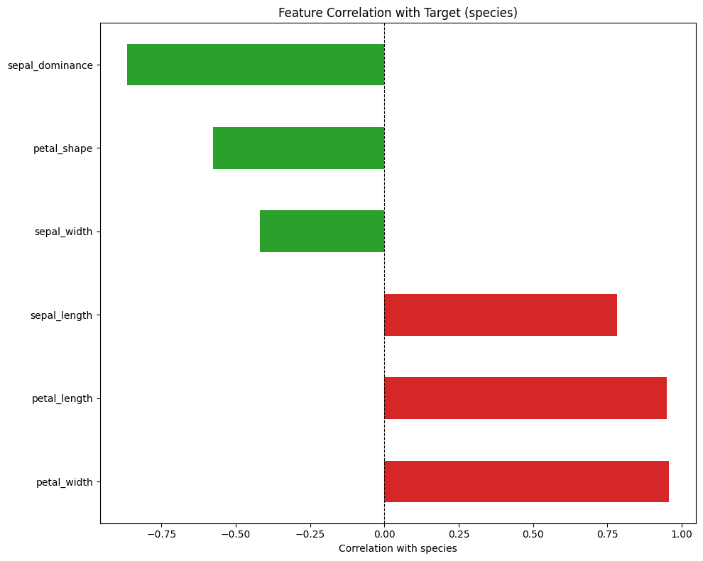
    


### Create `Features` Variable for Audit & Modeling 


```python
features = [col for col in df_eda.columns if col not in [target_var]]
features
```


    ['sepal_length',
     'sepal_width',
     'petal_length',
     'petal_width',
     'petal_shape',
     'sepal_dominance']


### Feature Selection Audit: Signal Strength & Cardinality


```python
features = [col for col in df_eda.columns if col != target_var]
results = []
all_corrs = df_eda[features].corrwith(df_eda[target_var])
for col in features:
    n_unique = df_eda[col].nunique()
    corr = all_corrs[col]
    abs_corr = abs(corr)
    # Default logic
    recommendation = "❌ DROP"
    reason = f"(Weak Signal: {corr:.4f})"
    # Threshold Logic
    if abs_corr >= 0.01:
        recommendation = "✅ KEEP"
        reason = f"(Strong Signal)"
    results.append({
        "Feature": col,
        "Unique_Values": n_unique,
        "Correlation": corr,
        "Recommendation": recommendation,
        "Reason": reason
    })
audit_df = pd.DataFrame(results)
# Create a temporary column for absolute sorting
audit_df["abs_corr"] = audit_df["Correlation"].abs()
# Sort by absolute correlation, Drop the temp column, and RESET the index
audit_df = audit_df \
    .sort_values("abs_corr", ascending=False) \
    .drop(columns=["abs_corr"]) \
    .reset_index(drop=True)
audit_df
```


<div>
<table border="1" class="dataframe">
  <thead>
    <tr style="text-align: right;">
      <th></th>
      <th>Feature</th>
      <th>Unique_Values</th>
      <th>Correlation</th>
      <th>Recommendation</th>
      <th>Reason</th>
    </tr>
  </thead>
  <tbody>
    <tr>
      <th>0</th>
      <td>petal_width</td>
      <td>22</td>
      <td>0.956464</td>
      <td>✅ KEEP</td>
      <td>(Strong Signal)</td>
    </tr>
    <tr>
      <th>1</th>
      <td>petal_length</td>
      <td>43</td>
      <td>0.949043</td>
      <td>✅ KEEP</td>
      <td>(Strong Signal)</td>
    </tr>
    <tr>
      <th>2</th>
      <td>sepal_dominance</td>
      <td>2</td>
      <td>-0.866025</td>
      <td>✅ KEEP</td>
      <td>(Strong Signal)</td>
    </tr>
    <tr>
      <th>3</th>
      <td>sepal_length</td>
      <td>35</td>
      <td>0.782561</td>
      <td>✅ KEEP</td>
      <td>(Strong Signal)</td>
    </tr>
    <tr>
      <th>4</th>
      <td>petal_shape</td>
      <td>2</td>
      <td>-0.577616</td>
      <td>✅ KEEP</td>
      <td>(Strong Signal)</td>
    </tr>
    <tr>
      <th>5</th>
      <td>sepal_width</td>
      <td>23</td>
      <td>-0.419446</td>
      <td>✅ KEEP</td>
      <td>(Strong Signal)</td>
    </tr>
  </tbody>
</table>
</div>


## Preprocessing

### Create `df_preprocessed` Dataset


```python
df_preprocessed = df_eda.copy()
df_preprocessed.shape
```


    (150, 7)


### Drop Low-Correlation Features

#### Based on EDA Recommendations, Drop Features w/ Correlation < 0.01; Low-Correlation


```python
# df_preprocessed.drop(columns=[
#     "",
# ], inplace=True)
# df_preprocessed
```

### Save `df_preprocess` Processed Dataset


```python
df_preprocessed.to_csv("iris_dataset_preprocessed.csv", index=False)
```

### Load `df_preprocess` Processed Dataset


```python
df_preprocessed = pd.read_csv("iris_dataset_preprocessed.csv")
df_preprocessed
```


<div>
<table border="1" class="dataframe">
  <thead>
    <tr style="text-align: right;">
      <th></th>
      <th>sepal_length</th>
      <th>sepal_width</th>
      <th>petal_length</th>
      <th>petal_width</th>
      <th>species</th>
      <th>petal_shape</th>
      <th>sepal_dominance</th>
    </tr>
  </thead>
  <tbody>
    <tr>
      <th>0</th>
      <td>5.1</td>
      <td>3.5</td>
      <td>1.4</td>
      <td>0.2</td>
      <td>0</td>
      <td>1.0</td>
      <td>1.0</td>
    </tr>
    <tr>
      <th>1</th>
      <td>4.9</td>
      <td>3.0</td>
      <td>1.4</td>
      <td>0.2</td>
      <td>0</td>
      <td>1.0</td>
      <td>1.0</td>
    </tr>
    <tr>
      <th>2</th>
      <td>4.7</td>
      <td>3.2</td>
      <td>1.3</td>
      <td>0.2</td>
      <td>0</td>
      <td>1.0</td>
      <td>1.0</td>
    </tr>
    <tr>
      <th>3</th>
      <td>4.6</td>
      <td>3.1</td>
      <td>1.5</td>
      <td>0.2</td>
      <td>0</td>
      <td>1.0</td>
      <td>1.0</td>
    </tr>
    <tr>
      <th>4</th>
      <td>5.0</td>
      <td>3.6</td>
      <td>1.4</td>
      <td>0.2</td>
      <td>0</td>
      <td>1.0</td>
      <td>1.0</td>
    </tr>
    <tr>
      <th>...</th>
      <td>...</td>
      <td>...</td>
      <td>...</td>
      <td>...</td>
      <td>...</td>
      <td>...</td>
      <td>...</td>
    </tr>
    <tr>
      <th>145</th>
      <td>6.7</td>
      <td>3.0</td>
      <td>5.2</td>
      <td>2.3</td>
      <td>2</td>
      <td>0.0</td>
      <td>0.0</td>
    </tr>
    <tr>
      <th>146</th>
      <td>6.3</td>
      <td>2.5</td>
      <td>5.0</td>
      <td>1.9</td>
      <td>2</td>
      <td>0.0</td>
      <td>0.0</td>
    </tr>
    <tr>
      <th>147</th>
      <td>6.5</td>
      <td>3.0</td>
      <td>5.2</td>
      <td>2.0</td>
      <td>2</td>
      <td>0.0</td>
      <td>0.0</td>
    </tr>
    <tr>
      <th>148</th>
      <td>6.2</td>
      <td>3.4</td>
      <td>5.4</td>
      <td>2.3</td>
      <td>2</td>
      <td>0.0</td>
      <td>0.0</td>
    </tr>
    <tr>
      <th>149</th>
      <td>5.9</td>
      <td>3.0</td>
      <td>5.1</td>
      <td>1.8</td>
      <td>2</td>
      <td>0.0</td>
      <td>0.0</td>
    </tr>
  </tbody>
</table>
<p>150 rows × 7 columns</p>
</div>


## Model


```python
class Model(nn.Module):
    """
    A feedforward neural network with two hidden layers and optional dropout.
    """

    def __init__(
            self, 
            in_features=IN_FEATURES, 
            h1=H1, 
            h2=H2, 
            out_features=OUT_FEATURES, 
            dropout=DROPOUT
        ):
        """
        Initializes the neural network layers.

        Parameters:
            in_features (int): Number of input features.
            h1 (int): Number of neurons in the first hidden layer.
            h2 (int): Number of neurons in the second hidden layer.
            out_features (int): Number of output features.
            dropout (float): Dropout rate (0.0 = no dropout).

        Returns:
            None
        """
        super(Model, self).__init__()
        self.fc1 = nn.Linear(in_features, h1)
        self.fc2 = nn.Linear(h1, h2)
        self.out = nn.Linear(h2, out_features)
        self.dropout = nn.Dropout(p=dropout)

    def forward(self, x):
        """
        Defines the forward pass of the neural network.

        Parameters:
            x (torch.Tensor): Input tensor.
        
        Returns:
            torch.Tensor: Output tensor after passing through the network.
        """
        x = F.relu(self.fc1(x))
        x = self.dropout(x)
        x = F.relu(self.fc2(x))
        x = self.dropout(x)
        x = self.out(x)
        return x
```

### Instantiate Model


```python
if torch.cuda.is_available():
    DEVICE = torch.device("cuda")
elif torch.backends.mps.is_available():
    DEVICE = torch.device("mps")
else:
    DEVICE = torch.device("cpu")    
model = Model().to(DEVICE)
model
```


    Model(
      (fc1): Linear(in_features=6, out_features=8, bias=True)
      (fc2): Linear(in_features=8, out_features=8, bias=True)
      (out): Linear(in_features=8, out_features=3, bias=True)
      (dropout): Dropout(p=0.0, inplace=False)
    )


```python
next(model.parameters()).device
```


    device(type='mps', index=0)


### Train-Test Split Model


```python
X = df_preprocessed.drop(target_var, axis=1).values.astype("float32")
X
```


    array([[5.1, 3.5, 1.4, 0.2, 1. , 1. ],
           [4.9, 3. , 1.4, 0.2, 1. , 1. ],
           [4.7, 3.2, 1.3, 0.2, 1. , 1. ],
           [4.6, 3.1, 1.5, 0.2, 1. , 1. ],
           [5. , 3.6, 1.4, 0.2, 1. , 1. ],
           [5.4, 3.9, 1.7, 0.4, 1. , 1. ],
           [4.6, 3.4, 1.4, 0.3, 1. , 1. ],
           [5. , 3.4, 1.5, 0.2, 1. , 1. ],
           [4.4, 2.9, 1.4, 0.2, 1. , 1. ],
           [4.9, 3.1, 1.5, 0.1, 1. , 1. ],
           [5.4, 3.7, 1.5, 0.2, 1. , 1. ],
           [4.8, 3.4, 1.6, 0.2, 1. , 1. ],
           [4.8, 3. , 1.4, 0.1, 1. , 1. ],
           [4.3, 3. , 1.1, 0.1, 1. , 1. ],
           [5.8, 4. , 1.2, 0.2, 1. , 1. ],
           [5.7, 4.4, 1.5, 0.4, 1. , 1. ],
           [5.4, 3.9, 1.3, 0.4, 1. , 1. ],
           [5.1, 3.5, 1.4, 0.3, 1. , 1. ],
           [5.7, 3.8, 1.7, 0.3, 1. , 1. ],
           [5.1, 3.8, 1.5, 0.3, 1. , 1. ],
           [5.4, 3.4, 1.7, 0.2, 1. , 1. ],
           [5.1, 3.7, 1.5, 0.4, 1. , 1. ],
           [4.6, 3.6, 1. , 0.2, 1. , 1. ],
           [5.1, 3.3, 1.7, 0.5, 1. , 1. ],
           [4.8, 3.4, 1.9, 0.2, 1. , 1. ],
           [5. , 3. , 1.6, 0.2, 1. , 1. ],
           [5. , 3.4, 1.6, 0.4, 1. , 1. ],
           [5.2, 3.5, 1.5, 0.2, 1. , 1. ],
           [5.2, 3.4, 1.4, 0.2, 1. , 1. ],
           [4.7, 3.2, 1.6, 0.2, 1. , 1. ],
           [4.8, 3.1, 1.6, 0.2, 1. , 1. ],
           [5.4, 3.4, 1.5, 0.4, 1. , 1. ],
           [5.2, 4.1, 1.5, 0.1, 1. , 1. ],
           [5.5, 4.2, 1.4, 0.2, 1. , 1. ],
           [4.9, 3.1, 1.5, 0.1, 1. , 1. ],
           [5. , 3.2, 1.2, 0.2, 1. , 1. ],
           [5.5, 3.5, 1.3, 0.2, 1. , 1. ],
           [4.9, 3.1, 1.5, 0.1, 1. , 1. ],
           [4.4, 3. , 1.3, 0.2, 1. , 1. ],
           [5.1, 3.4, 1.5, 0.2, 1. , 1. ],
           [5. , 3.5, 1.3, 0.3, 1. , 1. ],
           [4.5, 2.3, 1.3, 0.3, 1. , 1. ],
           [4.4, 3.2, 1.3, 0.2, 1. , 1. ],
           [5. , 3.5, 1.6, 0.6, 0. , 1. ],
           [5.1, 3.8, 1.9, 0.4, 1. , 1. ],
           [4.8, 3. , 1.4, 0.3, 1. , 1. ],
           [5.1, 3.8, 1.6, 0.2, 1. , 1. ],
           [4.6, 3.2, 1.4, 0.2, 1. , 1. ],
           [5.3, 3.7, 1.5, 0.2, 1. , 1. ],
           [5. , 3.3, 1.4, 0.2, 1. , 1. ],
           [7. , 3.2, 4.7, 1.4, 1. , 0. ],
           [6.4, 3.2, 4.5, 1.5, 0. , 0. ],
           [6.9, 3.1, 4.9, 1.5, 1. , 0. ],
           [5.5, 2.3, 4. , 1.3, 1. , 0. ],
           [6.5, 2.8, 4.6, 1.5, 1. , 0. ],
           [5.7, 2.8, 4.5, 1.3, 1. , 0. ],
           [6.3, 3.3, 4.7, 1.6, 0. , 0. ],
           [4.9, 2.4, 3.3, 1. , 1. , 0. ],
           [6.6, 2.9, 4.6, 1.3, 1. , 0. ],
           [5.2, 2.7, 3.9, 1.4, 0. , 0. ],
           [5. , 2. , 3.5, 1. , 1. , 0. ],
           [5.9, 3. , 4.2, 1.5, 0. , 0. ],
           [6. , 2.2, 4. , 1. , 1. , 0. ],
           [6.1, 2.9, 4.7, 1.4, 1. , 0. ],
           [5.6, 2.9, 3.6, 1.3, 0. , 0. ],
           [6.7, 3.1, 4.4, 1.4, 1. , 0. ],
           [5.6, 3. , 4.5, 1.5, 0. , 0. ],
           [5.8, 2.7, 4.1, 1. , 1. , 0. ],
           [6.2, 2.2, 4.5, 1.5, 0. , 0. ],
           [5.6, 2.5, 3.9, 1.1, 1. , 0. ],
           [5.9, 3.2, 4.8, 1.8, 0. , 0. ],
           [6.1, 2.8, 4. , 1.3, 1. , 0. ],
           [6.3, 2.5, 4.9, 1.5, 1. , 0. ],
           [6.1, 2.8, 4.7, 1.2, 1. , 0. ],
           [6.4, 2.9, 4.3, 1.3, 1. , 0. ],
           [6.6, 3. , 4.4, 1.4, 1. , 0. ],
           [6.8, 2.8, 4.8, 1.4, 1. , 0. ],
           [6.7, 3. , 5. , 1.7, 0. , 0. ],
           [6. , 2.9, 4.5, 1.5, 0. , 0. ],
           [5.7, 2.6, 3.5, 1. , 1. , 0. ],
           [5.5, 2.4, 3.8, 1.1, 1. , 0. ],
           [5.5, 2.4, 3.7, 1. , 1. , 0. ],
           [5.8, 2.7, 3.9, 1.2, 1. , 0. ],
           [6. , 2.7, 5.1, 1.6, 1. , 0. ],
           [5.4, 3. , 4.5, 1.5, 0. , 0. ],
           [6. , 3.4, 4.5, 1.6, 0. , 0. ],
           [6.7, 3.1, 4.7, 1.5, 1. , 0. ],
           [6.3, 2.3, 4.4, 1.3, 1. , 0. ],
           [5.6, 3. , 4.1, 1.3, 1. , 0. ],
           [5.5, 2.5, 4. , 1.3, 1. , 0. ],
           [5.5, 2.6, 4.4, 1.2, 1. , 0. ],
           [6.1, 3. , 4.6, 1.4, 1. , 0. ],
           [5.8, 2.6, 4. , 1.2, 1. , 0. ],
           [5. , 2.3, 3.3, 1. , 1. , 0. ],
           [5.6, 2.7, 4.2, 1.3, 1. , 0. ],
           [5.7, 3. , 4.2, 1.2, 1. , 0. ],
           [5.7, 2.9, 4.2, 1.3, 1. , 0. ],
           [6.2, 2.9, 4.3, 1.3, 1. , 0. ],
           [5.1, 2.5, 3. , 1.1, 0. , 0. ],
           [5.7, 2.8, 4.1, 1.3, 1. , 0. ],
           [6.3, 3.3, 6. , 2.5, 0. , 0. ],
           [5.8, 2.7, 5.1, 1.9, 0. , 0. ],
           [7.1, 3. , 5.9, 2.1, 0. , 0. ],
           [6.3, 2.9, 5.6, 1.8, 1. , 0. ],
           [6.5, 3. , 5.8, 2.2, 0. , 0. ],
           [7.6, 3. , 6.6, 2.1, 1. , 0. ],
           [4.9, 2.5, 4.5, 1.7, 0. , 0. ],
           [7.3, 2.9, 6.3, 1.8, 1. , 0. ],
           [6.7, 2.5, 5.8, 1.8, 1. , 0. ],
           [7.2, 3.6, 6.1, 2.5, 0. , 0. ],
           [6.5, 3.2, 5.1, 2. , 0. , 0. ],
           [6.4, 2.7, 5.3, 1.9, 0. , 0. ],
           [6.8, 3. , 5.5, 2.1, 0. , 0. ],
           [5.7, 2.5, 5. , 2. , 0. , 0. ],
           [5.8, 2.8, 5.1, 2.4, 0. , 0. ],
           [6.4, 3.2, 5.3, 2.3, 0. , 0. ],
           [6.5, 3. , 5.5, 1.8, 1. , 0. ],
           [7.7, 3.8, 6.7, 2.2, 1. , 0. ],
           [7.7, 2.6, 6.9, 2.3, 1. , 0. ],
           [6. , 2.2, 5. , 1.5, 1. , 0. ],
           [6.9, 3.2, 5.7, 2.3, 0. , 0. ],
           [5.6, 2.8, 4.9, 2. , 0. , 0. ],
           [7.7, 2.8, 6.7, 2. , 1. , 0. ],
           [6.3, 2.7, 4.9, 1.8, 0. , 0. ],
           [6.7, 3.3, 5.7, 2.1, 0. , 0. ],
           [7.2, 3.2, 6. , 1.8, 1. , 0. ],
           [6.2, 2.8, 4.8, 1.8, 0. , 0. ],
           [6.1, 3. , 4.9, 1.8, 0. , 0. ],
           [6.4, 2.8, 5.6, 2.1, 0. , 0. ],
           [7.2, 3. , 5.8, 1.6, 1. , 0. ],
           [7.4, 2.8, 6.1, 1.9, 1. , 0. ],
           [7.9, 3.8, 6.4, 2. , 1. , 0. ],
           [6.4, 2.8, 5.6, 2.2, 0. , 0. ],
           [6.3, 2.8, 5.1, 1.5, 1. , 0. ],
           [6.1, 2.6, 5.6, 1.4, 1. , 0. ],
           [7.7, 3. , 6.1, 2.3, 0. , 0. ],
           [6.3, 3.4, 5.6, 2.4, 0. , 0. ],
           [6.4, 3.1, 5.5, 1.8, 1. , 0. ],
           [6. , 3. , 4.8, 1.8, 0. , 0. ],
           [6.9, 3.1, 5.4, 2.1, 0. , 0. ],
           [6.7, 3.1, 5.6, 2.4, 0. , 0. ],
           [6.9, 3.1, 5.1, 2.3, 0. , 0. ],
           [5.8, 2.7, 5.1, 1.9, 0. , 0. ],
           [6.8, 3.2, 5.9, 2.3, 0. , 0. ],
           [6.7, 3.3, 5.7, 2.5, 0. , 0. ],
           [6.7, 3. , 5.2, 2.3, 0. , 0. ],
           [6.3, 2.5, 5. , 1.9, 0. , 0. ],
           [6.5, 3. , 5.2, 2. , 0. , 0. ],
           [6.2, 3.4, 5.4, 2.3, 0. , 0. ],
           [5.9, 3. , 5.1, 1.8, 0. , 0. ]], dtype=float32)


```python
X.shape
```


    (150, 6)


```python
if MODE == "classification":
    y = df_preprocessed[target_var].values.astype("int64")
else:
    y = df_preprocessed[target_var].values.astype("float32")
y
```


    array([0, 0, 0, 0, 0, 0, 0, 0, 0, 0, 0, 0, 0, 0, 0, 0, 0, 0, 0, 0, 0, 0,
           0, 0, 0, 0, 0, 0, 0, 0, 0, 0, 0, 0, 0, 0, 0, 0, 0, 0, 0, 0, 0, 0,
           0, 0, 0, 0, 0, 0, 1, 1, 1, 1, 1, 1, 1, 1, 1, 1, 1, 1, 1, 1, 1, 1,
           1, 1, 1, 1, 1, 1, 1, 1, 1, 1, 1, 1, 1, 1, 1, 1, 1, 1, 1, 1, 1, 1,
           1, 1, 1, 1, 1, 1, 1, 1, 1, 1, 1, 1, 2, 2, 2, 2, 2, 2, 2, 2, 2, 2,
           2, 2, 2, 2, 2, 2, 2, 2, 2, 2, 2, 2, 2, 2, 2, 2, 2, 2, 2, 2, 2, 2,
           2, 2, 2, 2, 2, 2, 2, 2, 2, 2, 2, 2, 2, 2, 2, 2, 2, 2])


```python
y.shape
```


    (150,)


```python
if MODE == "classification":
    train_idx, test_idx = train_test_split(
        np.arange(len(X)), 
        test_size=TEST_SIZE, 
        random_state=SEED, 
        stratify=y
    )
else:
    train_idx, test_idx = train_test_split(
        np.arange(len(X)), 
        test_size=TEST_SIZE, 
        random_state=SEED
    )   
X_train, X_test = X[train_idx], X[test_idx]
y_train, y_test = y[train_idx], y[test_idx]
len(train_idx), len(test_idx)
```


    (105, 45)


```python
X_train
```


    array([[5.1, 2.5, 3. , 1.1, 0. , 0. ],
           [6.2, 2.2, 4.5, 1.5, 0. , 0. ],
           [5.1, 3.8, 1.5, 0.3, 1. , 1. ],
           [6.8, 3.2, 5.9, 2.3, 0. , 0. ],
           [5.7, 2.8, 4.1, 1.3, 1. , 0. ],
           [6.7, 3. , 5.2, 2.3, 0. , 0. ],
           [4.9, 3.1, 1.5, 0.1, 1. , 1. ],
           [5.1, 3.8, 1.6, 0.2, 1. , 1. ],
           [4.4, 2.9, 1.4, 0.2, 1. , 1. ],
           [7.1, 3. , 5.9, 2.1, 0. , 0. ],
           [6.5, 3.2, 5.1, 2. , 0. , 0. ],
           [4.9, 3. , 1.4, 0.2, 1. , 1. ],
           [5. , 3. , 1.6, 0.2, 1. , 1. ],
           [6. , 2.9, 4.5, 1.5, 0. , 0. ],
           [5.5, 2.4, 3.8, 1.1, 1. , 0. ],
           [7.2, 3.2, 6. , 1.8, 1. , 0. ],
           [5. , 3.4, 1.6, 0.4, 1. , 1. ],
           [4.7, 3.2, 1.6, 0.2, 1. , 1. ],
           [6.7, 3.3, 5.7, 2.5, 0. , 0. ],
           [5.9, 3.2, 4.8, 1.8, 0. , 0. ],
           [5.4, 3.4, 1.5, 0.4, 1. , 1. ],
           [6.3, 2.7, 4.9, 1.8, 0. , 0. ],
           [7.6, 3. , 6.6, 2.1, 1. , 0. ],
           [7.7, 2.8, 6.7, 2. , 1. , 0. ],
           [5.7, 3. , 4.2, 1.2, 1. , 0. ],
           [4.6, 3.4, 1.4, 0.3, 1. , 1. ],
           [5.1, 3.7, 1.5, 0.4, 1. , 1. ],
           [5.4, 3.9, 1.3, 0.4, 1. , 1. ],
           [6.9, 3.1, 4.9, 1.5, 1. , 0. ],
           [5.5, 2.5, 4. , 1.3, 1. , 0. ],
           [5.7, 4.4, 1.5, 0.4, 1. , 1. ],
           [5.1, 3.5, 1.4, 0.3, 1. , 1. ],
           [5.8, 2.7, 4.1, 1. , 1. , 0. ],
           [5.6, 2.9, 3.6, 1.3, 0. , 0. ],
           [4.8, 3. , 1.4, 0.1, 1. , 1. ],
           [4.8, 3. , 1.4, 0.3, 1. , 1. ],
           [6.7, 3.1, 4.4, 1.4, 1. , 0. ],
           [6.3, 2.5, 5. , 1.9, 0. , 0. ],
           [7.9, 3.8, 6.4, 2. , 1. , 0. ],
           [5.1, 3.5, 1.4, 0.2, 1. , 1. ],
           [6.4, 2.8, 5.6, 2.1, 0. , 0. ],
           [4.6, 3.2, 1.4, 0.2, 1. , 1. ],
           [6. , 2.2, 5. , 1.5, 1. , 0. ],
           [5.5, 3.5, 1.3, 0.2, 1. , 1. ],
           [6.3, 3.3, 6. , 2.5, 0. , 0. ],
           [6. , 2.2, 4. , 1. , 1. , 0. ],
           [4.8, 3.4, 1.9, 0.2, 1. , 1. ],
           [7.7, 3. , 6.1, 2.3, 0. , 0. ],
           [6.1, 2.8, 4. , 1.3, 1. , 0. ],
           [5.7, 2.5, 5. , 2. , 0. , 0. ],
           [5.8, 2.7, 3.9, 1.2, 1. , 0. ],
           [4.5, 2.3, 1.3, 0.3, 1. , 1. ],
           [5.5, 2.4, 3.7, 1. , 1. , 0. ],
           [6.4, 3.1, 5.5, 1.8, 1. , 0. ],
           [6.1, 3. , 4.6, 1.4, 1. , 0. ],
           [6.3, 2.9, 5.6, 1.8, 1. , 0. ],
           [5.1, 3.4, 1.5, 0.2, 1. , 1. ],
           [5.7, 2.9, 4.2, 1.3, 1. , 0. ],
           [5. , 3.6, 1.4, 0.2, 1. , 1. ],
           [6.7, 3.1, 4.7, 1.5, 1. , 0. ],
           [6.8, 2.8, 4.8, 1.4, 1. , 0. ],
           [5.2, 2.7, 3.9, 1.4, 0. , 0. ],
           [7.2, 3.6, 6.1, 2.5, 0. , 0. ],
           [6. , 2.7, 5.1, 1.6, 1. , 0. ],
           [6.4, 2.9, 4.3, 1.3, 1. , 0. ],
           [6.3, 3.4, 5.6, 2.4, 0. , 0. ],
           [5.6, 2.8, 4.9, 2. , 0. , 0. ],
           [4.9, 3.1, 1.5, 0.1, 1. , 1. ],
           [6.9, 3.2, 5.7, 2.3, 0. , 0. ],
           [6.5, 2.8, 4.6, 1.5, 1. , 0. ],
           [5.6, 3. , 4.1, 1.3, 1. , 0. ],
           [7.7, 2.6, 6.9, 2.3, 1. , 0. ],
           [5.2, 4.1, 1.5, 0.1, 1. , 1. ],
           [6.4, 3.2, 5.3, 2.3, 0. , 0. ],
           [5.9, 3. , 5.1, 1.8, 0. , 0. ],
           [6.3, 2.3, 4.4, 1.3, 1. , 0. ],
           [4.8, 3.1, 1.6, 0.2, 1. , 1. ],
           [7.7, 3.8, 6.7, 2.2, 1. , 0. ],
           [6.8, 3. , 5.5, 2.1, 0. , 0. ],
           [5.1, 3.8, 1.9, 0.4, 1. , 1. ],
           [4.3, 3. , 1.1, 0.1, 1. , 1. ],
           [6.2, 2.8, 4.8, 1.8, 0. , 0. ],
           [7.2, 3. , 5.8, 1.6, 1. , 0. ],
           [5.8, 2.8, 5.1, 2.4, 0. , 0. ],
           [5.4, 3.9, 1.7, 0.4, 1. , 1. ],
           [5.8, 2.7, 5.1, 1.9, 0. , 0. ],
           [5. , 2. , 3.5, 1. , 1. , 0. ],
           [6.7, 3.3, 5.7, 2.1, 0. , 0. ],
           [7.4, 2.8, 6.1, 1.9, 1. , 0. ],
           [5.3, 3.7, 1.5, 0.2, 1. , 1. ],
           [6.1, 2.8, 4.7, 1.2, 1. , 0. ],
           [5.5, 2.6, 4.4, 1.2, 1. , 0. ],
           [7. , 3.2, 4.7, 1.4, 1. , 0. ],
           [6.3, 2.5, 4.9, 1.5, 1. , 0. ],
           [5.9, 3. , 4.2, 1.5, 0. , 0. ],
           [5.2, 3.5, 1.5, 0.2, 1. , 1. ],
           [6.9, 3.1, 5.4, 2.1, 0. , 0. ],
           [5.8, 2.6, 4. , 1.2, 1. , 0. ],
           [5.8, 2.7, 5.1, 1.9, 0. , 0. ],
           [4.8, 3.4, 1.6, 0.2, 1. , 1. ],
           [4.9, 3.1, 1.5, 0.1, 1. , 1. ],
           [5.7, 2.6, 3.5, 1. , 1. , 0. ],
           [5.5, 4.2, 1.4, 0.2, 1. , 1. ],
           [5.6, 2.7, 4.2, 1.3, 1. , 0. ],
           [4.6, 3.1, 1.5, 0.2, 1. , 1. ]], dtype=float32)


```python
X_train.shape
```


    (105, 6)


```python
y_train
```


    array([1, 1, 0, 2, 1, 2, 0, 0, 0, 2, 2, 0, 0, 1, 1, 2, 0, 0, 2, 1, 0, 2,
           2, 2, 1, 0, 0, 0, 1, 1, 0, 0, 1, 1, 0, 0, 1, 2, 2, 0, 2, 0, 2, 0,
           2, 1, 0, 2, 1, 2, 1, 0, 1, 2, 1, 2, 0, 1, 0, 1, 1, 1, 2, 1, 1, 2,
           2, 0, 2, 1, 1, 2, 0, 2, 2, 1, 0, 2, 2, 0, 0, 2, 2, 2, 0, 2, 1, 2,
           2, 0, 1, 1, 1, 1, 1, 0, 2, 1, 2, 0, 0, 1, 0, 1, 0])


```python
y_train.shape
```


    (105,)


```python
X_test
```


    array([[7.3, 2.9, 6.3, 1.8, 1. , 0. ],
           [6.1, 2.9, 4.7, 1.4, 1. , 0. ],
           [6.3, 2.8, 5.1, 1.5, 1. , 0. ],
           [6.3, 3.3, 4.7, 1.6, 0. , 0. ],
           [6.1, 3. , 4.9, 1.8, 0. , 0. ],
           [6.7, 3.1, 5.6, 2.4, 0. , 0. ],
           [5.5, 2.3, 4. , 1.3, 1. , 0. ],
           [5.6, 2.5, 3.9, 1.1, 1. , 0. ],
           [5.4, 3.4, 1.7, 0.2, 1. , 1. ],
           [6.9, 3.1, 5.1, 2.3, 0. , 0. ],
           [5.8, 4. , 1.2, 0.2, 1. , 1. ],
           [4.4, 3. , 1.3, 0.2, 1. , 1. ],
           [6.7, 2.5, 5.8, 1.8, 1. , 0. ],
           [6.5, 3. , 5.5, 1.8, 1. , 0. ],
           [5.2, 3.4, 1.4, 0.2, 1. , 1. ],
           [6.2, 3.4, 5.4, 2.3, 0. , 0. ],
           [4.9, 2.4, 3.3, 1. , 1. , 0. ],
           [5.4, 3.7, 1.5, 0.2, 1. , 1. ],
           [5.1, 3.3, 1.7, 0.5, 1. , 1. ],
           [5.7, 3.8, 1.7, 0.3, 1. , 1. ],
           [6.2, 2.9, 4.3, 1.3, 1. , 0. ],
           [5. , 3.4, 1.5, 0.2, 1. , 1. ],
           [6.6, 3. , 4.4, 1.4, 1. , 0. ],
           [6.5, 3. , 5.8, 2.2, 0. , 0. ],
           [6. , 3. , 4.8, 1.8, 0. , 0. ],
           [6.4, 3.2, 4.5, 1.5, 0. , 0. ],
           [5.4, 3. , 4.5, 1.5, 0. , 0. ],
           [5. , 2.3, 3.3, 1. , 1. , 0. ],
           [5.6, 3. , 4.5, 1.5, 0. , 0. ],
           [5. , 3.2, 1.2, 0.2, 1. , 1. ],
           [6.1, 2.6, 5.6, 1.4, 1. , 0. ],
           [6.4, 2.8, 5.6, 2.2, 0. , 0. ],
           [6. , 3.4, 4.5, 1.6, 0. , 0. ],
           [5. , 3.3, 1.4, 0.2, 1. , 1. ],
           [6.4, 2.7, 5.3, 1.9, 0. , 0. ],
           [5. , 3.5, 1.3, 0.3, 1. , 1. ],
           [4.4, 3.2, 1.3, 0.2, 1. , 1. ],
           [4.7, 3.2, 1.3, 0.2, 1. , 1. ],
           [5. , 3.5, 1.6, 0.6, 0. , 1. ],
           [6.7, 3. , 5. , 1.7, 0. , 0. ],
           [5.7, 2.8, 4.5, 1.3, 1. , 0. ],
           [4.6, 3.6, 1. , 0.2, 1. , 1. ],
           [4.9, 2.5, 4.5, 1.7, 0. , 0. ],
           [6.5, 3. , 5.2, 2. , 0. , 0. ],
           [6.6, 2.9, 4.6, 1.3, 1. , 0. ]], dtype=float32)


```python
X_test.shape
```


    (45, 6)


```python
y_test
```


    array([2, 1, 2, 1, 2, 2, 1, 1, 0, 2, 0, 0, 2, 2, 0, 2, 1, 0, 0, 0, 1, 0,
           1, 2, 2, 1, 1, 1, 1, 0, 2, 2, 1, 0, 2, 0, 0, 0, 0, 1, 1, 0, 2, 2,
           1])


```python
y_test.shape
```


    (45,)


### Scale Features


```python
scaler = StandardScaler()
X_train_scaled = pd.DataFrame(
    scaler.fit_transform(X_train),
    columns=features
)
X_test_scaled = pd.DataFrame(
    scaler.transform(X_test),
    columns=features
)

# Save scaler for inference
joblib.dump(scaler, "iris_scaler.pkl")
print("Scaler Saved: 'iris_scaler.pkl'")
```

    Scaler Saved: 'iris_scaler.pkl'


### Create Custom Dataset (Memory Efficient)


```python
class NumpyDataset(torch.utils.data.Dataset):
    """
    A memory-efficient dataset that keeps data as numpy arrays.
    Converts to tensors only when batching (on-demand).
    """

    def __init__(
            self, 
            X, 
            y, 
            device, 
            mode="classification"
    ):
        """
        Initializes the dataset with numpy arrays.

        Parameters:
            X (np.ndarray): Feature array.
            y (np.ndarray): Label array.
            device (torch.device): Device to move tensors to.
            mode (str): "classification" or "regression".

        Returns:
            None
        """
        self.X = X
        self.y = y
        self.device = device
        self.mode = mode

    def __len__(self):
        """
        Returns the number of samples in the dataset.

        Returns:
            int: Number of samples.
        """
        return len(self.X)

    def __getitem__(self, idx):
        """
        Returns a single sample as tensors on the specified device.

        Parameters:
            idx (int): Index of the sample.

        Returns:
            tuple[torch.Tensor, torch.Tensor]: Feature and label tensors.
        """
        X_tensor = torch.tensor(self.X[idx]).float().to(self.device)
        if self.mode == "classification":
            y_tensor = torch.tensor(self.y[idx]).long().to(self.device)
        else:
            y_tensor = torch.tensor(self.y[idx]).float().to(self.device)
        return X_tensor, y_tensor
```

## Create DataLoaders


```python
train_dataset = NumpyDataset(X_train_scaled.values, y_train, DEVICE, MODE)
test_dataset = NumpyDataset(X_test_scaled.values, y_test, DEVICE, MODE)
train_loader = DataLoader(train_dataset, batch_size=BATCH_SIZE, shuffle=True)
test_loader = DataLoader(test_dataset, batch_size=BATCH_SIZE, shuffle=False)
len(train_loader), len(test_loader)
```


    (4, 2)


## Create Loss Function & Optimizer


```python
if MODE == "classification":
    if df[target_var].nunique() == 2:
        # OPTION A: Binary Specific (Output layer must have 1 neuron)
        criterion = nn.BCEWithLogitsLoss()
    else:
        # OPTION B: Standard Multiclass (Output layer must have 2+ neurons)
        criterion = nn.CrossEntropyLoss()
else:
    # OPTION C: Regression
    criterion = nn.MSELoss()
criterion
```


    CrossEntropyLoss()


```python
optimizer = torch.optim.AdamW(model.parameters(), lr=LR)
optimizer
```


    AdamW (
    Parameter Group 0
        amsgrad: False
        betas: (0.9, 0.999)
        capturable: False
        decoupled_weight_decay: True
        differentiable: False
        eps: 1e-08
        foreach: None
        fused: None
        lr: 0.01
        maximize: False
        weight_decay: 0.01
    )


## Train Model


```python
train_losses = []
val_losses = []
train_losses, val_losses
```


    ([], [])


```python
best_val_loss = float("inf")

for i in range(EPOCHS):
    model.train()
    
    epoch_train_loss = 0.0

    for X_batch, y_batch in train_loader:
        optimizer.zero_grad()
        y_pred = model(X_batch)
        loss = criterion(y_pred, y_batch)
        loss.backward()
        optimizer.step()
        epoch_train_loss += loss.item()
    
    train_loss = epoch_train_loss / len(train_loader)
    train_losses.append(train_loss)

    model.eval()
    epoch_val_loss = 0.0
    
    with torch.no_grad():
        for X_batch, y_batch in test_loader:
            y_val_pred = model(X_batch)
            epoch_val_loss += criterion(y_val_pred, y_batch).item()
    val_loss = epoch_val_loss / len(test_loader)
    val_losses.append(val_loss)

    # Save model if validation loss improves
    if val_loss < best_val_loss:
        best_val_loss = val_loss
        torch.save(model.state_dict(), "iris_model.pth")

    if i % LOG_INTERVAL == 0:
        print(f"Epoch {i}/{EPOCHS} - Training Loss: {train_loss:.4f} - Validation Loss: {val_loss:.4f}")

print("-" * 30)
print(f"Best Validation Loss: {best_val_loss:.4f}")
print("Model Weights Saved: 'iris_model.pth'")
```

    Epoch 0/1000 - Training Loss: 1.1365 - Validation Loss: 1.1353
    Epoch 10/1000 - Training Loss: 0.4889 - Validation Loss: 0.4439
    Epoch 20/1000 - Training Loss: 0.2784 - Validation Loss: 0.3909
    Epoch 30/1000 - Training Loss: 0.1604 - Validation Loss: 0.3489
    Epoch 40/1000 - Training Loss: 0.0784 - Validation Loss: 0.2354
    Epoch 50/1000 - Training Loss: 0.0553 - Validation Loss: 0.1771
    Epoch 60/1000 - Training Loss: 0.0396 - Validation Loss: 0.1368
    Epoch 70/1000 - Training Loss: 0.0319 - Validation Loss: 0.1300
    Epoch 80/1000 - Training Loss: 0.0292 - Validation Loss: 0.1357
    Epoch 90/1000 - Training Loss: 0.0258 - Validation Loss: 0.1336
    Epoch 100/1000 - Training Loss: 0.0226 - Validation Loss: 0.1455
    Epoch 110/1000 - Training Loss: 0.0200 - Validation Loss: 0.1633
    Epoch 120/1000 - Training Loss: 0.0183 - Validation Loss: 0.1561
    Epoch 130/1000 - Training Loss: 0.0263 - Validation Loss: 0.1887
    Epoch 140/1000 - Training Loss: 0.0188 - Validation Loss: 0.1594
    Epoch 150/1000 - Training Loss: 0.0154 - Validation Loss: 0.1746
    Epoch 160/1000 - Training Loss: 0.0168 - Validation Loss: 0.1951
    Epoch 170/1000 - Training Loss: 0.0216 - Validation Loss: 0.1519
    Epoch 180/1000 - Training Loss: 0.0326 - Validation Loss: 0.2079
    Epoch 190/1000 - Training Loss: 0.0159 - Validation Loss: 0.2024
    Epoch 200/1000 - Training Loss: 0.0143 - Validation Loss: 0.1760
    Epoch 210/1000 - Training Loss: 0.0128 - Validation Loss: 0.1626
    Epoch 220/1000 - Training Loss: 0.0121 - Validation Loss: 0.1891
    Epoch 230/1000 - Training Loss: 0.0235 - Validation Loss: 0.1787
    Epoch 240/1000 - Training Loss: 0.0085 - Validation Loss: 0.1740
    Epoch 250/1000 - Training Loss: 0.0104 - Validation Loss: 0.1624
    Epoch 260/1000 - Training Loss: 0.0126 - Validation Loss: 0.2152
    Epoch 270/1000 - Training Loss: 0.0086 - Validation Loss: 0.1750
    Epoch 280/1000 - Training Loss: 0.0081 - Validation Loss: 0.2155
    Epoch 290/1000 - Training Loss: 0.0100 - Validation Loss: 0.2453
    Epoch 300/1000 - Training Loss: 0.0134 - Validation Loss: 0.1988
    Epoch 310/1000 - Training Loss: 0.0067 - Validation Loss: 0.1757
    Epoch 320/1000 - Training Loss: 0.0058 - Validation Loss: 0.2490
    Epoch 330/1000 - Training Loss: 0.0056 - Validation Loss: 0.1926
    Epoch 340/1000 - Training Loss: 0.0068 - Validation Loss: 0.2272
    Epoch 350/1000 - Training Loss: 0.0058 - Validation Loss: 0.1858
    Epoch 360/1000 - Training Loss: 0.0064 - Validation Loss: 0.2075
    Epoch 370/1000 - Training Loss: 0.0089 - Validation Loss: 0.2241
    Epoch 380/1000 - Training Loss: 0.0085 - Validation Loss: 0.2112
    Epoch 390/1000 - Training Loss: 0.0083 - Validation Loss: 0.2216
    Epoch 400/1000 - Training Loss: 0.0041 - Validation Loss: 0.2240
    Epoch 410/1000 - Training Loss: 0.0038 - Validation Loss: 0.2278
    Epoch 420/1000 - Training Loss: 0.0068 - Validation Loss: 0.2677
    Epoch 430/1000 - Training Loss: 0.0038 - Validation Loss: 0.2344
    Epoch 440/1000 - Training Loss: 0.0034 - Validation Loss: 0.2317
    Epoch 450/1000 - Training Loss: 0.0362 - Validation Loss: 0.1513
    Epoch 460/1000 - Training Loss: 0.0029 - Validation Loss: 0.2609
    Epoch 470/1000 - Training Loss: 0.0062 - Validation Loss: 0.2417
    Epoch 480/1000 - Training Loss: 0.0028 - Validation Loss: 0.2765
    Epoch 490/1000 - Training Loss: 0.0028 - Validation Loss: 0.2983
    Epoch 500/1000 - Training Loss: 0.0047 - Validation Loss: 0.2537
    Epoch 510/1000 - Training Loss: 0.0035 - Validation Loss: 0.2963
    Epoch 520/1000 - Training Loss: 0.0043 - Validation Loss: 0.2989
    Epoch 530/1000 - Training Loss: 0.0030 - Validation Loss: 0.2697
    Epoch 540/1000 - Training Loss: 0.0036 - Validation Loss: 0.2756
    Epoch 550/1000 - Training Loss: 0.0020 - Validation Loss: 0.2972
    Epoch 560/1000 - Training Loss: 0.0019 - Validation Loss: 0.2552
    Epoch 570/1000 - Training Loss: 0.0016 - Validation Loss: 0.2601
    Epoch 580/1000 - Training Loss: 0.0015 - Validation Loss: 0.2899
    Epoch 590/1000 - Training Loss: 0.0016 - Validation Loss: 0.2940
    Epoch 600/1000 - Training Loss: 0.0015 - Validation Loss: 0.3159
    Epoch 610/1000 - Training Loss: 0.0014 - Validation Loss: 0.2606
    Epoch 620/1000 - Training Loss: 0.0020 - Validation Loss: 0.3271
    Epoch 630/1000 - Training Loss: 0.0015 - Validation Loss: 0.3110
    Epoch 640/1000 - Training Loss: 0.0016 - Validation Loss: 0.3255
    Epoch 650/1000 - Training Loss: 0.0017 - Validation Loss: 0.2710
    Epoch 660/1000 - Training Loss: 0.0011 - Validation Loss: 0.3438
    Epoch 670/1000 - Training Loss: 0.0015 - Validation Loss: 0.2984
    Epoch 680/1000 - Training Loss: 0.0010 - Validation Loss: 0.3257
    Epoch 690/1000 - Training Loss: 0.0010 - Validation Loss: 0.3364
    Epoch 700/1000 - Training Loss: 0.0010 - Validation Loss: 0.3370
    Epoch 710/1000 - Training Loss: 0.0012 - Validation Loss: 0.3105
    Epoch 720/1000 - Training Loss: 0.0008 - Validation Loss: 0.3331
    Epoch 730/1000 - Training Loss: 0.0008 - Validation Loss: 0.3420
    Epoch 740/1000 - Training Loss: 0.0010 - Validation Loss: 0.3397
    Epoch 750/1000 - Training Loss: 0.0007 - Validation Loss: 0.3481
    Epoch 760/1000 - Training Loss: 0.0013 - Validation Loss: 0.4577
    Epoch 770/1000 - Training Loss: 0.0038 - Validation Loss: 0.3381
    Epoch 780/1000 - Training Loss: 0.0007 - Validation Loss: 0.4575
    Epoch 790/1000 - Training Loss: 0.0006 - Validation Loss: 0.3666
    Epoch 800/1000 - Training Loss: 0.0005 - Validation Loss: 0.3633
    Epoch 810/1000 - Training Loss: 0.0011 - Validation Loss: 0.4677
    Epoch 820/1000 - Training Loss: 0.0006 - Validation Loss: 0.3536
    Epoch 830/1000 - Training Loss: 0.0005 - Validation Loss: 0.3984
    Epoch 840/1000 - Training Loss: 0.0007 - Validation Loss: 0.4062
    Epoch 850/1000 - Training Loss: 0.0009 - Validation Loss: 0.3149
    Epoch 860/1000 - Training Loss: 0.0007 - Validation Loss: 0.3344
    Epoch 870/1000 - Training Loss: 0.0004 - Validation Loss: 0.4071
    Epoch 880/1000 - Training Loss: 0.0023 - Validation Loss: 0.3755
    Epoch 890/1000 - Training Loss: 0.0015 - Validation Loss: 0.4428
    Epoch 900/1000 - Training Loss: 0.0006 - Validation Loss: 0.3808
    Epoch 910/1000 - Training Loss: 0.0009 - Validation Loss: 0.4153
    Epoch 920/1000 - Training Loss: 0.0005 - Validation Loss: 0.4512
    Epoch 930/1000 - Training Loss: 0.0005 - Validation Loss: 0.4253
    Epoch 940/1000 - Training Loss: 0.0006 - Validation Loss: 0.4027
    Epoch 950/1000 - Training Loss: 0.0003 - Validation Loss: 0.4134
    Epoch 960/1000 - Training Loss: 0.0003 - Validation Loss: 0.4516
    Epoch 970/1000 - Training Loss: 0.0004 - Validation Loss: 0.4076
    Epoch 980/1000 - Training Loss: 0.0006 - Validation Loss: 0.4151
    Epoch 990/1000 - Training Loss: 0.0013 - Validation Loss: 0.4861
    ------------------------------
    Best Validation Loss: 0.1256
    Model Weights Saved: 'iris_model.pth'


## Evaluate Model


```python
model.eval()
```


    Model(
      (fc1): Linear(in_features=6, out_features=8, bias=True)
      (fc2): Linear(in_features=8, out_features=8, bias=True)
      (out): Linear(in_features=8, out_features=3, bias=True)
      (dropout): Dropout(p=0.0, inplace=False)
    )


```python
total_val_loss = 0.0
total_val_loss
```


    0.0


```python
with torch.no_grad():
    for X_batch, y_batch in test_loader:
        y_eval = model(X_batch)
        total_val_loss += criterion(y_eval, y_batch).item()
val_loss = total_val_loss / len(test_loader)
val_loss
```


    0.4090814143419266


### Model Accuracy & Loss


```python
model.eval()

if MODE == "classification":
    train_correct = 0
    train_total = 0
    test_correct = 0
    test_total = 0

    with torch.no_grad():
        for X_batch, y_batch in train_loader:
            preds = model(X_batch).argmax(dim=1)
            train_correct += (preds == y_batch).sum().item()
            train_total += len(y_batch)

        for X_batch, y_batch in test_loader:
            preds = model(X_batch).argmax(dim=1)
            test_correct += (preds == y_batch).sum().item()
            test_total += len(y_batch)

    train_acc = train_correct / train_total
    test_acc = test_correct / test_total
    
    print(f"Train Accuracy: {train_acc:.4f} ({train_correct}/{train_total})")
    print(f"Test Accuracy: {test_acc:.4f} ({test_correct}/{test_total})")
    print(f"Training Loss: {train_loss:.4f}")
    print(f"Validation Loss: {val_loss:.4f}")
else:
    train_preds_list = []
    train_targets_list = []
    test_preds_list = []
    test_targets_list = []

    with torch.no_grad():
        for X_batch, y_batch in train_loader:
            preds = model(X_batch).squeeze()
            train_preds_list.append(preds.cpu().numpy())
            train_targets_list.append(y_batch.cpu().numpy())

        for X_batch, y_batch in test_loader:
            preds = model(X_batch).squeeze()
            test_preds_list.append(preds.cpu().numpy())
            test_targets_list.append(y_batch.cpu().numpy())

    train_preds_np = np.concatenate(train_preds_list)
    train_targets_np = np.concatenate(train_targets_list)
    test_preds_np = np.concatenate(test_preds_list)
    test_targets_np = np.concatenate(test_targets_list)

    train_r2 = r2_score(train_targets_np, train_preds_np)
    test_r2 = r2_score(test_targets_np, test_preds_np)
    train_mse = mean_squared_error(train_targets_np, train_preds_np)
    test_mse = mean_squared_error(test_targets_np, test_preds_np)
    train_mae = mean_absolute_error(train_targets_np, train_preds_np)
    test_mae = mean_absolute_error(test_targets_np, test_preds_np)

    print(f"Train R²: {train_r2:.4f}")
    print(f"Test R²: {test_r2:.4f}")
    print(f"Train MSE: {train_mse:.4f}")
    print(f"Test MSE: {test_mse:.4f}")
    print(f"Train MAE: {train_mae:.4f}")
    print(f"Test MAE: {test_mae:.4f}")
    print(f"Training Loss: {train_loss:.4f}")
    print(f"Validation Loss: {val_loss:.4f}")
```

    Train Accuracy: 1.0000 (105/105)
    Test Accuracy: 0.9111 (41/45)
    Training Loss: 0.0004
    Validation Loss: 0.4091


### Model Correct vs Incorrect Predictions


```python
if MODE == "classification":
    fig, (ax1, ax2) = plt.subplots(1, 2, figsize=(10, 5))
    colors = ["#00FF00", "#FF0000"]  # Green for correct, red for incorrect
    ax1.pie([train_acc, 1 - train_acc], 
            labels=["Correct", "Incorrect"], 
            autopct="%1.1f%%", 
            colors=colors, 
            startangle=90, 
            explode=(0.1, 0))
    ax1.set_title("Training Accuracy")
    ax2.pie([test_acc, 1 - test_acc], 
            labels=["Correct", "Incorrect"], 
            autopct="%1.1f%%", 
            colors=colors, 
            startangle=90, 
            explode=(0.1, 0))
    ax2.set_title("Test Accuracy")
    plt.tight_layout()
    plt.show()
else:
    fig, (ax1, ax2) = plt.subplots(1, 2, figsize=(12, 5))
    ax1.scatter(train_targets_np, train_preds_np, alpha=0.5)
    ax1.plot([train_targets_np.min(), train_targets_np.max()], 
             [train_targets_np.min(), train_targets_np.max()], "r--", lw=2)
    ax1.set_xlabel("Actual")
    ax1.set_ylabel("Predicted")
    ax1.set_title(f"Train: Actual vs Predicted (R²={train_r2:.4f})")
    ax2.scatter(test_targets_np, test_preds_np, alpha=0.5)
    ax2.plot([test_targets_np.min(), test_targets_np.max()], 
             [test_targets_np.min(), test_targets_np.max()], "r--", lw=2)
    ax2.set_xlabel("Actual")
    ax2.set_ylabel("Predicted")
    ax2.set_title(f"Test: Actual vs Predicted (R²={test_r2:.4f})")
    plt.tight_layout()
    plt.show()
```


    
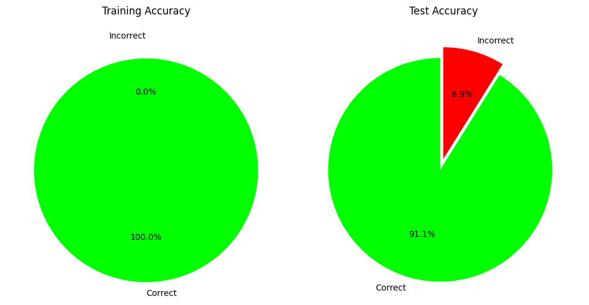
    


### Model Confusion Matrix


```python
y_true = []
y_pred = []

model.eval()
with torch.no_grad():
    for X_batch, y_batch in test_loader:
        # Get raw scores
        outputs = model(X_batch)
        # Convert raw scores to class index (0, 1, or 2)
        _, predicted = torch.max(outputs, 1)
        # Store results
        y_true.extend(y_batch.cpu().numpy())
        y_pred.extend(predicted.cpu().numpy())

cm = confusion_matrix(y_true, y_pred)

plt.figure(figsize=(8, 6))
sns.heatmap(
    cm, 
    annot=True, 
    fmt="d", 
    cmap="Blues",
    xticklabels=["Setosa", "Versicolor", "Virginica"],
    yticklabels=["Setosa", "Versicolor", "Virginica"]
)
plt.xlabel("Predicted Label")
plt.ylabel("Actual Label")
plt.title("Confusion Matrix: Where did the model fail?")
plt.show()
```


    
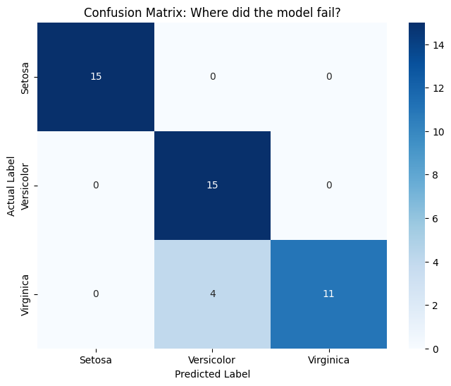
    


### Model Training vs Validation Over Epochs


```python
plt.figure(figsize=(10, 6))
plt.plot(range(len(train_losses)), train_losses, label="Training Loss")
plt.plot(range(len(val_losses)), val_losses, label="Validation Loss")
plt.xlabel("Epochs")
plt.ylabel("Loss")
plt.title("Training and Validation Loss Over Epochs")
plt.legend()
plt.show()
```


    
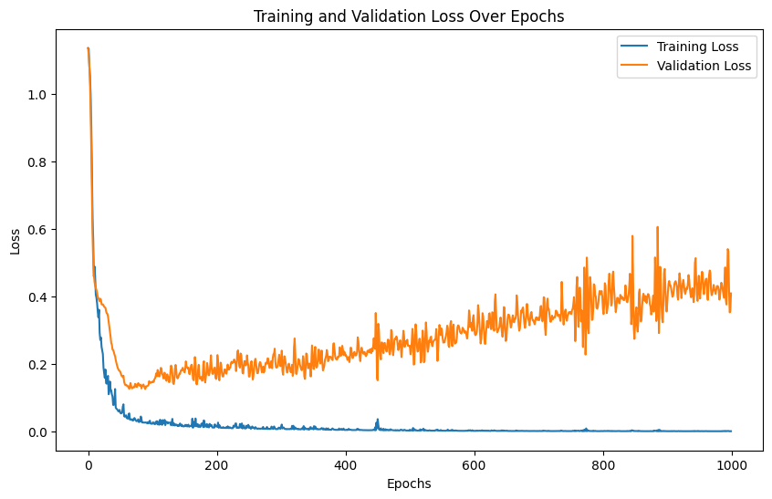
    


### Model Classification Report


```python
print(classification_report(
    y_true,
    y_pred, 
    target_names=["Setosa", "Versicolor", "Virginica"]
))
```

                  precision    recall  f1-score   support
    
          Setosa       1.00      1.00      1.00        15
      Versicolor       0.79      1.00      0.88        15
       Virginica       1.00      0.73      0.85        15
    
        accuracy                           0.91        45
       macro avg       0.93      0.91      0.91        45
    weighted avg       0.93      0.91      0.91        45
    


### ROC Curve


```python
y_probs = []
y_true = []

model.eval()
with torch.no_grad():
    for X_batch, y_batch in test_loader:
        # Get Logits (Raw scores)
        logits = model(X_batch)
        # Apply Softmax to get Probabilities (0.0 to 1.0)
        probs = F.softmax(logits, dim=1)
        # Store results
        y_probs.extend(probs.cpu().numpy())
        y_true.extend(y_batch.cpu().numpy())

# Convert to numpy array for Scikit-Learn
y_probs = np.array(y_probs)
y_probs
```


    array([[4.00222007e-07, 9.23992870e-13, 9.99999642e-01],
           [2.40723691e-10, 1.00000000e+00, 1.50104831e-12],
           [5.48299823e-08, 9.99999881e-01, 3.61460373e-08],
           [2.02408423e-09, 1.00000000e+00, 3.18745134e-11],
           [1.69062742e-03, 2.99382359e-01, 6.98926985e-01],
           [6.71729481e-08, 2.85314394e-19, 9.99999881e-01],
           [8.65836153e-11, 1.00000000e+00, 4.84421151e-13],
           [1.43236560e-11, 1.00000000e+00, 1.24423583e-14],
           [9.99951601e-01, 4.64150835e-05, 1.99366514e-06],
           [9.49456194e-07, 1.72841193e-13, 9.99999046e-01],
           [9.99944806e-01, 5.50627410e-05, 1.50921977e-07],
           [9.99991536e-01, 2.58664090e-06, 5.78880008e-06],
           [4.55327125e-07, 1.01209752e-12, 9.99999523e-01],
           [9.39977035e-05, 3.79039011e-05, 9.99868035e-01],
           [9.99977827e-01, 2.09151822e-05, 1.28188594e-06],
           [9.23003336e-06, 2.72560186e-12, 9.99990821e-01],
           [6.61629388e-12, 1.00000000e+00, 7.42467723e-17],
           [9.99982357e-01, 1.69111900e-05, 7.02497800e-07],
           [9.99942780e-01, 4.43840918e-06, 5.28387500e-05],
           [9.99971747e-01, 2.66714887e-05, 1.57756142e-06],
           [5.07376224e-11, 1.00000000e+00, 1.67471519e-13],
           [9.99989629e-01, 8.36812342e-06, 2.03545778e-06],
           [4.00349198e-11, 1.00000000e+00, 1.57583202e-13],
           [1.37121447e-07, 1.37704165e-17, 9.99999881e-01],
           [8.07535776e-04, 9.19196427e-01, 7.99959674e-02],
           [4.22621049e-10, 1.00000000e+00, 4.54664041e-12],
           [7.53122276e-09, 1.00000000e+00, 1.26843994e-10],
           [5.43500835e-12, 1.00000000e+00, 1.81460967e-16],
           [3.83779986e-09, 1.00000000e+00, 6.14532175e-11],
           [9.99979734e-01, 1.86589914e-05, 1.53225733e-06],
           [3.75925825e-04, 8.75599444e-01, 1.24024592e-01],
           [8.32402520e-08, 4.59461690e-18, 9.99999881e-01],
           [5.61682345e-09, 1.00000000e+00, 7.39320064e-11],
           [9.99985695e-01, 1.23113150e-05, 1.97731811e-06],
           [2.40172335e-06, 1.34336486e-10, 9.99997616e-01],
           [9.99993443e-01, 3.93314713e-06, 2.63856623e-06],
           [9.99994755e-01, 1.26822056e-06, 3.90346349e-06],
           [9.99992490e-01, 4.79279970e-06, 2.73823775e-06],
           [9.99257028e-01, 8.33061131e-05, 6.59657700e-04],
           [1.28695276e-04, 9.80778933e-01, 1.90924145e-02],
           [2.54812227e-10, 1.00000000e+00, 1.03721632e-12],
           [9.99998450e-01, 8.08660218e-07, 7.11300004e-07],
           [2.05454789e-03, 8.02953422e-01, 1.94991991e-01],
           [1.09241628e-05, 7.37367944e-09, 9.99989033e-01],
           [1.87666029e-11, 1.00000000e+00, 7.08893190e-14]], dtype=float32)


```python
final_auc_score = roc_auc_score(
    y_true, 
    y_probs, 
    multi_class="ovr"
)
final_auc_score
```


    0.9874074074074075


```python
final_auc_score = roc_auc_score(
    y_true, 
    y_probs, 
    multi_class="ovr"
)
print(f"Overall ROC AUC Score: {final_auc_score:.4f}")
colors = [
    "red", 
    "green", 
    "blue"
]
plt.figure(figsize=(10, 8))
for class_label in range(len(target_vars)):    
    # Create binary target for this specific class (One-vs-Rest)
    y_true_binary = (np.array(y_true) == class_label).astype(int)
    # Get the curve points
    fpr, tpr, _ = roc_curve(y_true_binary, y_probs[:, class_label])
    # Calculate AUC for this specific class
    current_auc = auc(fpr, tpr)
    # Plot
    plt.plot(
        fpr, 
        tpr, 
        color=colors[class_label],
        lw=2, 
        label=f"{target_vars[class_label]} (AUC = {current_auc:.4f})"
    )
plt.plot(
    [0, 1], 
    [0, 1], 
    "k--", 
    label="Random Classifier (AUC = 0.50)"
)
plt.xlabel("False Positive Rate")
plt.ylabel("True Positive Rate")
plt.title(f"Multi-Class ROC Curve (Overall AUC = {final_auc_score:.4f})")
plt.legend(loc="lower right")
plt.grid(alpha=0.3)
plt.tight_layout()
plt.show()
```

    Overall ROC AUC Score: 0.9874


    

    


### Summary Metrics


```python
test_accuracy = accuracy_score(y_true, y_pred)
precision, recall, f1, _ = precision_recall_fscore_support(
    y_true, 
    y_pred, 
    average="weighted"
)
auc_score = roc_auc_score(y_true, y_probs, multi_class="ovr")

print("-" * 101)
print(f"{'METRIC':<18} {'SCORE':<10} {'DESCRIPTION'}")
print("-" * 101)
print(f"{'Accuracy':<18} {test_accuracy:.4f}     Overall correctness (caution: misleading if classes are imbalanced)")
print(f"{'Precision':<18} {precision:.4f}     Trustworthiness: When it predicts 'Yes', how often is it right?")
print(f"{'Recall':<18} {recall:.4f}     Coverage: Of all actual 'Yes' cases, how many did we find?")
print(f"{'F1-Score':<18} {f1:.4f}     Balance: Harmonic mean of Precision & Recall (good for unequal classes)")
print(f"{'ROC AUC':<18} {auc_score:.4f}     Separability: How well it distinguishes between classes (1.0 = perfect)")
print("-" * 101)
```

    -----------------------------------------------------------------------------------------------------
    METRIC             SCORE      DESCRIPTION
    -----------------------------------------------------------------------------------------------------
    Accuracy           0.9333     Overall correctness (caution: misleading if classes are imbalanced)
    Precision          0.9345     Trustworthiness: When it predicts 'Yes', how often is it right?
    Recall             0.9333     Coverage: Of all actual 'Yes' cases, how many did we find?
    F1-Score           0.9333     Balance: Harmonic mean of Precision & Recall (good for unequal classes)
    ROC AUC            0.9941     Separability: How well it distinguishes between classes (1.0 = perfect)
    -----------------------------------------------------------------------------------------------------


## Postprocessing

### SHAP

#### Create SHAP Explainer & Compute Values


```python
def model_predict(data_numpy):
    """
    Wrapper function to make a PyTorch model compatible with SHAP Explainer.

    Parameters:
        data_numpy (np.ndarray): A 2D Numpy array of input features 
                                 with shape (n_samples, n_features).

    Returns:
        np.ndarray: A 2D Numpy array of class probabilities with shape 
                    (n_samples, n_classes). Each row sums to 1.0.
    """
    data_tensor = torch.tensor(data_numpy).float().to(DEVICE)
    model.eval()
    with torch.no_grad():
        logits = model(data_tensor)
        probs = F.softmax(logits, dim=1)
    return probs.cpu().numpy()


# We summarize the training background to 100 representative samples (speeds up calculation)
background = shap.kmeans(X_train_scaled.values, 100)
explainer = shap.KernelExplainer(model_predict, background)

# Note: For multi-class, this returns a LIST of n arrays (one per class)
shap_values_all = explainer.shap_values(X_test_scaled.values)
```


      0%|          | 0/45 [00:00<?, ?it/s]


#### Global Explanation (Feature Importance)


```python
plt.figure(figsize=(10, 5))
shap.summary_plot(
    shap_values_all, 
    X_test_scaled, 
    class_names=["Setosa", "Versicolor", "Virginica"],
    plot_type="bar",
    show=False 
)
plt.xlabel("Average Absolute SHAP Value (Feature Importance)")
plt.tight_layout()
plt.show()
```

    /var/folders/qg/60m3b34x32gczgr10l3665300000gn/T/ipykernel_93934/1735042558.py:2: FutureWarning: The NumPy global RNG was seeded by calling `np.random.seed`. In a future version this function will no longer use the global RNG. Pass `rng` explicitly to opt-in to the new behaviour and silence this warning.
      shap.summary_plot(


    

    


## New Model


```python
IN_FEATURES = 3
IN_FEATURES
```


    3


### Re-Create `Features` Variable for Audit & Modeling 


```python
lean_features = [
    "sepal_dominance", 
    "petal_width", 
    "petal_length"
]
lean_features
```


    ['sepal_dominance', 'petal_width', 'petal_length']


```python
class NewModel(nn.Module):
    """
    A feedforward neural network with two hidden layers and optional dropout.
    """

    def __init__(
            self, 
            in_features=IN_FEATURES, 
            h1=H1, 
            h2=H2, 
            out_features=OUT_FEATURES, 
            dropout=DROPOUT
    ):
        """
        Initializes the neural network layers.

        Parameters:
            in_features (int): Number of input features.
            h1 (int): Number of neurons in the first hidden layer.
            h2 (int): Number of neurons in the second hidden layer.
            out_features (int): Number of output features.
            dropout (float): Dropout rate (0.0 = no dropout).

        Returns:
            None
        """
        super(NewModel, self).__init__()
        self.fc1 = nn.Linear(in_features, h1)
        self.fc2 = nn.Linear(h1, h2)
        self.out = nn.Linear(h2, out_features)
        self.dropout = nn.Dropout(p=dropout)

    def forward(self, x):
        """
        Defines the forward pass of the neural network.

        Parameters:
            x (torch.Tensor): Input tensor.
        
        Returns:
            torch.Tensor: Output tensor after passing through the network.
        """
        x = F.relu(self.fc1(x))
        x = self.dropout(x)
        x = F.relu(self.fc2(x))
        x = self.dropout(x)
        x = self.out(x)
        return x
```

### Re-Instantiate Model


```python
if torch.cuda.is_available():
    DEVICE = torch.device("cuda")
elif torch.backends.mps.is_available():
    DEVICE = torch.device("mps")
else:
    DEVICE = torch.device("cpu")    
new_model = NewModel().to(DEVICE)
new_model
```


    NewModel(
      (fc1): Linear(in_features=3, out_features=8, bias=True)
      (fc2): Linear(in_features=8, out_features=8, bias=True)
      (out): Linear(in_features=8, out_features=3, bias=True)
      (dropout): Dropout(p=0.0, inplace=False)
    )


```python
next(new_model.parameters()).device
```


    device(type='mps', index=0)


### Re-Train-Test Split Model


```python
X = df_preprocessed[lean_features].values.astype("float32")
X
```


    array([[1. , 0.2, 1.4],
           [1. , 0.2, 1.4],
           [1. , 0.2, 1.3],
           [1. , 0.2, 1.5],
           [1. , 0.2, 1.4],
           [1. , 0.4, 1.7],
           [1. , 0.3, 1.4],
           [1. , 0.2, 1.5],
           [1. , 0.2, 1.4],
           [1. , 0.1, 1.5],
           [1. , 0.2, 1.5],
           [1. , 0.2, 1.6],
           [1. , 0.1, 1.4],
           [1. , 0.1, 1.1],
           [1. , 0.2, 1.2],
           [1. , 0.4, 1.5],
           [1. , 0.4, 1.3],
           [1. , 0.3, 1.4],
           [1. , 0.3, 1.7],
           [1. , 0.3, 1.5],
           [1. , 0.2, 1.7],
           [1. , 0.4, 1.5],
           [1. , 0.2, 1. ],
           [1. , 0.5, 1.7],
           [1. , 0.2, 1.9],
           [1. , 0.2, 1.6],
           [1. , 0.4, 1.6],
           [1. , 0.2, 1.5],
           [1. , 0.2, 1.4],
           [1. , 0.2, 1.6],
           [1. , 0.2, 1.6],
           [1. , 0.4, 1.5],
           [1. , 0.1, 1.5],
           [1. , 0.2, 1.4],
           [1. , 0.1, 1.5],
           [1. , 0.2, 1.2],
           [1. , 0.2, 1.3],
           [1. , 0.1, 1.5],
           [1. , 0.2, 1.3],
           [1. , 0.2, 1.5],
           [1. , 0.3, 1.3],
           [1. , 0.3, 1.3],
           [1. , 0.2, 1.3],
           [1. , 0.6, 1.6],
           [1. , 0.4, 1.9],
           [1. , 0.3, 1.4],
           [1. , 0.2, 1.6],
           [1. , 0.2, 1.4],
           [1. , 0.2, 1.5],
           [1. , 0.2, 1.4],
           [0. , 1.4, 4.7],
           [0. , 1.5, 4.5],
           [0. , 1.5, 4.9],
           [0. , 1.3, 4. ],
           [0. , 1.5, 4.6],
           [0. , 1.3, 4.5],
           [0. , 1.6, 4.7],
           [0. , 1. , 3.3],
           [0. , 1.3, 4.6],
           [0. , 1.4, 3.9],
           [0. , 1. , 3.5],
           [0. , 1.5, 4.2],
           [0. , 1. , 4. ],
           [0. , 1.4, 4.7],
           [0. , 1.3, 3.6],
           [0. , 1.4, 4.4],
           [0. , 1.5, 4.5],
           [0. , 1. , 4.1],
           [0. , 1.5, 4.5],
           [0. , 1.1, 3.9],
           [0. , 1.8, 4.8],
           [0. , 1.3, 4. ],
           [0. , 1.5, 4.9],
           [0. , 1.2, 4.7],
           [0. , 1.3, 4.3],
           [0. , 1.4, 4.4],
           [0. , 1.4, 4.8],
           [0. , 1.7, 5. ],
           [0. , 1.5, 4.5],
           [0. , 1. , 3.5],
           [0. , 1.1, 3.8],
           [0. , 1. , 3.7],
           [0. , 1.2, 3.9],
           [0. , 1.6, 5.1],
           [0. , 1.5, 4.5],
           [0. , 1.6, 4.5],
           [0. , 1.5, 4.7],
           [0. , 1.3, 4.4],
           [0. , 1.3, 4.1],
           [0. , 1.3, 4. ],
           [0. , 1.2, 4.4],
           [0. , 1.4, 4.6],
           [0. , 1.2, 4. ],
           [0. , 1. , 3.3],
           [0. , 1.3, 4.2],
           [0. , 1.2, 4.2],
           [0. , 1.3, 4.2],
           [0. , 1.3, 4.3],
           [0. , 1.1, 3. ],
           [0. , 1.3, 4.1],
           [0. , 2.5, 6. ],
           [0. , 1.9, 5.1],
           [0. , 2.1, 5.9],
           [0. , 1.8, 5.6],
           [0. , 2.2, 5.8],
           [0. , 2.1, 6.6],
           [0. , 1.7, 4.5],
           [0. , 1.8, 6.3],
           [0. , 1.8, 5.8],
           [0. , 2.5, 6.1],
           [0. , 2. , 5.1],
           [0. , 1.9, 5.3],
           [0. , 2.1, 5.5],
           [0. , 2. , 5. ],
           [0. , 2.4, 5.1],
           [0. , 2.3, 5.3],
           [0. , 1.8, 5.5],
           [0. , 2.2, 6.7],
           [0. , 2.3, 6.9],
           [0. , 1.5, 5. ],
           [0. , 2.3, 5.7],
           [0. , 2. , 4.9],
           [0. , 2. , 6.7],
           [0. , 1.8, 4.9],
           [0. , 2.1, 5.7],
           [0. , 1.8, 6. ],
           [0. , 1.8, 4.8],
           [0. , 1.8, 4.9],
           [0. , 2.1, 5.6],
           [0. , 1.6, 5.8],
           [0. , 1.9, 6.1],
           [0. , 2. , 6.4],
           [0. , 2.2, 5.6],
           [0. , 1.5, 5.1],
           [0. , 1.4, 5.6],
           [0. , 2.3, 6.1],
           [0. , 2.4, 5.6],
           [0. , 1.8, 5.5],
           [0. , 1.8, 4.8],
           [0. , 2.1, 5.4],
           [0. , 2.4, 5.6],
           [0. , 2.3, 5.1],
           [0. , 1.9, 5.1],
           [0. , 2.3, 5.9],
           [0. , 2.5, 5.7],
           [0. , 2.3, 5.2],
           [0. , 1.9, 5. ],
           [0. , 2. , 5.2],
           [0. , 2.3, 5.4],
           [0. , 1.8, 5.1]], dtype=float32)


```python
if MODE == "classification":
    y = df_preprocessed[target_var].values.astype("int64")
else:
    y = df_preprocessed[target_var].values.astype("float32")
y
```


    array([0, 0, 0, 0, 0, 0, 0, 0, 0, 0, 0, 0, 0, 0, 0, 0, 0, 0, 0, 0, 0, 0,
           0, 0, 0, 0, 0, 0, 0, 0, 0, 0, 0, 0, 0, 0, 0, 0, 0, 0, 0, 0, 0, 0,
           0, 0, 0, 0, 0, 0, 1, 1, 1, 1, 1, 1, 1, 1, 1, 1, 1, 1, 1, 1, 1, 1,
           1, 1, 1, 1, 1, 1, 1, 1, 1, 1, 1, 1, 1, 1, 1, 1, 1, 1, 1, 1, 1, 1,
           1, 1, 1, 1, 1, 1, 1, 1, 1, 1, 1, 1, 2, 2, 2, 2, 2, 2, 2, 2, 2, 2,
           2, 2, 2, 2, 2, 2, 2, 2, 2, 2, 2, 2, 2, 2, 2, 2, 2, 2, 2, 2, 2, 2,
           2, 2, 2, 2, 2, 2, 2, 2, 2, 2, 2, 2, 2, 2, 2, 2, 2, 2])


```python
X.shape
```


    (150, 3)


```python
y.shape
```


    (150,)


```python
if MODE == "classification":
    train_idx, test_idx = train_test_split(
        np.arange(len(X)), 
        test_size=TEST_SIZE, 
        random_state=SEED, 
        stratify=y
    )
else:
    train_idx, test_idx = train_test_split(
        np.arange(len(X)), 
        test_size=TEST_SIZE, 
        random_state=SEED
    )   
X_train, X_test = X[train_idx], X[test_idx]
y_train, y_test = y[train_idx], y[test_idx]
len(train_idx), len(test_idx)
```


    (105, 45)


```python
X_train
```


    array([[0. , 1.1, 3. ],
           [0. , 1.5, 4.5],
           [1. , 0.3, 1.5],
           [0. , 2.3, 5.9],
           [0. , 1.3, 4.1],
           [0. , 2.3, 5.2],
           [1. , 0.1, 1.5],
           [1. , 0.2, 1.6],
           [1. , 0.2, 1.4],
           [0. , 2.1, 5.9],
           [0. , 2. , 5.1],
           [1. , 0.2, 1.4],
           [1. , 0.2, 1.6],
           [0. , 1.5, 4.5],
           [0. , 1.1, 3.8],
           [0. , 1.8, 6. ],
           [1. , 0.4, 1.6],
           [1. , 0.2, 1.6],
           [0. , 2.5, 5.7],
           [0. , 1.8, 4.8],
           [1. , 0.4, 1.5],
           [0. , 1.8, 4.9],
           [0. , 2.1, 6.6],
           [0. , 2. , 6.7],
           [0. , 1.2, 4.2],
           [1. , 0.3, 1.4],
           [1. , 0.4, 1.5],
           [1. , 0.4, 1.3],
           [0. , 1.5, 4.9],
           [0. , 1.3, 4. ],
           [1. , 0.4, 1.5],
           [1. , 0.3, 1.4],
           [0. , 1. , 4.1],
           [0. , 1.3, 3.6],
           [1. , 0.1, 1.4],
           [1. , 0.3, 1.4],
           [0. , 1.4, 4.4],
           [0. , 1.9, 5. ],
           [0. , 2. , 6.4],
           [1. , 0.2, 1.4],
           [0. , 2.1, 5.6],
           [1. , 0.2, 1.4],
           [0. , 1.5, 5. ],
           [1. , 0.2, 1.3],
           [0. , 2.5, 6. ],
           [0. , 1. , 4. ],
           [1. , 0.2, 1.9],
           [0. , 2.3, 6.1],
           [0. , 1.3, 4. ],
           [0. , 2. , 5. ],
           [0. , 1.2, 3.9],
           [1. , 0.3, 1.3],
           [0. , 1. , 3.7],
           [0. , 1.8, 5.5],
           [0. , 1.4, 4.6],
           [0. , 1.8, 5.6],
           [1. , 0.2, 1.5],
           [0. , 1.3, 4.2],
           [1. , 0.2, 1.4],
           [0. , 1.5, 4.7],
           [0. , 1.4, 4.8],
           [0. , 1.4, 3.9],
           [0. , 2.5, 6.1],
           [0. , 1.6, 5.1],
           [0. , 1.3, 4.3],
           [0. , 2.4, 5.6],
           [0. , 2. , 4.9],
           [1. , 0.1, 1.5],
           [0. , 2.3, 5.7],
           [0. , 1.5, 4.6],
           [0. , 1.3, 4.1],
           [0. , 2.3, 6.9],
           [1. , 0.1, 1.5],
           [0. , 2.3, 5.3],
           [0. , 1.8, 5.1],
           [0. , 1.3, 4.4],
           [1. , 0.2, 1.6],
           [0. , 2.2, 6.7],
           [0. , 2.1, 5.5],
           [1. , 0.4, 1.9],
           [1. , 0.1, 1.1],
           [0. , 1.8, 4.8],
           [0. , 1.6, 5.8],
           [0. , 2.4, 5.1],
           [1. , 0.4, 1.7],
           [0. , 1.9, 5.1],
           [0. , 1. , 3.5],
           [0. , 2.1, 5.7],
           [0. , 1.9, 6.1],
           [1. , 0.2, 1.5],
           [0. , 1.2, 4.7],
           [0. , 1.2, 4.4],
           [0. , 1.4, 4.7],
           [0. , 1.5, 4.9],
           [0. , 1.5, 4.2],
           [1. , 0.2, 1.5],
           [0. , 2.1, 5.4],
           [0. , 1.2, 4. ],
           [0. , 1.9, 5.1],
           [1. , 0.2, 1.6],
           [1. , 0.1, 1.5],
           [0. , 1. , 3.5],
           [1. , 0.2, 1.4],
           [0. , 1.3, 4.2],
           [1. , 0.2, 1.5]], dtype=float32)


```python
X_train.shape
```


    (105, 3)


```python
y_train
```


    array([1, 1, 0, 2, 1, 2, 0, 0, 0, 2, 2, 0, 0, 1, 1, 2, 0, 0, 2, 1, 0, 2,
           2, 2, 1, 0, 0, 0, 1, 1, 0, 0, 1, 1, 0, 0, 1, 2, 2, 0, 2, 0, 2, 0,
           2, 1, 0, 2, 1, 2, 1, 0, 1, 2, 1, 2, 0, 1, 0, 1, 1, 1, 2, 1, 1, 2,
           2, 0, 2, 1, 1, 2, 0, 2, 2, 1, 0, 2, 2, 0, 0, 2, 2, 2, 0, 2, 1, 2,
           2, 0, 1, 1, 1, 1, 1, 0, 2, 1, 2, 0, 0, 1, 0, 1, 0])


```python
y_train.shape
```


    (105,)


```python
X_test
```


    array([[0. , 1.8, 6.3],
           [0. , 1.4, 4.7],
           [0. , 1.5, 5.1],
           [0. , 1.6, 4.7],
           [0. , 1.8, 4.9],
           [0. , 2.4, 5.6],
           [0. , 1.3, 4. ],
           [0. , 1.1, 3.9],
           [1. , 0.2, 1.7],
           [0. , 2.3, 5.1],
           [1. , 0.2, 1.2],
           [1. , 0.2, 1.3],
           [0. , 1.8, 5.8],
           [0. , 1.8, 5.5],
           [1. , 0.2, 1.4],
           [0. , 2.3, 5.4],
           [0. , 1. , 3.3],
           [1. , 0.2, 1.5],
           [1. , 0.5, 1.7],
           [1. , 0.3, 1.7],
           [0. , 1.3, 4.3],
           [1. , 0.2, 1.5],
           [0. , 1.4, 4.4],
           [0. , 2.2, 5.8],
           [0. , 1.8, 4.8],
           [0. , 1.5, 4.5],
           [0. , 1.5, 4.5],
           [0. , 1. , 3.3],
           [0. , 1.5, 4.5],
           [1. , 0.2, 1.2],
           [0. , 1.4, 5.6],
           [0. , 2.2, 5.6],
           [0. , 1.6, 4.5],
           [1. , 0.2, 1.4],
           [0. , 1.9, 5.3],
           [1. , 0.3, 1.3],
           [1. , 0.2, 1.3],
           [1. , 0.2, 1.3],
           [1. , 0.6, 1.6],
           [0. , 1.7, 5. ],
           [0. , 1.3, 4.5],
           [1. , 0.2, 1. ],
           [0. , 1.7, 4.5],
           [0. , 2. , 5.2],
           [0. , 1.3, 4.6]], dtype=float32)


```python
X_test.shape
```


    (45, 3)


```python
y_test
```


    array([2, 1, 2, 1, 2, 2, 1, 1, 0, 2, 0, 0, 2, 2, 0, 2, 1, 0, 0, 0, 1, 0,
           1, 2, 2, 1, 1, 1, 1, 0, 2, 2, 1, 0, 2, 0, 0, 0, 0, 1, 1, 0, 2, 2,
           1])


```python
y_test.shape
```


    (45,)


### Re-Scale Features


```python
scaler = StandardScaler()
X_train_scaled = pd.DataFrame(
    scaler.fit_transform(X_train),
    columns=lean_features
)
X_test_scaled = pd.DataFrame(
    scaler.transform(X_test),
    columns=lean_features
)

# Re-save scaler for inference
joblib.dump(scaler, "iris_scaler.pkl")
print("Scaler Saved: 'iris_scaler.pkl'")
```

    Scaler Saved: 'iris_scaler.pkl'


### Re-Create Custom Dataset (Memory Efficient)


```python
class NumpyDataset(torch.utils.data.Dataset):
    """
    A memory-efficient dataset that keeps data as numpy arrays.
    Converts to tensors only when batching (on-demand).
    """

    def __init__(self, X, y, device, mode="classification"):
        """
        Initializes the dataset with numpy arrays.

        Parameters:
            X (np.ndarray): Feature array.
            y (np.ndarray): Label array.
            device (torch.device): Device to move tensors to.
            mode (str): "classification" or "regression".

        Returns:
            None
        """
        self.X = X
        self.y = y
        self.device = device
        self.mode = mode

    def __len__(self):
        """
        Returns the number of samples in the dataset.

        Returns:
            int: Number of samples.
        """
        return len(self.X)

    def __getitem__(self, idx):
        """
        Returns a single sample as tensors on the specified device.

        Parameters:
            idx (int): Index of the sample.

        Returns:
            tuple[torch.Tensor, torch.Tensor]: Feature and label tensors.
        """
        X_tensor = torch.tensor(self.X[idx]).float().to(self.device)
        if self.mode == "classification":
            y_tensor = torch.tensor(self.y[idx]).long().to(self.device)
        else:
            y_tensor = torch.tensor(self.y[idx]).float().to(self.device)
        return X_tensor, y_tensor
```

## Re-Create DataLoaders


```python
train_dataset = NumpyDataset(X_train_scaled.values, y_train, DEVICE, MODE)
test_dataset = NumpyDataset(X_test_scaled.values, y_test, DEVICE, MODE)
train_loader = DataLoader(train_dataset, batch_size=BATCH_SIZE, shuffle=True)
test_loader = DataLoader(test_dataset, batch_size=BATCH_SIZE, shuffle=False)
len(train_loader), len(test_loader)
```


    (4, 2)


## Re-Create Loss Function & Optimizer


```python
if MODE == "classification":
    if df[target_var].nunique() == 2:
        # OPTION A: Binary Specific (Output layer must have 1 neuron)
        criterion = nn.BCEWithLogitsLoss()
    else:
        # OPTION B: Standard Multiclass (Output layer must have 2+ neurons)
        criterion = nn.CrossEntropyLoss()
else:
    # OPTION C: Regression
    criterion = nn.MSELoss()
criterion
```


    CrossEntropyLoss()


```python
optimizer = torch.optim.AdamW(new_model.parameters(), lr=LR)
optimizer
```


    AdamW (
    Parameter Group 0
        amsgrad: False
        betas: (0.9, 0.999)
        capturable: False
        decoupled_weight_decay: True
        differentiable: False
        eps: 1e-08
        foreach: None
        fused: None
        lr: 0.01
        maximize: False
        weight_decay: 0.01
    )


## Re-Train Model


```python
train_losses = []
val_losses = []
train_losses, val_losses
```


    ([], [])


```python
best_val_loss = float("inf")

for i in range(EPOCHS):
    new_model.train()
    
    epoch_train_loss = 0.0

    for X_batch, y_batch in train_loader:
        optimizer.zero_grad()
        y_pred = new_model(X_batch)
        loss = criterion(y_pred, y_batch)
        loss.backward()
        optimizer.step()
        epoch_train_loss += loss.item()
    
    train_loss = epoch_train_loss / len(train_loader)
    train_losses.append(train_loss)

    new_model.eval()

    epoch_val_loss = 0.0
    
    with torch.no_grad():
        for X_batch, y_batch in test_loader:
            y_val_pred = new_model(X_batch)
            epoch_val_loss += criterion(y_val_pred, y_batch).item()
    val_loss = epoch_val_loss / len(test_loader)
    val_losses.append(val_loss)

    # Save model if validation loss improves
    if val_loss < best_val_loss:
        best_val_loss = val_loss
        torch.save(new_model.state_dict(), "iris_model.pth")

    if i % LOG_INTERVAL == 0:
        print(f"Epoch {i}/{EPOCHS} - Training Loss: {train_loss:.4f} - Validation Loss: {val_loss:.4f}")

print("-" * 30)
print(f"Best Validation Loss: {best_val_loss:.4f}")
print("Model Weights Saved: 'iris_model.pth'")
```

    Epoch 0/1000 - Training Loss: 1.0735 - Validation Loss: 1.0206
    Epoch 10/1000 - Training Loss: 0.1752 - Validation Loss: 0.2261
    Epoch 20/1000 - Training Loss: 0.0578 - Validation Loss: 0.1696
    Epoch 30/1000 - Training Loss: 0.0763 - Validation Loss: 0.1637
    Epoch 40/1000 - Training Loss: 0.0554 - Validation Loss: 0.1845
    Epoch 50/1000 - Training Loss: 0.0467 - Validation Loss: 0.1695
    Epoch 60/1000 - Training Loss: 0.0604 - Validation Loss: 0.2041
    Epoch 70/1000 - Training Loss: 0.0714 - Validation Loss: 0.1780
    Epoch 80/1000 - Training Loss: 0.0942 - Validation Loss: 0.1906
    Epoch 90/1000 - Training Loss: 0.0404 - Validation Loss: 0.1591
    Epoch 100/1000 - Training Loss: 0.0532 - Validation Loss: 0.1836
    Epoch 110/1000 - Training Loss: 0.0411 - Validation Loss: 0.1731
    Epoch 120/1000 - Training Loss: 0.0388 - Validation Loss: 0.1757
    Epoch 130/1000 - Training Loss: 0.0389 - Validation Loss: 0.1697
    Epoch 140/1000 - Training Loss: 0.0539 - Validation Loss: 0.1631
    Epoch 150/1000 - Training Loss: 0.0619 - Validation Loss: 0.2242
    Epoch 160/1000 - Training Loss: 0.0419 - Validation Loss: 0.1842
    Epoch 170/1000 - Training Loss: 0.0993 - Validation Loss: 0.1656
    Epoch 180/1000 - Training Loss: 0.0450 - Validation Loss: 0.1617
    Epoch 190/1000 - Training Loss: 0.0556 - Validation Loss: 0.2140
    Epoch 200/1000 - Training Loss: 0.0402 - Validation Loss: 0.1716
    Epoch 210/1000 - Training Loss: 0.0401 - Validation Loss: 0.1720
    Epoch 220/1000 - Training Loss: 0.0375 - Validation Loss: 0.2012
    Epoch 230/1000 - Training Loss: 0.0395 - Validation Loss: 0.1669
    Epoch 240/1000 - Training Loss: 0.0389 - Validation Loss: 0.1715
    Epoch 250/1000 - Training Loss: 0.0393 - Validation Loss: 0.1837
    Epoch 260/1000 - Training Loss: 0.0388 - Validation Loss: 0.1732
    Epoch 270/1000 - Training Loss: 0.0404 - Validation Loss: 0.2019
    Epoch 280/1000 - Training Loss: 0.0389 - Validation Loss: 0.1823
    Epoch 290/1000 - Training Loss: 0.0437 - Validation Loss: 0.1691
    Epoch 300/1000 - Training Loss: 0.1004 - Validation Loss: 0.2070
    Epoch 310/1000 - Training Loss: 0.0384 - Validation Loss: 0.1760
    Epoch 320/1000 - Training Loss: 0.0385 - Validation Loss: 0.1794
    Epoch 330/1000 - Training Loss: 0.0891 - Validation Loss: 0.2017
    Epoch 340/1000 - Training Loss: 0.0429 - Validation Loss: 0.1754
    Epoch 350/1000 - Training Loss: 0.0415 - Validation Loss: 0.1823
    Epoch 360/1000 - Training Loss: 0.0407 - Validation Loss: 0.1884
    Epoch 370/1000 - Training Loss: 0.0378 - Validation Loss: 0.1738
    Epoch 380/1000 - Training Loss: 0.0407 - Validation Loss: 0.1822
    Epoch 390/1000 - Training Loss: 0.0396 - Validation Loss: 0.1922
    Epoch 400/1000 - Training Loss: 0.0454 - Validation Loss: 0.1716
    Epoch 410/1000 - Training Loss: 0.0429 - Validation Loss: 0.1749
    Epoch 420/1000 - Training Loss: 0.0712 - Validation Loss: 0.1787
    Epoch 430/1000 - Training Loss: 0.0455 - Validation Loss: 0.1888
    Epoch 440/1000 - Training Loss: 0.0450 - Validation Loss: 0.1746
    Epoch 450/1000 - Training Loss: 0.0392 - Validation Loss: 0.1981
    Epoch 460/1000 - Training Loss: 0.0394 - Validation Loss: 0.1939
    Epoch 470/1000 - Training Loss: 0.0811 - Validation Loss: 0.1748
    Epoch 480/1000 - Training Loss: 0.0774 - Validation Loss: 0.1859
    Epoch 490/1000 - Training Loss: 0.0733 - Validation Loss: 0.1835
    Epoch 500/1000 - Training Loss: 0.0422 - Validation Loss: 0.1809
    Epoch 510/1000 - Training Loss: 0.0395 - Validation Loss: 0.1822
    Epoch 520/1000 - Training Loss: 0.0681 - Validation Loss: 0.1789
    Epoch 530/1000 - Training Loss: 0.0392 - Validation Loss: 0.1965
    Epoch 540/1000 - Training Loss: 0.0396 - Validation Loss: 0.1931
    Epoch 550/1000 - Training Loss: 0.0591 - Validation Loss: 0.1949
    Epoch 560/1000 - Training Loss: 0.0793 - Validation Loss: 0.1782
    Epoch 570/1000 - Training Loss: 0.0606 - Validation Loss: 0.1907
    Epoch 580/1000 - Training Loss: 0.0511 - Validation Loss: 0.1723
    Epoch 590/1000 - Training Loss: 0.0415 - Validation Loss: 0.2065
    Epoch 600/1000 - Training Loss: 0.0391 - Validation Loss: 0.1793
    Epoch 610/1000 - Training Loss: 0.0435 - Validation Loss: 0.1712
    Epoch 620/1000 - Training Loss: 0.0597 - Validation Loss: 0.1866
    Epoch 630/1000 - Training Loss: 0.0403 - Validation Loss: 0.1925
    Epoch 640/1000 - Training Loss: 0.0401 - Validation Loss: 0.1812
    Epoch 650/1000 - Training Loss: 0.0402 - Validation Loss: 0.2027
    Epoch 660/1000 - Training Loss: 0.0417 - Validation Loss: 0.1808
    Epoch 670/1000 - Training Loss: 0.0384 - Validation Loss: 0.1878
    Epoch 680/1000 - Training Loss: 0.0397 - Validation Loss: 0.1863
    Epoch 690/1000 - Training Loss: 0.0572 - Validation Loss: 0.1994
    Epoch 700/1000 - Training Loss: 0.0430 - Validation Loss: 0.1731
    Epoch 710/1000 - Training Loss: 0.0474 - Validation Loss: 0.1756
    Epoch 720/1000 - Training Loss: 0.0399 - Validation Loss: 0.1774
    Epoch 730/1000 - Training Loss: 0.0377 - Validation Loss: 0.1870
    Epoch 740/1000 - Training Loss: 0.0440 - Validation Loss: 0.1778
    Epoch 750/1000 - Training Loss: 0.0714 - Validation Loss: 0.1852
    Epoch 760/1000 - Training Loss: 0.0618 - Validation Loss: 0.2115
    Epoch 770/1000 - Training Loss: 0.0778 - Validation Loss: 0.1741
    Epoch 780/1000 - Training Loss: 0.0380 - Validation Loss: 0.1993
    Epoch 790/1000 - Training Loss: 0.0409 - Validation Loss: 0.1778
    Epoch 800/1000 - Training Loss: 0.0384 - Validation Loss: 0.1887
    Epoch 810/1000 - Training Loss: 0.0453 - Validation Loss: 0.1776
    Epoch 820/1000 - Training Loss: 0.0394 - Validation Loss: 0.1976
    Epoch 830/1000 - Training Loss: 0.0650 - Validation Loss: 0.1757
    Epoch 840/1000 - Training Loss: 0.0380 - Validation Loss: 0.1959
    Epoch 850/1000 - Training Loss: 0.0413 - Validation Loss: 0.1941
    Epoch 860/1000 - Training Loss: 0.0391 - Validation Loss: 0.2044
    Epoch 870/1000 - Training Loss: 0.0404 - Validation Loss: 0.1884
    Epoch 880/1000 - Training Loss: 0.0394 - Validation Loss: 0.1965
    Epoch 890/1000 - Training Loss: 0.0394 - Validation Loss: 0.1889
    Epoch 900/1000 - Training Loss: 0.0641 - Validation Loss: 0.1854
    Epoch 910/1000 - Training Loss: 0.0423 - Validation Loss: 0.1853
    Epoch 920/1000 - Training Loss: 0.0479 - Validation Loss: 0.2510
    Epoch 930/1000 - Training Loss: 0.0459 - Validation Loss: 0.2144
    Epoch 940/1000 - Training Loss: 0.0390 - Validation Loss: 0.1751
    Epoch 950/1000 - Training Loss: 0.0621 - Validation Loss: 0.1812
    Epoch 960/1000 - Training Loss: 0.0410 - Validation Loss: 0.1776
    Epoch 970/1000 - Training Loss: 0.0726 - Validation Loss: 0.1767
    Epoch 980/1000 - Training Loss: 0.0567 - Validation Loss: 0.1845
    Epoch 990/1000 - Training Loss: 0.0424 - Validation Loss: 0.1783
    ------------------------------
    Best Validation Loss: 0.1500
    Model Weights Saved: 'iris_model.pth'


## Evaluate Model


```python
new_model.eval()
```


    NewModel(
      (fc1): Linear(in_features=3, out_features=8, bias=True)
      (fc2): Linear(in_features=8, out_features=8, bias=True)
      (out): Linear(in_features=8, out_features=3, bias=True)
      (dropout): Dropout(p=0.0, inplace=False)
    )


```python
total_val_loss = 0.0
total_val_loss
```


    0.0


```python
with torch.no_grad():
    for X_batch, y_batch in test_loader:
        y_eval = new_model(X_batch)
        total_val_loss += criterion(y_eval, y_batch).item()
val_loss = total_val_loss / len(test_loader)
val_loss
```


    0.18089495040476322


### Model Accuracy & Loss


```python
new_model.eval()

if MODE == "classification":
    train_correct = 0
    train_total = 0
    test_correct = 0
    test_total = 0

    with torch.no_grad():
        for X_batch, y_batch in train_loader:
            preds = new_model(X_batch).argmax(dim=1)
            train_correct += (preds == y_batch).sum().item()
            train_total += len(y_batch)

        for X_batch, y_batch in test_loader:
            preds = new_model(X_batch).argmax(dim=1)
            test_correct += (preds == y_batch).sum().item()
            test_total += len(y_batch)

    train_acc = train_correct / train_total
    test_acc = test_correct / test_total
    
    print(f"Train Accuracy: {train_acc:.4f} ({train_correct}/{train_total})")
    print(f"Test Accuracy: {test_acc:.4f} ({test_correct}/{test_total})")
    print(f"Training Loss: {train_loss:.4f}")
    print(f"Validation Loss: {val_loss:.4f}")
else:
    train_preds_list = []
    train_targets_list = []
    test_preds_list = []
    test_targets_list = []

    with torch.no_grad():
        for X_batch, y_batch in train_loader:
            preds = new_model(X_batch).squeeze()
            train_preds_list.append(preds.cpu().numpy())
            train_targets_list.append(y_batch.cpu().numpy())

        for X_batch, y_batch in test_loader:
            preds = new_model(X_batch).squeeze()
            test_preds_list.append(preds.cpu().numpy())
            test_targets_list.append(y_batch.cpu().numpy())

    train_preds_np = np.concatenate(train_preds_list)
    train_targets_np = np.concatenate(train_targets_list)
    test_preds_np = np.concatenate(test_preds_list)
    test_targets_np = np.concatenate(test_targets_list)

    train_r2 = r2_score(train_targets_np, train_preds_np)
    test_r2 = r2_score(test_targets_np, test_preds_np)
    train_mse = mean_squared_error(train_targets_np, train_preds_np)
    test_mse = mean_squared_error(test_targets_np, test_preds_np)
    train_mae = mean_absolute_error(train_targets_np, train_preds_np)
    test_mae = mean_absolute_error(test_targets_np, test_preds_np)

    print(f"Train R²: {train_r2:.4f}")
    print(f"Test R²: {test_r2:.4f}")
    print(f"Train MSE: {train_mse:.4f}")
    print(f"Test MSE: {test_mse:.4f}")
    print(f"Train MAE: {train_mae:.4f}")
    print(f"Test MAE: {test_mae:.4f}")
    print(f"Training Loss: {train_loss:.4f}")
    print(f"Validation Loss: {val_loss:.4f}")
```

    Train Accuracy: 0.9714 (102/105)
    Test Accuracy: 0.9333 (42/45)
    Training Loss: 0.0425
    Validation Loss: 0.1809


### Model Correct vs Incorrect Predictions


```python
if MODE == "classification":
    fig, (ax1, ax2) = plt.subplots(1, 2, figsize=(10, 5))
    colors = ["#00FF00", "#FF0000"]  # Green for correct, red for incorrect
    ax1.pie([train_acc, 1 - train_acc], 
            labels=["Correct", "Incorrect"], 
            autopct="%1.1f%%", 
            colors=colors, 
            startangle=90, 
            explode=(0.1, 0))
    ax1.set_title("Training Accuracy")
    ax2.pie([test_acc, 1 - test_acc], 
            labels=["Correct", "Incorrect"], 
            autopct="%1.1f%%", 
            colors=colors, 
            startangle=90, 
            explode=(0.1, 0))
    ax2.set_title("Test Accuracy")
    plt.tight_layout()
    plt.show()
else:
    fig, (ax1, ax2) = plt.subplots(1, 2, figsize=(12, 5))
    ax1.scatter(train_targets_np, train_preds_np, alpha=0.5)
    ax1.plot([train_targets_np.min(), train_targets_np.max()], 
             [train_targets_np.min(), train_targets_np.max()], "r--", lw=2)
    ax1.set_xlabel("Actual")
    ax1.set_ylabel("Predicted")
    ax1.set_title(f"Train: Actual vs Predicted (R²={train_r2:.4f})")
    ax2.scatter(test_targets_np, test_preds_np, alpha=0.5)
    ax2.plot([test_targets_np.min(), test_targets_np.max()], 
             [test_targets_np.min(), test_targets_np.max()], "r--", lw=2)
    ax2.set_xlabel("Actual")
    ax2.set_ylabel("Predicted")
    ax2.set_title(f"Test: Actual vs Predicted (R²={test_r2:.4f})")
    plt.tight_layout()
    plt.show()
```


    
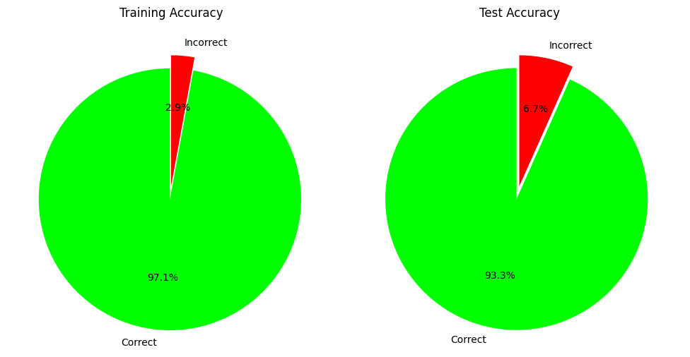
    


### Model Confusion Matrix


```python
y_true = []
y_pred = []

new_model.eval()
with torch.no_grad():
    for X_batch, y_batch in test_loader:
        # Get raw scores
        outputs = new_model(X_batch)
        # Convert raw scores to class index (0, 1, or 2)
        _, predicted = torch.max(outputs, 1)
        # Store results
        y_true.extend(y_batch.cpu().numpy())
        y_pred.extend(predicted.cpu().numpy())

cm = confusion_matrix(y_true, y_pred)

plt.figure(figsize=(8, 6))
sns.heatmap(
    cm, 
    annot=True, 
    fmt="d", 
    cmap="Blues",
    xticklabels=["Setosa", "Versicolor", "Virginica"],
    yticklabels=["Setosa", "Versicolor", "Virginica"]
)
plt.xlabel("Predicted Label")
plt.ylabel("Actual Label")
plt.title("Confusion Matrix: Where did the model fail?")
plt.show()
```


    
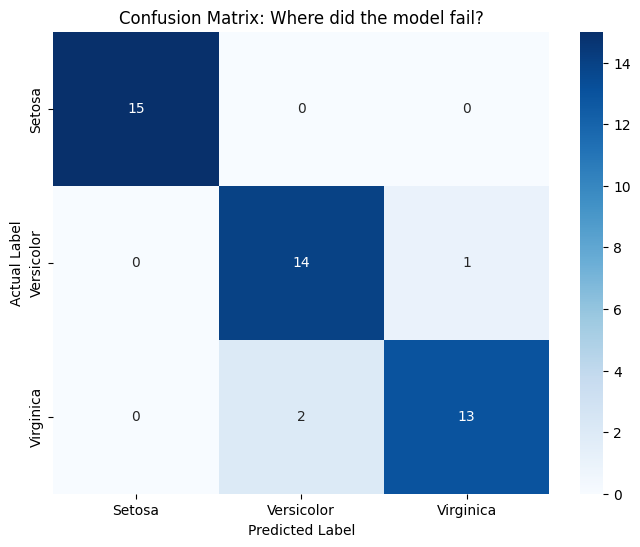
    


### Model Training vs Validation Over Epochs


```python
plt.figure(figsize=(10, 6))
plt.plot(range(len(train_losses)), train_losses, label="Training Loss")
plt.plot(range(len(val_losses)), val_losses, label="Validation Loss")
plt.xlabel("Epochs")
plt.ylabel("Loss")
plt.title("Training and Validation Loss Over Epochs")
plt.legend()
plt.show()
```


    
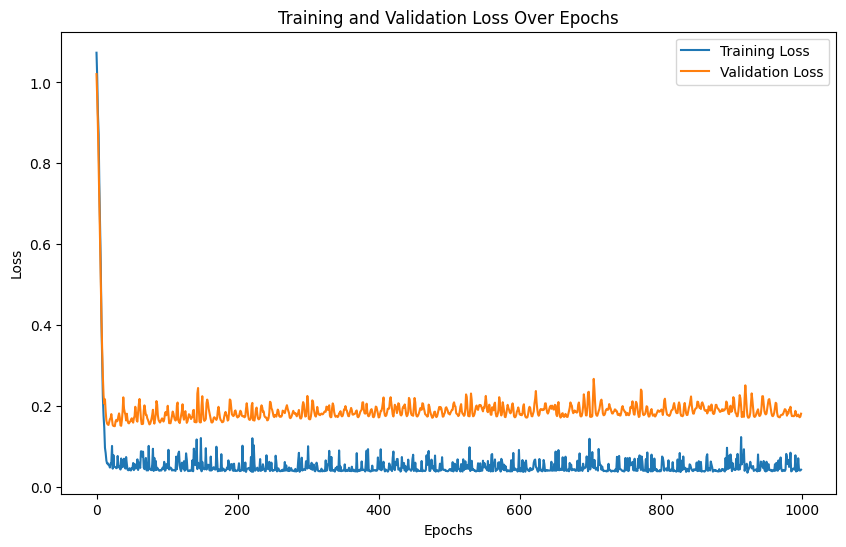
    


### Model Classification Report


```python
print(classification_report(
    y_true,
    y_pred, 
    target_names=["Setosa", "Versicolor", "Virginica"]
))
```

                  precision    recall  f1-score   support
    
          Setosa       1.00      1.00      1.00        15
      Versicolor       0.88      0.93      0.90        15
       Virginica       0.93      0.87      0.90        15
    
        accuracy                           0.93        45
       macro avg       0.93      0.93      0.93        45
    weighted avg       0.93      0.93      0.93        45
    


### ROC Curve


```python
y_probs = []
y_true = []

new_model.eval()
with torch.no_grad():
    for X_batch, y_batch in test_loader:
        # Get Logits (Raw scores)
        logits = new_model(X_batch)
        # Apply Softmax to get Probabilities (0.0 to 1.0)
        probs = F.softmax(logits, dim=1)
        # Store results
        y_probs.extend(probs.cpu().numpy())
        y_true.extend(y_batch.cpu().numpy())

# Convert to numpy array for Scikit-Learn
y_probs = np.array(y_probs)
y_probs
```


    array([[2.10318717e-06, 6.44016429e-04, 9.99353826e-01],
           [1.25439125e-04, 9.88427341e-01, 1.14471633e-02],
           [4.94584790e-04, 6.37881696e-01, 3.61623734e-01],
           [3.18269653e-04, 9.02363360e-01, 9.73184332e-02],
           [3.73496121e-04, 1.99031562e-01, 8.00594985e-01],
           [5.84482279e-07, 3.01060441e-04, 9.99698400e-01],
           [1.36752888e-05, 9.99596417e-01, 3.89884779e-04],
           [7.66661742e-06, 9.99794066e-01, 1.98311973e-04],
           [9.99996662e-01, 2.90367257e-06, 5.10241364e-07],
           [8.49261050e-06, 1.47497503e-03, 9.98516619e-01],
           [9.99998927e-01, 8.95013443e-07, 1.33038597e-07],
           [9.99998689e-01, 1.13254055e-06, 1.74075709e-07],
           [1.54833087e-05, 2.10663560e-03, 9.97877955e-01],
           [5.12242877e-05, 4.28376533e-03, 9.95665014e-01],
           [9.99998331e-01, 1.43310194e-06, 2.27770457e-07],
           [2.56326189e-06, 7.24290439e-04, 9.99273121e-01],
           [3.61278626e-06, 9.99936581e-01, 5.97861945e-05],
           [9.99997854e-01, 1.81342818e-06, 2.98028198e-07],
           [9.99994993e-01, 4.07210064e-06, 9.90863327e-07],
           [9.99996185e-01, 3.25016526e-06, 6.36584218e-07],
           [2.57994543e-05, 9.99186695e-01, 7.87442550e-04],
           [9.99997854e-01, 1.81342818e-06, 2.98028198e-07],
           [4.37026465e-05, 9.98389006e-01, 1.56731717e-03],
           [1.02324702e-06, 4.19844670e-04, 9.99579132e-01],
           [4.50400490e-04, 3.32082957e-01, 6.67466581e-01],
           [1.08871485e-04, 9.91101086e-01, 8.79004691e-03],
           [1.08871485e-04, 9.91101086e-01, 8.79004691e-03],
           [3.61278626e-06, 9.99936581e-01, 5.97861945e-05],
           [1.08871485e-04, 9.91101086e-01, 8.79004691e-03],
           [9.99998927e-01, 8.95013443e-07, 1.33038597e-07],
           [3.38533922e-04, 1.43549874e-01, 8.56111646e-01],
           [2.27467694e-06, 6.74700248e-04, 9.99323010e-01],
           [1.79379058e-04, 9.73603785e-01, 2.62168236e-02],
           [9.99998331e-01, 1.43310194e-06, 2.27770457e-07],
           [5.79291336e-05, 5.05266385e-03, 9.94889379e-01],
           [9.99998450e-01, 1.26768123e-06, 2.17178510e-07],
           [9.99998689e-01, 1.13254055e-06, 1.74075709e-07],
           [9.99998689e-01, 1.13254055e-06, 1.74075709e-07],
           [9.99995470e-01, 3.60207241e-06, 9.44787587e-07],
           [4.27926774e-04, 2.74761170e-01, 7.24810839e-01],
           [4.03185040e-05, 9.98646796e-01, 1.31291093e-03],
           [9.99999285e-01, 5.58962086e-07, 7.77067228e-08],
           [2.83747533e-04, 9.23804760e-01, 7.59115443e-02],
           [4.40765580e-05, 3.91854811e-03, 9.96037364e-01],
           [5.40108485e-05, 9.97907877e-01, 2.03817734e-03]], dtype=float32)


```python
final_auc_score = roc_auc_score(
    y_true, 
    y_probs, 
    multi_class="ovr"
)
final_auc_score
```


    0.994074074074074


```python
final_auc_score = roc_auc_score(
    y_true, 
    y_probs, 
    multi_class="ovr"
)
print(f"Overall ROC AUC Score: {final_auc_score:.4f}")
colors = [
    "red", 
    "green", 
    "blue"
]
plt.figure(figsize=(10, 8))
for class_label in range(len(target_vars)):    
    # Create binary target for this specific class (One-vs-Rest)
    y_true_binary = (np.array(y_true) == class_label).astype(int)
    # Get the curve points
    fpr, tpr, _ = roc_curve(y_true_binary, y_probs[:, class_label])
    # Calculate AUC for this specific class
    current_auc = auc(fpr, tpr)
    # Plot
    plt.plot(
        fpr, 
        tpr, 
        color=colors[class_label],
        lw=2, 
        label=f"{target_vars[class_label]} (AUC = {current_auc:.4f})"
    )
plt.plot(
    [0, 1], 
    [0, 1], 
    "k--", 
    label="Random Classifier (AUC = 0.50)"
)
plt.xlabel("False Positive Rate")
plt.ylabel("True Positive Rate")
plt.title(f"Multi-Class ROC Curve (Overall AUC = {final_auc_score:.4f})")
plt.legend(loc="lower right")
plt.grid(alpha=0.3)
plt.tight_layout()
plt.show()
```

    Overall ROC AUC Score: 0.9941


    

    


### Summary Metrics


```python
test_accuracy = accuracy_score(y_true, y_pred)
precision, recall, f1, _ = precision_recall_fscore_support(
    y_true, 
    y_pred, 
    average="weighted"
)
auc_score = roc_auc_score(y_true, y_probs, multi_class="ovr")

print("-" * 101)
print(f"{'METRIC':<18} {'SCORE':<10} {'DESCRIPTION'}")
print("-" * 101)
print(f"{'Accuracy':<18} {test_accuracy:.4f}     Overall correctness (caution: misleading if classes are imbalanced)")
print(f"{'Precision':<18} {precision:.4f}     Trustworthiness: When it predicts 'Yes', how often is it right?")
print(f"{'Recall':<18} {recall:.4f}     Coverage: Of all actual 'Yes' cases, how many did we find?")
print(f"{'F1-Score':<18} {f1:.4f}     Balance: Harmonic mean of Precision & Recall (good for unequal classes)")
print(f"{'ROC AUC':<18} {auc_score:.4f}     Separability: How well it distinguishes between classes (1.0 = perfect)")
print("-" * 101)
```

    -----------------------------------------------------------------------------------------------------
    METRIC             SCORE      DESCRIPTION
    -----------------------------------------------------------------------------------------------------
    Accuracy           0.9333     Overall correctness (caution: misleading if classes are imbalanced)
    Precision          0.9345     Trustworthiness: When it predicts 'Yes', how often is it right?
    Recall             0.9333     Coverage: Of all actual 'Yes' cases, how many did we find?
    F1-Score           0.9333     Balance: Harmonic mean of Precision & Recall (good for unequal classes)
    ROC AUC            0.9941     Separability: How well it distinguishes between classes (1.0 = perfect)
    -----------------------------------------------------------------------------------------------------


## Load Model


```python
loaded_model = NewModel().to(DEVICE)
loaded_model.load_state_dict(torch.load("iris_model.pth", map_location=DEVICE, weights_only=True))
loaded_model.eval()
print("Model Loaded: 'iris_model.pth'")
```

    Model Loaded: 'iris_model.pth'


## Load Scaler


```python
scaler = joblib.load("iris_scaler.pkl")
print("Scaler Loaded: 'iris_scaler.pkl'")
```

    Scaler Loaded: 'iris_scaler.pkl'


## Inference


```python
def predict(model, features, mode=MODE):
    """
    Make a prediction on new data.

    Parameters:
        model (nn.Module): Trained PyTorch model.
        features (list[float]): List of feature values.
        mode (str): "classification" or "regression".

    Returns:
        tuple[str, float] | float: For classification: (class_name, confidence).
                                   For regression: predicted value.
    """
    species_map = {0: "setosa", 1: "versicolor", 2: "virginica"}
    model.eval()
    with torch.no_grad():
        X_new = torch.tensor(features).float().to(DEVICE)
        if X_new.dim() == 1:
            X_new = X_new.unsqueeze(0)
        logits = model(X_new)
        if mode == "classification":
            probabilities = torch.softmax(logits, dim=1)
            predicted_class = logits.argmax(dim=1).item()
            confidence = probabilities[0][predicted_class].item()
            return species_map[predicted_class], confidence
        else:
            return logits.squeeze().item()
```

### Example: New Flower Measurements 


```python
# 1. Define Raw Data (matching lean_features order: sepal_dominance, petal_width, petal_length)
sepal_dominance = 1.0  # setosa IS sepal_dominant (sepal_length > 2*petal_length)
petal_width = 0.2      # small petal width → setosa characteristic
petal_length = 1.4     # small petal length → setosa characteristic
raw_flower = [sepal_dominance, petal_width, petal_length]

# 2. CRITICAL: Scale using the fitted scaler from training
scaled_flower = scaler.transform([raw_flower])

# 3. Predict using SCALED data
if MODE == "classification":
    species, confidence = predict(loaded_model, scaled_flower[0])
    
    print(f"Raw Input:         {raw_flower}")
    # print(f"Scaled Input:      {list(scaled_flower[0])}")
    print(f"Predicted Species: {species}")
    print(f"Confidence:        {confidence:.2%}")
else:
    prediction = predict(loaded_model, scaled_flower[0])
    print(f"Predicted Value: {prediction:.4f}")
```

    Raw Input:         [1.0, 0.2, 1.4]
    Predicted Species: setosa
    Confidence:        99.96%

