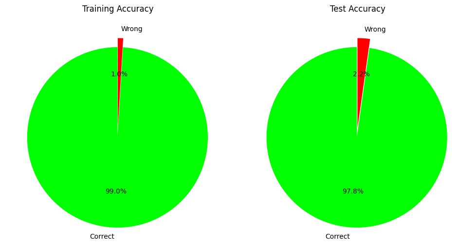
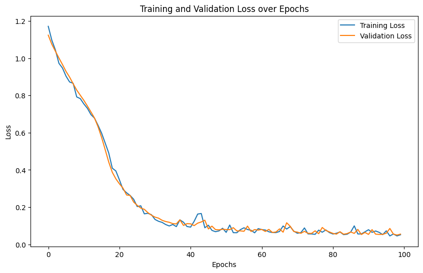

# Iris - MLP

### [dataset](https://www.kaggle.com/datasets/himanshunakrani/iris-dataset)

Author: [Kevin Thomas](mailto:ket189@pitt.edu)

License: MIT

## Install Libraries


```python
# !python -m pip install --upgrade pip
# %pip install torch torchvision --index-url https://download.pytorch.org/whl/cu124  # Windows with CUDA 12.4
# # %pip install torch  # MacOS or CPU-only
# %pip install pandas matplotlib
# %pip install scikit-learn
```

## Import Libraries


```python
import numpy as np
import torch
import torch.nn as nn
import torch.nn.functional as F
from torch.utils.data import DataLoader
import pandas as pd
import matplotlib.pyplot as plt
%matplotlib inline
from sklearn.feature_selection import f_classif, f_regression
from sklearn.model_selection import train_test_split
from sklearn.metrics import r2_score, mean_squared_error, mean_absolute_error
```

## Seed


```python
SEED = 42
SEED
```


    42


```python
torch.manual_seed(SEED)
```


    <torch._C.Generator at 0x104446eb0>


## Parameters


```python
IN_FEATURES=4
IN_FEATURES
```


    4


```python
H1=8
H1
```


    8


```python
H2=8
H2
```


    8


```python
OUT_FEATURES=3
OUT_FEATURES
```


    3


```python
TEST_SIZE=0.3
TEST_SIZE
```


    0.3


```python
MODE = "classification"  # "classification" or "regression"
MODE
```


    'classification'


```python
DATA_PATH = "iris.csv"
DATA_PATH
```


    'iris.csv'


## Hyperparameters


```python
LR = 0.01
LR
```


    0.01


```python
EPOCHS = 100
EPOCHS
```


    100


```python
LOG_INTERVAL = 10
LOG_INTERVAL
```


    10


```python
BATCH_SIZE = 32  # Adjust based on dataset size (32-2048 typical)
BATCH_SIZE
```


    32


```python
CHUNK_SIZE = None  # Set to int (e.g., 100000) for large files, None for small files
CHUNK_SIZE
```


```python
DROPOUT = 0.0  # Dropout rate (0.0 = no dropout, 0.2-0.5 typical for regularization)
DROPOUT
```


    0.0


## Load Dataset


```python
if CHUNK_SIZE is None:
    df = pd.read_csv(DATA_PATH)
else:
    chunks = []
    for chunk in pd.read_csv(DATA_PATH, chunksize=CHUNK_SIZE):
        chunks.append(chunk)
    df = pd.concat(chunks, ignore_index=True)
    del chunks  # Free memory  
df
```


<div>
<style scoped>
    .dataframe tbody tr th:only-of-type {
        vertical-align: middle;
    }

    .dataframe tbody tr th {
        vertical-align: top;
    }

    .dataframe thead th {
        text-align: right;
    }
</style>
<table border="1" class="dataframe">
  <thead>
    <tr style="text-align: right;">
      <th></th>
      <th>sepal_length</th>
      <th>sepal_width</th>
      <th>petal_length</th>
      <th>petal_width</th>
      <th>species</th>
    </tr>
  </thead>
  <tbody>
    <tr>
      <th>0</th>
      <td>5.1</td>
      <td>3.5</td>
      <td>1.4</td>
      <td>0.2</td>
      <td>setosa</td>
    </tr>
    <tr>
      <th>1</th>
      <td>4.9</td>
      <td>3.0</td>
      <td>1.4</td>
      <td>0.2</td>
      <td>setosa</td>
    </tr>
    <tr>
      <th>2</th>
      <td>4.7</td>
      <td>3.2</td>
      <td>1.3</td>
      <td>0.2</td>
      <td>setosa</td>
    </tr>
    <tr>
      <th>3</th>
      <td>4.6</td>
      <td>3.1</td>
      <td>1.5</td>
      <td>0.2</td>
      <td>setosa</td>
    </tr>
    <tr>
      <th>4</th>
      <td>5.0</td>
      <td>3.6</td>
      <td>1.4</td>
      <td>0.2</td>
      <td>setosa</td>
    </tr>
    <tr>
      <th>...</th>
      <td>...</td>
      <td>...</td>
      <td>...</td>
      <td>...</td>
      <td>...</td>
    </tr>
    <tr>
      <th>145</th>
      <td>6.7</td>
      <td>3.0</td>
      <td>5.2</td>
      <td>2.3</td>
      <td>virginica</td>
    </tr>
    <tr>
      <th>146</th>
      <td>6.3</td>
      <td>2.5</td>
      <td>5.0</td>
      <td>1.9</td>
      <td>virginica</td>
    </tr>
    <tr>
      <th>147</th>
      <td>6.5</td>
      <td>3.0</td>
      <td>5.2</td>
      <td>2.0</td>
      <td>virginica</td>
    </tr>
    <tr>
      <th>148</th>
      <td>6.2</td>
      <td>3.4</td>
      <td>5.4</td>
      <td>2.3</td>
      <td>virginica</td>
    </tr>
    <tr>
      <th>149</th>
      <td>5.9</td>
      <td>3.0</td>
      <td>5.1</td>
      <td>1.8</td>
      <td>virginica</td>
    </tr>
  </tbody>
</table>
<p>150 rows × 5 columns</p>
</div>


```python
df.info()
```

    <class 'pandas.core.frame.DataFrame'>
    RangeIndex: 150 entries, 0 to 149
    Data columns (total 5 columns):
     #   Column        Non-Null Count  Dtype  
    ---  ------        --------------  -----  
     0   sepal_length  150 non-null    float64
     1   sepal_width   150 non-null    float64
     2   petal_length  150 non-null    float64
     3   petal_width   150 non-null    float64
     4   species       150 non-null    object 
    dtypes: float64(4), object(1)
    memory usage: 6.0+ KB


## Clean Dataset


```python
df.isna().sum()
```


    sepal_length    0
    sepal_width     0
    petal_length    0
    petal_width     0
    species         0
    dtype: int64


## Feature Engineer Dataset


```python
df["species"] = df["species"].map({
    "setosa": 0,
    "versicolor": 1,
    "virginica": 2,
})
df.head()
```


<div>
<style scoped>
    .dataframe tbody tr th:only-of-type {
        vertical-align: middle;
    }

    .dataframe tbody tr th {
        vertical-align: top;
    }

    .dataframe thead th {
        text-align: right;
    }
</style>
<table border="1" class="dataframe">
  <thead>
    <tr style="text-align: right;">
      <th></th>
      <th>sepal_length</th>
      <th>sepal_width</th>
      <th>petal_length</th>
      <th>petal_width</th>
      <th>species</th>
    </tr>
  </thead>
  <tbody>
    <tr>
      <th>0</th>
      <td>5.1</td>
      <td>3.5</td>
      <td>1.4</td>
      <td>0.2</td>
      <td>0</td>
    </tr>
    <tr>
      <th>1</th>
      <td>4.9</td>
      <td>3.0</td>
      <td>1.4</td>
      <td>0.2</td>
      <td>0</td>
    </tr>
    <tr>
      <th>2</th>
      <td>4.7</td>
      <td>3.2</td>
      <td>1.3</td>
      <td>0.2</td>
      <td>0</td>
    </tr>
    <tr>
      <th>3</th>
      <td>4.6</td>
      <td>3.1</td>
      <td>1.5</td>
      <td>0.2</td>
      <td>0</td>
    </tr>
    <tr>
      <th>4</th>
      <td>5.0</td>
      <td>3.6</td>
      <td>1.4</td>
      <td>0.2</td>
      <td>0</td>
    </tr>
  </tbody>
</table>
</div>


## Identify Feature Statistical Significance (P-Values)


```python
feature_cols = [col for col in df.columns if col != "species"]
X_stats = df[feature_cols].values
y_stats = df["species"].values
```


```python
if MODE == "classification":
    f_scores, p_values = f_classif(X_stats, y_stats)
else:
    f_scores, p_values = f_regression(X_stats, y_stats)
f_scores, p_values
```


    (array([ 119.26450218,   47.3644614 , 1179.0343277 ,  959.32440573]),
     array([1.66966919e-31, 1.32791652e-16, 3.05197580e-91, 4.37695696e-85]))


```python
test_name = "ANOVA F-test" if MODE == "classification" else "F-regression"
print(f"Feature Statistical Significance ({test_name})")
print("=" * 55)
print(f"{'Feature':<20} {'F-Score':>12} {'P-Value':>15} {'Significant?':>10}")
print("-" * 55)
for feat, f_score, p_val in zip(feature_cols, f_scores, p_values):
    sig = "✓ Yes" if p_val < 0.05 else "✗ No"
    print(f"{feat:<20} {f_score:>12.2f} {p_val:>15.2e} {sig:>10}")
print("-" * 55)
print("Note: P-value < 0.05 indicates statistically significant feature")
```

    Feature Statistical Significance (ANOVA F-test)
    =======================================================
    Feature                   F-Score         P-Value Significant?
    -------------------------------------------------------
    sepal_length               119.26        1.67e-31      ✓ Yes
    sepal_width                 47.36        1.33e-16      ✓ Yes
    petal_length              1179.03        3.05e-91      ✓ Yes
    petal_width                959.32        4.38e-85      ✓ Yes
    -------------------------------------------------------
    Note: P-value < 0.05 indicates statistically significant feature


```python
fig, ax = plt.subplots(figsize=(10, 5))
colors = ["green" if p < 0.05 else "red" for p in p_values]
bars = ax.barh(feature_cols, -np.log10(p_values), color=colors)
ax.axvline(x=-np.log10(0.05), color="black", linestyle="--", label="p=0.05 threshold")
ax.set_xlabel("-log10(p-value)")
ax.set_title("Feature Significance: Higher = More Significant")
ax.legend()
plt.tight_layout()
plt.show()
```


    

    


## Create Model


```python
class Model(nn.Module):
    """
    A feedforward neural network with two hidden layers and optional dropout.
    """

    def __init__(self, in_features=IN_FEATURES, h1=H1, h2=H2, out_features=OUT_FEATURES, dropout=DROPOUT):
        """
        Initializes the neural network layers.

        Parameters:
            in_features (int): Number of input features.
            h1 (int): Number of neurons in the first hidden layer.
            h2 (int): Number of neurons in the second hidden layer.
            out_features (int): Number of output features.
            dropout (float): Dropout rate (0.0 = no dropout).

        Returns:
            None
        """
        super(Model, self).__init__()
        self.fc1 = nn.Linear(in_features, h1)
        self.fc2 = nn.Linear(h1, h2)
        self.out = nn.Linear(h2, out_features)
        self.dropout = nn.Dropout(p=dropout)

    def forward(self, x):
        """
        Defines the forward pass of the neural network.

        Parameters:
            x (torch.Tensor): Input tensor.
        
        Returns:
            torch.Tensor: Output tensor after passing through the network.
        """
        x = F.relu(self.fc1(x))
        x = self.dropout(x)
        x = F.relu(self.fc2(x))
        x = self.dropout(x)
        x = self.out(x)
        return x
```

## Instantiate Model


```python
if torch.cuda.is_available():
    DEVICE = torch.device("cuda")
elif torch.backends.mps.is_available():
    DEVICE = torch.device("mps")
else:
    DEVICE = torch.device("cpu")    
model = Model().to(DEVICE)
model
```


    Model(
      (fc1): Linear(in_features=4, out_features=8, bias=True)
      (fc2): Linear(in_features=8, out_features=8, bias=True)
      (out): Linear(in_features=8, out_features=3, bias=True)
      (dropout): Dropout(p=0.0, inplace=False)
    )


```python
next(model.parameters()).device
```


    device(type='mps', index=0)


## Train-Test Split


```python
X = df.drop("species", axis=1).values.astype("float32")
X
```


    array([[5.1, 3.5, 1.4, 0.2],
           [4.9, 3. , 1.4, 0.2],
           [4.7, 3.2, 1.3, 0.2],
           [4.6, 3.1, 1.5, 0.2],
           [5. , 3.6, 1.4, 0.2],
           [5.4, 3.9, 1.7, 0.4],
           [4.6, 3.4, 1.4, 0.3],
           [5. , 3.4, 1.5, 0.2],
           [4.4, 2.9, 1.4, 0.2],
           [4.9, 3.1, 1.5, 0.1],
           [5.4, 3.7, 1.5, 0.2],
           [4.8, 3.4, 1.6, 0.2],
           [4.8, 3. , 1.4, 0.1],
           [4.3, 3. , 1.1, 0.1],
           [5.8, 4. , 1.2, 0.2],
           [5.7, 4.4, 1.5, 0.4],
           [5.4, 3.9, 1.3, 0.4],
           [5.1, 3.5, 1.4, 0.3],
           [5.7, 3.8, 1.7, 0.3],
           [5.1, 3.8, 1.5, 0.3],
           [5.4, 3.4, 1.7, 0.2],
           [5.1, 3.7, 1.5, 0.4],
           [4.6, 3.6, 1. , 0.2],
           [5.1, 3.3, 1.7, 0.5],
           [4.8, 3.4, 1.9, 0.2],
           [5. , 3. , 1.6, 0.2],
           [5. , 3.4, 1.6, 0.4],
           [5.2, 3.5, 1.5, 0.2],
           [5.2, 3.4, 1.4, 0.2],
           [4.7, 3.2, 1.6, 0.2],
           [4.8, 3.1, 1.6, 0.2],
           [5.4, 3.4, 1.5, 0.4],
           [5.2, 4.1, 1.5, 0.1],
           [5.5, 4.2, 1.4, 0.2],
           [4.9, 3.1, 1.5, 0.1],
           [5. , 3.2, 1.2, 0.2],
           [5.5, 3.5, 1.3, 0.2],
           [4.9, 3.1, 1.5, 0.1],
           [4.4, 3. , 1.3, 0.2],
           [5.1, 3.4, 1.5, 0.2],
           [5. , 3.5, 1.3, 0.3],
           [4.5, 2.3, 1.3, 0.3],
           [4.4, 3.2, 1.3, 0.2],
           [5. , 3.5, 1.6, 0.6],
           [5.1, 3.8, 1.9, 0.4],
           [4.8, 3. , 1.4, 0.3],
           [5.1, 3.8, 1.6, 0.2],
           [4.6, 3.2, 1.4, 0.2],
           [5.3, 3.7, 1.5, 0.2],
           [5. , 3.3, 1.4, 0.2],
           [7. , 3.2, 4.7, 1.4],
           [6.4, 3.2, 4.5, 1.5],
           [6.9, 3.1, 4.9, 1.5],
           [5.5, 2.3, 4. , 1.3],
           [6.5, 2.8, 4.6, 1.5],
           [5.7, 2.8, 4.5, 1.3],
           [6.3, 3.3, 4.7, 1.6],
           [4.9, 2.4, 3.3, 1. ],
           [6.6, 2.9, 4.6, 1.3],
           [5.2, 2.7, 3.9, 1.4],
           [5. , 2. , 3.5, 1. ],
           [5.9, 3. , 4.2, 1.5],
           [6. , 2.2, 4. , 1. ],
           [6.1, 2.9, 4.7, 1.4],
           [5.6, 2.9, 3.6, 1.3],
           [6.7, 3.1, 4.4, 1.4],
           [5.6, 3. , 4.5, 1.5],
           [5.8, 2.7, 4.1, 1. ],
           [6.2, 2.2, 4.5, 1.5],
           [5.6, 2.5, 3.9, 1.1],
           [5.9, 3.2, 4.8, 1.8],
           [6.1, 2.8, 4. , 1.3],
           [6.3, 2.5, 4.9, 1.5],
           [6.1, 2.8, 4.7, 1.2],
           [6.4, 2.9, 4.3, 1.3],
           [6.6, 3. , 4.4, 1.4],
           [6.8, 2.8, 4.8, 1.4],
           [6.7, 3. , 5. , 1.7],
           [6. , 2.9, 4.5, 1.5],
           [5.7, 2.6, 3.5, 1. ],
           [5.5, 2.4, 3.8, 1.1],
           [5.5, 2.4, 3.7, 1. ],
           [5.8, 2.7, 3.9, 1.2],
           [6. , 2.7, 5.1, 1.6],
           [5.4, 3. , 4.5, 1.5],
           [6. , 3.4, 4.5, 1.6],
           [6.7, 3.1, 4.7, 1.5],
           [6.3, 2.3, 4.4, 1.3],
           [5.6, 3. , 4.1, 1.3],
           [5.5, 2.5, 4. , 1.3],
           [5.5, 2.6, 4.4, 1.2],
           [6.1, 3. , 4.6, 1.4],
           [5.8, 2.6, 4. , 1.2],
           [5. , 2.3, 3.3, 1. ],
           [5.6, 2.7, 4.2, 1.3],
           [5.7, 3. , 4.2, 1.2],
           [5.7, 2.9, 4.2, 1.3],
           [6.2, 2.9, 4.3, 1.3],
           [5.1, 2.5, 3. , 1.1],
           [5.7, 2.8, 4.1, 1.3],
           [6.3, 3.3, 6. , 2.5],
           [5.8, 2.7, 5.1, 1.9],
           [7.1, 3. , 5.9, 2.1],
           [6.3, 2.9, 5.6, 1.8],
           [6.5, 3. , 5.8, 2.2],
           [7.6, 3. , 6.6, 2.1],
           [4.9, 2.5, 4.5, 1.7],
           [7.3, 2.9, 6.3, 1.8],
           [6.7, 2.5, 5.8, 1.8],
           [7.2, 3.6, 6.1, 2.5],
           [6.5, 3.2, 5.1, 2. ],
           [6.4, 2.7, 5.3, 1.9],
           [6.8, 3. , 5.5, 2.1],
           [5.7, 2.5, 5. , 2. ],
           [5.8, 2.8, 5.1, 2.4],
           [6.4, 3.2, 5.3, 2.3],
           [6.5, 3. , 5.5, 1.8],
           [7.7, 3.8, 6.7, 2.2],
           [7.7, 2.6, 6.9, 2.3],
           [6. , 2.2, 5. , 1.5],
           [6.9, 3.2, 5.7, 2.3],
           [5.6, 2.8, 4.9, 2. ],
           [7.7, 2.8, 6.7, 2. ],
           [6.3, 2.7, 4.9, 1.8],
           [6.7, 3.3, 5.7, 2.1],
           [7.2, 3.2, 6. , 1.8],
           [6.2, 2.8, 4.8, 1.8],
           [6.1, 3. , 4.9, 1.8],
           [6.4, 2.8, 5.6, 2.1],
           [7.2, 3. , 5.8, 1.6],
           [7.4, 2.8, 6.1, 1.9],
           [7.9, 3.8, 6.4, 2. ],
           [6.4, 2.8, 5.6, 2.2],
           [6.3, 2.8, 5.1, 1.5],
           [6.1, 2.6, 5.6, 1.4],
           [7.7, 3. , 6.1, 2.3],
           [6.3, 3.4, 5.6, 2.4],
           [6.4, 3.1, 5.5, 1.8],
           [6. , 3. , 4.8, 1.8],
           [6.9, 3.1, 5.4, 2.1],
           [6.7, 3.1, 5.6, 2.4],
           [6.9, 3.1, 5.1, 2.3],
           [5.8, 2.7, 5.1, 1.9],
           [6.8, 3.2, 5.9, 2.3],
           [6.7, 3.3, 5.7, 2.5],
           [6.7, 3. , 5.2, 2.3],
           [6.3, 2.5, 5. , 1.9],
           [6.5, 3. , 5.2, 2. ],
           [6.2, 3.4, 5.4, 2.3],
           [5.9, 3. , 5.1, 1.8]], dtype=float32)


```python
X.shape
```


    (150, 4)


```python
if MODE == "classification":
    y = df["species"].values.astype("int64")
else:
    y = df["species"].values.astype("float32")
y
```


    array([0, 0, 0, 0, 0, 0, 0, 0, 0, 0, 0, 0, 0, 0, 0, 0, 0, 0, 0, 0, 0, 0,
           0, 0, 0, 0, 0, 0, 0, 0, 0, 0, 0, 0, 0, 0, 0, 0, 0, 0, 0, 0, 0, 0,
           0, 0, 0, 0, 0, 0, 1, 1, 1, 1, 1, 1, 1, 1, 1, 1, 1, 1, 1, 1, 1, 1,
           1, 1, 1, 1, 1, 1, 1, 1, 1, 1, 1, 1, 1, 1, 1, 1, 1, 1, 1, 1, 1, 1,
           1, 1, 1, 1, 1, 1, 1, 1, 1, 1, 1, 1, 2, 2, 2, 2, 2, 2, 2, 2, 2, 2,
           2, 2, 2, 2, 2, 2, 2, 2, 2, 2, 2, 2, 2, 2, 2, 2, 2, 2, 2, 2, 2, 2,
           2, 2, 2, 2, 2, 2, 2, 2, 2, 2, 2, 2, 2, 2, 2, 2, 2, 2])


```python
y.shape
```


    (150,)


```python
if MODE == "classification":
    train_idx, test_idx = train_test_split(
        np.arange(len(X)), test_size=TEST_SIZE, random_state=SEED, stratify=y
    )
else:
    train_idx, test_idx = train_test_split(
        np.arange(len(X)), test_size=TEST_SIZE, random_state=SEED
    )   
X_train, X_test = X[train_idx], X[test_idx]
y_train, y_test = y[train_idx], y[test_idx]
len(train_idx), len(test_idx)
```


    (105, 45)


```python
X_train
```


    array([[5.1, 2.5, 3. , 1.1],
           [6.2, 2.2, 4.5, 1.5],
           [5.1, 3.8, 1.5, 0.3],
           [6.8, 3.2, 5.9, 2.3],
           [5.7, 2.8, 4.1, 1.3],
           [6.7, 3. , 5.2, 2.3],
           [4.9, 3.1, 1.5, 0.1],
           [5.1, 3.8, 1.6, 0.2],
           [4.4, 2.9, 1.4, 0.2],
           [7.1, 3. , 5.9, 2.1],
           [6.5, 3.2, 5.1, 2. ],
           [4.9, 3. , 1.4, 0.2],
           [5. , 3. , 1.6, 0.2],
           [6. , 2.9, 4.5, 1.5],
           [5.5, 2.4, 3.8, 1.1],
           [7.2, 3.2, 6. , 1.8],
           [5. , 3.4, 1.6, 0.4],
           [4.7, 3.2, 1.6, 0.2],
           [6.7, 3.3, 5.7, 2.5],
           [5.9, 3.2, 4.8, 1.8],
           [5.4, 3.4, 1.5, 0.4],
           [6.3, 2.7, 4.9, 1.8],
           [7.6, 3. , 6.6, 2.1],
           [7.7, 2.8, 6.7, 2. ],
           [5.7, 3. , 4.2, 1.2],
           [4.6, 3.4, 1.4, 0.3],
           [5.1, 3.7, 1.5, 0.4],
           [5.4, 3.9, 1.3, 0.4],
           [6.9, 3.1, 4.9, 1.5],
           [5.5, 2.5, 4. , 1.3],
           [5.7, 4.4, 1.5, 0.4],
           [5.1, 3.5, 1.4, 0.3],
           [5.8, 2.7, 4.1, 1. ],
           [5.6, 2.9, 3.6, 1.3],
           [4.8, 3. , 1.4, 0.1],
           [4.8, 3. , 1.4, 0.3],
           [6.7, 3.1, 4.4, 1.4],
           [6.3, 2.5, 5. , 1.9],
           [7.9, 3.8, 6.4, 2. ],
           [5.1, 3.5, 1.4, 0.2],
           [6.4, 2.8, 5.6, 2.1],
           [4.6, 3.2, 1.4, 0.2],
           [6. , 2.2, 5. , 1.5],
           [5.5, 3.5, 1.3, 0.2],
           [6.3, 3.3, 6. , 2.5],
           [6. , 2.2, 4. , 1. ],
           [4.8, 3.4, 1.9, 0.2],
           [7.7, 3. , 6.1, 2.3],
           [6.1, 2.8, 4. , 1.3],
           [5.7, 2.5, 5. , 2. ],
           [5.8, 2.7, 3.9, 1.2],
           [4.5, 2.3, 1.3, 0.3],
           [5.5, 2.4, 3.7, 1. ],
           [6.4, 3.1, 5.5, 1.8],
           [6.1, 3. , 4.6, 1.4],
           [6.3, 2.9, 5.6, 1.8],
           [5.1, 3.4, 1.5, 0.2],
           [5.7, 2.9, 4.2, 1.3],
           [5. , 3.6, 1.4, 0.2],
           [6.7, 3.1, 4.7, 1.5],
           [6.8, 2.8, 4.8, 1.4],
           [5.2, 2.7, 3.9, 1.4],
           [7.2, 3.6, 6.1, 2.5],
           [6. , 2.7, 5.1, 1.6],
           [6.4, 2.9, 4.3, 1.3],
           [6.3, 3.4, 5.6, 2.4],
           [5.6, 2.8, 4.9, 2. ],
           [4.9, 3.1, 1.5, 0.1],
           [6.9, 3.2, 5.7, 2.3],
           [6.5, 2.8, 4.6, 1.5],
           [5.6, 3. , 4.1, 1.3],
           [7.7, 2.6, 6.9, 2.3],
           [5.2, 4.1, 1.5, 0.1],
           [6.4, 3.2, 5.3, 2.3],
           [5.9, 3. , 5.1, 1.8],
           [6.3, 2.3, 4.4, 1.3],
           [4.8, 3.1, 1.6, 0.2],
           [7.7, 3.8, 6.7, 2.2],
           [6.8, 3. , 5.5, 2.1],
           [5.1, 3.8, 1.9, 0.4],
           [4.3, 3. , 1.1, 0.1],
           [6.2, 2.8, 4.8, 1.8],
           [7.2, 3. , 5.8, 1.6],
           [5.8, 2.8, 5.1, 2.4],
           [5.4, 3.9, 1.7, 0.4],
           [5.8, 2.7, 5.1, 1.9],
           [5. , 2. , 3.5, 1. ],
           [6.7, 3.3, 5.7, 2.1],
           [7.4, 2.8, 6.1, 1.9],
           [5.3, 3.7, 1.5, 0.2],
           [6.1, 2.8, 4.7, 1.2],
           [5.5, 2.6, 4.4, 1.2],
           [7. , 3.2, 4.7, 1.4],
           [6.3, 2.5, 4.9, 1.5],
           [5.9, 3. , 4.2, 1.5],
           [5.2, 3.5, 1.5, 0.2],
           [6.9, 3.1, 5.4, 2.1],
           [5.8, 2.6, 4. , 1.2],
           [5.8, 2.7, 5.1, 1.9],
           [4.8, 3.4, 1.6, 0.2],
           [4.9, 3.1, 1.5, 0.1],
           [5.7, 2.6, 3.5, 1. ],
           [5.5, 4.2, 1.4, 0.2],
           [5.6, 2.7, 4.2, 1.3],
           [4.6, 3.1, 1.5, 0.2]], dtype=float32)


```python
X_train.shape
```


    (105, 4)


```python
y_train
```


    array([1, 1, 0, 2, 1, 2, 0, 0, 0, 2, 2, 0, 0, 1, 1, 2, 0, 0, 2, 1, 0, 2,
           2, 2, 1, 0, 0, 0, 1, 1, 0, 0, 1, 1, 0, 0, 1, 2, 2, 0, 2, 0, 2, 0,
           2, 1, 0, 2, 1, 2, 1, 0, 1, 2, 1, 2, 0, 1, 0, 1, 1, 1, 2, 1, 1, 2,
           2, 0, 2, 1, 1, 2, 0, 2, 2, 1, 0, 2, 2, 0, 0, 2, 2, 2, 0, 2, 1, 2,
           2, 0, 1, 1, 1, 1, 1, 0, 2, 1, 2, 0, 0, 1, 0, 1, 0])


```python
y_train.shape
```


    (105,)


```python
X_test
```


    array([[7.3, 2.9, 6.3, 1.8],
           [6.1, 2.9, 4.7, 1.4],
           [6.3, 2.8, 5.1, 1.5],
           [6.3, 3.3, 4.7, 1.6],
           [6.1, 3. , 4.9, 1.8],
           [6.7, 3.1, 5.6, 2.4],
           [5.5, 2.3, 4. , 1.3],
           [5.6, 2.5, 3.9, 1.1],
           [5.4, 3.4, 1.7, 0.2],
           [6.9, 3.1, 5.1, 2.3],
           [5.8, 4. , 1.2, 0.2],
           [4.4, 3. , 1.3, 0.2],
           [6.7, 2.5, 5.8, 1.8],
           [6.5, 3. , 5.5, 1.8],
           [5.2, 3.4, 1.4, 0.2],
           [6.2, 3.4, 5.4, 2.3],
           [4.9, 2.4, 3.3, 1. ],
           [5.4, 3.7, 1.5, 0.2],
           [5.1, 3.3, 1.7, 0.5],
           [5.7, 3.8, 1.7, 0.3],
           [6.2, 2.9, 4.3, 1.3],
           [5. , 3.4, 1.5, 0.2],
           [6.6, 3. , 4.4, 1.4],
           [6.5, 3. , 5.8, 2.2],
           [6. , 3. , 4.8, 1.8],
           [6.4, 3.2, 4.5, 1.5],
           [5.4, 3. , 4.5, 1.5],
           [5. , 2.3, 3.3, 1. ],
           [5.6, 3. , 4.5, 1.5],
           [5. , 3.2, 1.2, 0.2],
           [6.1, 2.6, 5.6, 1.4],
           [6.4, 2.8, 5.6, 2.2],
           [6. , 3.4, 4.5, 1.6],
           [5. , 3.3, 1.4, 0.2],
           [6.4, 2.7, 5.3, 1.9],
           [5. , 3.5, 1.3, 0.3],
           [4.4, 3.2, 1.3, 0.2],
           [4.7, 3.2, 1.3, 0.2],
           [5. , 3.5, 1.6, 0.6],
           [6.7, 3. , 5. , 1.7],
           [5.7, 2.8, 4.5, 1.3],
           [4.6, 3.6, 1. , 0.2],
           [4.9, 2.5, 4.5, 1.7],
           [6.5, 3. , 5.2, 2. ],
           [6.6, 2.9, 4.6, 1.3]], dtype=float32)


```python
X_test.shape
```


    (45, 4)


```python
y_test
```


    array([2, 1, 2, 1, 2, 2, 1, 1, 0, 2, 0, 0, 2, 2, 0, 2, 1, 0, 0, 0, 1, 0,
           1, 2, 2, 1, 1, 1, 1, 0, 2, 2, 1, 0, 2, 0, 0, 0, 0, 1, 1, 0, 2, 2,
           1])


```python
y_test.shape
```


    (45,)


## Create Custom Dataset (Memory Efficient)


```python
class NumpyDataset(torch.utils.data.Dataset):
    """
    A memory-efficient dataset that keeps data as numpy arrays.
    Converts to tensors only when batching (on-demand).
    """

    def __init__(self, X, y, device, mode="classification"):
        """
        Initializes the dataset with numpy arrays.

        Parameters:
            X (np.ndarray): Feature array.
            y (np.ndarray): Label array.
            device (torch.device): Device to move tensors to.
            mode (str): "classification" or "regression".

        Returns:
            None
        """
        self.X = X
        self.y = y
        self.device = device
        self.mode = mode

    def __len__(self):
        """
        Returns the number of samples in the dataset.

        Returns:
            int: Number of samples.
        """
        return len(self.X)

    def __getitem__(self, idx):
        """
        Returns a single sample as tensors on the specified device.

        Parameters:
            idx (int): Index of the sample.

        Returns:
            tuple[torch.Tensor, torch.Tensor]: Feature and label tensors.
        """
        X_tensor = torch.tensor(self.X[idx]).float().to(self.device)
        
        if self.mode == "classification":
            y_tensor = torch.tensor(self.y[idx]).long().to(self.device)
        else:
            y_tensor = torch.tensor(self.y[idx]).float().to(self.device)
        return X_tensor, y_tensor
```

## Create DataLoaders


```python
train_dataset = NumpyDataset(X_train, y_train, DEVICE, MODE)
test_dataset = NumpyDataset(X_test, y_test, DEVICE, MODE)
train_loader = DataLoader(train_dataset, batch_size=BATCH_SIZE, shuffle=True)
test_loader = DataLoader(test_dataset, batch_size=BATCH_SIZE, shuffle=False)
len(train_loader), len(test_loader)
```


    (4, 2)


## Create Loss Function & Optimizer


```python
if MODE == "classification":
    criterion = nn.CrossEntropyLoss()
else:
    criterion = nn.MSELoss()
criterion
```


    CrossEntropyLoss()


```python
optimizer = torch.optim.AdamW(model.parameters(), lr=LR)
optimizer
```


    AdamW (
    Parameter Group 0
        amsgrad: False
        betas: (0.9, 0.999)
        capturable: False
        decoupled_weight_decay: True
        differentiable: False
        eps: 1e-08
        foreach: None
        fused: None
        lr: 0.01
        maximize: False
        weight_decay: 0.01
    )


## Train Model


```python
train_losses = []
val_losses = []
train_losses, val_losses
```


    ([], [])


```python
for i in range(EPOCHS):
    model.train()
    
    epoch_train_loss = 0.0

    for X_batch, y_batch in train_loader:
        optimizer.zero_grad()
        y_pred = model(X_batch)
        loss = criterion(y_pred, y_batch)
        loss.backward()
        optimizer.step()
        epoch_train_loss += loss.item()
    
    train_loss = epoch_train_loss / len(train_loader)
    train_losses.append(train_loss)

    model.eval()

    epoch_val_loss = 0.0
    
    with torch.no_grad():
        for X_batch, y_batch in test_loader:
            y_val_pred = model(X_batch)
            epoch_val_loss += criterion(y_val_pred, y_batch).item()
    val_loss = epoch_val_loss / len(test_loader)
    val_losses.append(val_loss)

    if i % LOG_INTERVAL == 0:
        print(f"Epoch {i}/{EPOCHS} - Training Loss: {train_loss:.4f} - Validation Loss: {val_loss:.4f}")
```

    Epoch 0/100 - Training Loss: 1.1716 - Validation Loss: 1.1242
    Epoch 10/100 - Training Loss: 0.7547 - Validation Loss: 0.7739
    Epoch 20/100 - Training Loss: 0.3467 - Validation Loss: 0.3254
    Epoch 30/100 - Training Loss: 0.1338 - Validation Loss: 0.1464
    Epoch 40/100 - Training Loss: 0.0927 - Validation Loss: 0.1103
    Epoch 50/100 - Training Loss: 0.0644 - Validation Loss: 0.0795
    Epoch 60/100 - Training Loss: 0.0793 - Validation Loss: 0.0802
    Epoch 70/100 - Training Loss: 0.0596 - Validation Loss: 0.0658
    Epoch 80/100 - Training Loss: 0.0557 - Validation Loss: 0.0589
    Epoch 90/100 - Training Loss: 0.0787 - Validation Loss: 0.0535


## Evaluate Model


```python
model.eval()
```


    Model(
      (fc1): Linear(in_features=4, out_features=8, bias=True)
      (fc2): Linear(in_features=8, out_features=8, bias=True)
      (out): Linear(in_features=8, out_features=3, bias=True)
      (dropout): Dropout(p=0.0, inplace=False)
    )


```python
total_val_loss = 0.0
total_val_loss
```


    0.0


```python
with torch.no_grad():
    for X_batch, y_batch in test_loader:
        y_eval = model(X_batch)
        total_val_loss += criterion(y_eval, y_batch).item()
val_loss = total_val_loss / len(test_loader)
val_loss
```


    0.05494216736406088


```python
model.eval()

if MODE == "classification":
    train_correct = 0
    train_total = 0
    test_correct = 0
    test_total = 0

    with torch.no_grad():
        for X_batch, y_batch in train_loader:
            preds = model(X_batch).argmax(dim=1)
            train_correct += (preds == y_batch).sum().item()
            train_total += len(y_batch)

        for X_batch, y_batch in test_loader:
            preds = model(X_batch).argmax(dim=1)
            test_correct += (preds == y_batch).sum().item()
            test_total += len(y_batch)

    train_acc = train_correct / train_total
    test_acc = test_correct / test_total
    
    print(f"Train Accuracy: {train_acc:.4f} ({train_correct}/{train_total})")
    print(f"Test Accuracy: {test_acc:.4f} ({test_correct}/{test_total})")
    print(f"Training Loss: {train_loss:.4f}")
    print(f"Validation Loss: {val_loss:.4f}")
else:
    train_preds_list = []
    train_targets_list = []
    test_preds_list = []
    test_targets_list = []

    with torch.no_grad():
        for X_batch, y_batch in train_loader:
            preds = model(X_batch).squeeze()
            train_preds_list.append(preds.cpu().numpy())
            train_targets_list.append(y_batch.cpu().numpy())

        for X_batch, y_batch in test_loader:
            preds = model(X_batch).squeeze()
            test_preds_list.append(preds.cpu().numpy())
            test_targets_list.append(y_batch.cpu().numpy())

    train_preds_np = np.concatenate(train_preds_list)
    train_targets_np = np.concatenate(train_targets_list)
    test_preds_np = np.concatenate(test_preds_list)
    test_targets_np = np.concatenate(test_targets_list)

    train_r2 = r2_score(train_targets_np, train_preds_np)
    test_r2 = r2_score(test_targets_np, test_preds_np)
    train_mse = mean_squared_error(train_targets_np, train_preds_np)
    test_mse = mean_squared_error(test_targets_np, test_preds_np)
    train_mae = mean_absolute_error(train_targets_np, train_preds_np)
    test_mae = mean_absolute_error(test_targets_np, test_preds_np)

    print(f"Train R²: {train_r2:.4f}")
    print(f"Test R²: {test_r2:.4f}")
    print(f"Train MSE: {train_mse:.4f}")
    print(f"Test MSE: {test_mse:.4f}")
    print(f"Train MAE: {train_mae:.4f}")
    print(f"Test MAE: {test_mae:.4f}")
    print(f"Training Loss: {train_loss:.4f}")
    print(f"Validation Loss: {val_loss:.4f}")
```

    Train Accuracy: 0.9905 (104/105)
    Test Accuracy: 0.9778 (44/45)
    Training Loss: 0.0516
    Validation Loss: 0.0549


```python
if MODE == "classification":
    fig, (ax1, ax2) = plt.subplots(1, 2, figsize=(10, 5))
    colors = ["#00FF00", "#FF0000"]  # Green for correct, red for wrong
    ax1.pie([train_acc, 1 - train_acc], 
            labels=["Correct", "Wrong"], 
            autopct="%1.1f%%", 
            colors=colors, 
            startangle=90, 
            explode=(0.1, 0))
    ax1.set_title("Training Accuracy")
    ax2.pie([test_acc, 1 - test_acc], 
            labels=["Correct", "Wrong"], 
            autopct="%1.1f%%", 
            colors=colors, 
            startangle=90, 
            explode=(0.1, 0))
    ax2.set_title("Test Accuracy")
    plt.tight_layout()
    plt.show()
else:
    fig, (ax1, ax2) = plt.subplots(1, 2, figsize=(12, 5))
    ax1.scatter(train_targets_np, train_preds_np, alpha=0.5)
    ax1.plot([train_targets_np.min(), train_targets_np.max()], 
             [train_targets_np.min(), train_targets_np.max()], "r--", lw=2)
    ax1.set_xlabel("Actual")
    ax1.set_ylabel("Predicted")
    ax1.set_title(f"Train: Actual vs Predicted (R²={train_r2:.4f})")
    ax2.scatter(test_targets_np, test_preds_np, alpha=0.5)
    ax2.plot([test_targets_np.min(), test_targets_np.max()], 
             [test_targets_np.min(), test_targets_np.max()], "r--", lw=2)
    ax2.set_xlabel("Actual")
    ax2.set_ylabel("Predicted")
    ax2.set_title(f"Test: Actual vs Predicted (R²={test_r2:.4f})")
    plt.tight_layout()
    plt.show()
```


    

    


```python
plt.figure(figsize=(10, 6))
plt.plot(range(len(train_losses)), train_losses, label="Training Loss")
plt.plot(range(len(val_losses)), val_losses, label="Validation Loss")
plt.xlabel("Epochs")
plt.ylabel("Loss")
plt.title("Training and Validation Loss over Epochs")
plt.legend()
plt.show()
```


    

    


## Save Model


```python
torch.save(model.state_dict(), "iris_model.pth")
print("Model saved to iris_model.pth")
```

    Model saved to iris_model.pth


## Load Model


```python
loaded_model = Model().to(DEVICE)
loaded_model.load_state_dict(torch.load("iris_model.pth", map_location=DEVICE))
loaded_model.eval()
print("Model loaded from iris_model.pth")
```

    Model loaded from iris_model.pth


## Inference


```python
def predict(model, features, mode=MODE):
    """
    Make a prediction on new data.

    Parameters:
        model (nn.Module): Trained PyTorch model.
        features (list[float]): List of feature values.
        mode (str): "classification" or "regression".

    Returns:
        tuple[str, float] | float: For classification: (class_name, confidence).
                                   For regression: predicted value.
    """
    species_map = {0: "setosa", 1: "versicolor", 2: "virginica"}
    model.eval()
    with torch.no_grad():
        X_new = torch.tensor(features).float().to(DEVICE)
        
        if X_new.dim() == 1:
            X_new = X_new.unsqueeze(0)
        logits = model(X_new)
        if mode == "classification":
            probabilities = torch.softmax(logits, dim=1)
            predicted_class = logits.argmax(dim=1).item()
            confidence = probabilities[0][predicted_class].item()
            return species_map[predicted_class], confidence
        else:
            return logits.squeeze().item()
```


```python
# Example: New flower measurements [sepal_length, sepal_width, petal_length, petal_width]
new_flower = [5.1, 3.5, 1.4, 0.2]

if MODE == "classification":
    species, confidence = predict(model, new_flower)
    print(f"Input: {new_flower}")
    print(f"Predicted Species: {species}")
    print(f"Confidence: {confidence:.2%}")
else:
    prediction = predict(model, new_flower)
    print(f"Input: {new_flower}")
    print(f"Predicted Value: {prediction:.4f}")
```

    Input: [5.1, 3.5, 1.4, 0.2]
    Predicted Species: setosa
    Confidence: 99.91%

